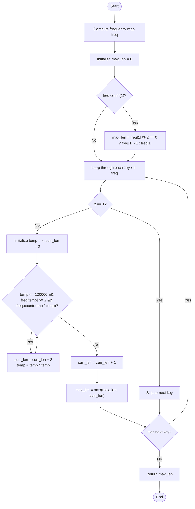

# 💡 Approach — Find the Maximum Number of Elements in Subset

| 📄 [Problem](./Problem.md) | 💡 [Approach](./Approach.md) | 🧩 [Solution](./Solution.cpp) | 🚀 [Main](./Main.cpp) |
|:--------------------------:|:-----------------------------:|:------------------------------:|:---------------------:|

---

## 📊 Metadata

---

## 🎯 Core Insight

> [!TIP]
> **Frequency Map + Chain Simulation:**
> The subset elements must follow a symmetrical squaring sequence:
> 
> $$x \to x^2 \to x^4 \dots \to x^k \to \dots x^4 \to x^2 \to x$$
> 
> 1. **Frequency Requirements:** For any step of the sequence with value $y$, we need at least 2 copies of $y$ to place them on both ends, unless it is the peak element $x^k$ which only requires 1 copy.
> 2. **Base 1 (Edge Case):** Since $1^2 = 1$, the sequence of ones is $1 \to 1 \dots \to 1$. We can choose all ones if their count is odd, or $count - 1$ if even, as long as we have at least one.
> 3. **Base $x > 1$ Simulation:** For each distinct number $x > 1$ in the array, we check if we can form a chain. While we have at least 2 copies of the current value and at least 1 copy of its square, we add 2 to our length and jump to the square. When this condition fails, we place 1 copy of the current value as the peak and stop.

---

## 🔩 Step-by-Step Breakdown

**Step 1: Compute Frequency Map**
- Create an `unordered_map<long long, int> freq` and store the counts of all elements in `nums`.

**Step 2: Handle Edge Case of Ones**
- If `1` is present in the map:
  - If its count is odd, we can use all of them: `max_len = freq[1]`.
  - If its count is even, we can use one less: `max_len = freq[1] - 1`.

**Step 3: Simulate Chain for Elements > 1**
- For each unique element `x` in the map:
  - If `x == 1`, skip.
  - Initialize `temp = x` and `current_length = 0`.
  - Run a loop:
    - Check if `temp <= 100000` (to prevent integer overflow when squaring) AND `freq[temp] >= 2` AND `freq.count(temp * temp)`:
      - If true, add `2` to `current_length` and set `temp = temp * temp`.
      - If false, add `1` to `current_length` (for the peak element) and break.
  - Update `max_len = max(max_len, current_length)`.

**Step 4: Return Result**
- Return `max_len`.

---

## 🔄 Mermaid Flowchart

---

## 🧮 Dry Run — Example 1

Input: `nums = [5, 4, 1, 2, 2]`

### 1. Frequency Map
- `freq = {1: 1, 2: 2, 4: 1, 5: 1}`

### 2. Handle Ones
- `freq.count(1)` is true, count is `1`.
- `max_len = 1`.

### 3. Simulation for keys > 1

- **For `x = 2`**:
  - `temp = 2`, `curr_len = 0`.
  - Loop 1: `temp = 2`. `freq[2] = 2 >= 2` AND `freq.count(4)` is true.
    - `curr_len = 2`.
    - `temp = 4`.
  - Loop 2: `temp = 4`. `freq[4] = 1 < 2` $\implies$ condition fails.
    - `curr_len = 2 + 1 = 3`.
    - Break.
  - `max_len = max(1, 3) = 3`.

- **For `x = 4`**:
  - `temp = 4`, `curr_len = 0`.
  - Loop 1: `temp = 4`. `freq[4] = 1 < 2` $\implies$ condition fails.
    - `curr_len = 0 + 1 = 1`.
    - Break.
  - `max_len = max(3, 1) = 3`.

- **For `x = 5`**:
  - `temp = 5`, `curr_len = 0`.
  - Loop 1: `temp = 5`. `freq[5] = 1 < 2` $\implies$ condition fails.
    - `curr_len = 0 + 1 = 1`.
    - Break.
  - `max_len = max(3, 1) = 3`.

**Final Output:** `3` ✅

---

## 📊 Complexity Analysis

| Metric | Complexity | Reasoning |
| :---: | :---: | :--- |
| 🕐 Time | $$O(n)$$ | Building the frequency map takes $$O(n)$$. Since elements square rapidly ($$2 \to 4 \to 16 \to 256 \to 65536 \dots$$), the maximum length of any chain is at most 5. Hence, the simulation takes $$O(1)$$ per starting element. |
| 💾 Space | $$O(n)$$ | The hash map stores at most $$n$$ unique keys, requiring linear auxiliary space. |

---

> *"Symmetry in numbers reveals hidden paths of exponential growth, structured around a singular peak."*

---

<h3>Happy Coding! 🚀</h3>

