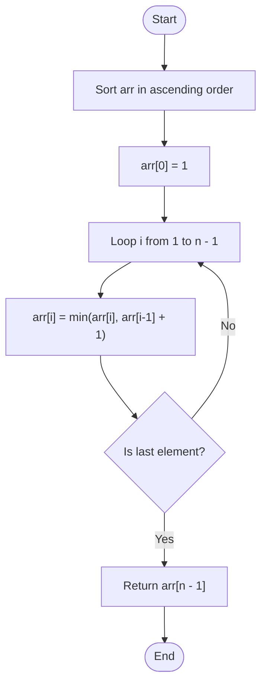

# 💡 Approach — Maximum Element After Decreasing and Rearranging

| 📄 [Problem](./Problem.md) | 💡 [Approach](./Approach.md) | 🧩 [Solution](./Solution.cpp) | 🚀 [Main](./Main.cpp) |
|:--------------------------:|:-----------------------------:|:------------------------------:|:---------------------:|

---

## 📊 Metadata

---

## 🎯 Core Insight

> [!TIP]
> **Greedy + Sorting Strategy:**
> 1. **Sorting:** Sorting the array arranges the numbers in non-decreasing order. This is the optimal configuration to build up our sequence since it puts larger numbers later, allowing the sequence to rise as much as possible.
> 2. **Base Limit:** The first element must be set to `1` (or decreased to 1 if it's larger).
> 3. **Incremental Growth:** For each subsequent element at index `i`, we can only increase its height by at most `1` relative to `arr[i-1]`. We want to make it as large as possible, but it cannot exceed its original value (since we can only *decrease* values). Thus:
>    
>    $$arr[i] = \min(arr[i], arr[i-1] + 1)$$
> 
> The maximum element in the resulting array will always be the last element of the sorted and modified array.

---

## 🔩 Step-by-Step Breakdown

**Step 1: Sort the Array**
- Sort `arr` in ascending order.

**Step 2: Initialize first element**
- Update `arr[0] = 1`.

**Step 3: Apply Adjacent Constraints**
- Iterate from `i = 1` to `arr.length - 1`:
  - `arr[i] = min(arr[i], arr[i-1] + 1)`

**Step 4: Return Result**
- Return `arr[arr.length - 1]`.

---

## 🔄 Mermaid Flowchart

---

## 🧮 Dry Run — Example 2

Input: `arr = [100, 1, 1000]`

### 1. Sorting
- Sorted `arr` = `[1, 100, 1000]`

### 2. Initialization
- `arr[0] = 1`

### 3. Iteration

- **Step 1 ($$i = 1$$)**:
  - `arr[1] = min(100, arr[0] + 1) = min(100, 1 + 1) = 2`
  - Array: `[1, 2, 1000]`

- **Step 2 ($$i = 2$$)**:
  - `arr[2] = min(1000, arr[1] + 1) = min(1000, 2 + 1) = 3`
  - Array: `[1, 2, 3]`

**Final Output:** `arr[2] = 3` ✅

---

## 📊 Complexity Analysis

| Metric | Complexity | Reasoning |
| :---: | :---: | :--- |
| 🕐 Time | $$O(n \log n)$$ | Sorting the array takes $$O(n \log n)$$ time. The subsequent greedy scanning pass takes $$O(n)$$ time. |
| 💾 Space | $$O(1)$$ | If sorted in-place, the auxiliary space is $$O(1)$$. (Depending on the sorting algorithm implementation, e.g., Quicksort/Heapsort). |

---

> *"Growing step by step ensures that we reach our maximum height without leaving any gaps behind."*

---

<h3>Happy Coding! 🚀</h3>

