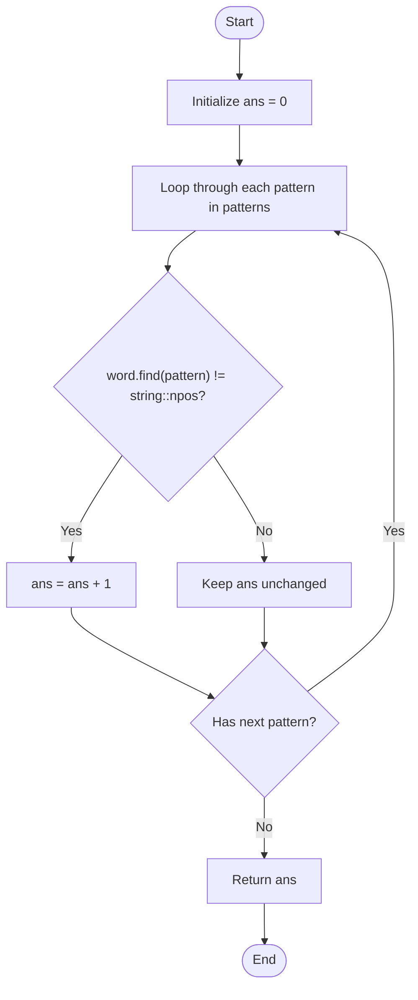

# 💡 Approach — Number of Strings That Appear as Substrings in Word

| 📄 [Problem](./Problem.md) | 💡 [Approach](./Approach.md) | 🧩 [Solution](./Solution.cpp) | 🚀 [Main](./Main.cpp) |
|:--------------------------:|:-----------------------------:|:------------------------------:|:---------------------:|

---

## 📊 Metadata

---

## 🎯 Core Insight

> [!TIP]
> **Linear Substring Search:**
> Since the constraints on `patterns.length`, `patterns[i].length`, and `word.length` are all extremely small ($$\le 100$$), a simple linear check for each pattern inside `word` is highly efficient. In C++, `std::string::find` uses highly optimized searches which run in $$O(\text{pattern.length} \times \text{word.length})$$ in the worst case (or faster using modern compiler optimizations).

---

## 🔩 Step-by-Step Breakdown

**Step 1: Initialize Count**
- Initialize a counter `ans = 0`.

**Step 2: Search Substrings**
- Loop through each `pattern` in the `patterns` array:
  - Perform a substring search using `word.find(pattern)`.
  - If the search result is not equal to `std::string::npos` (meaning the pattern was found in `word`), increment `ans` by 1.

**Step 3: Return Result**
- Return the final count `ans`.

---

## 🔄 Mermaid Flowchart

---

## 🧮 Dry Run — Example 1

Input: `patterns = ["a", "abc", "bc", "d"]`, `word = "abc"`

### Execution

| Step | Pattern | `word.find(pattern)` Result | Condition: Found? | `ans` Update |
| :---: | :---: | :---: | :---: | :---: |
| **Start** | — | — | — | `0` |
| **1** | `"a"` | `0` (index where `"a"` starts) | True | `1` |
| **2** | `"abc"` | `0` (index where `"abc"` starts) | True | `2` |
| **3** | `"bc"` | `1` (index where `"bc"` starts) | True | `3` |
| **4** | `"d"` | `std::string::npos` (not found) | False | `3` |

**Final Output:** `3` ✅

---

## 📊 Complexity Analysis

| Metric | Complexity | Reasoning |
| :---: | :---: | :--- |
| 🕐 Time | $$O(m \cdot l \cdot w)$$ | We iterate over $$m$$ patterns. For each pattern of max length $$l$$, searching it in `word` of length $$w$$ takes $$O(l \cdot w)$$ time in the worst case. |
| 💾 Space | $$O(1)$$ | We only use a constant number of counter variables, requiring no auxiliary storage. |

---

> *"The simplicity of searching within a word lies in matching character by character until the pattern emerges."*

---

<h3>Happy Coding! 🚀</h3>

