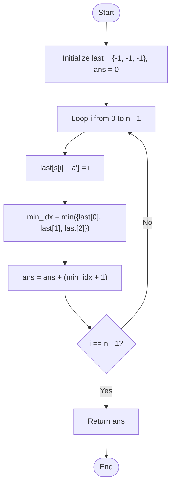

# 💡 Approach — Number of Substrings Containing All Three Characters

| 📄 [Problem](./Problem.md) | 💡 [Approach](./Approach.md) | 🧩 [Solution](./Solution.cpp) | 🚀 [Main](./Main.cpp) |
|:--------------------------:|:-----------------------------:|:------------------------------:|:---------------------:|

---

## 📊 Metadata

---

## 🎯 Core Insight

> [!TIP]
> **Single-Pass Last-Seen Index Tracker:**
> Instead of checking all possible substrings, we can iterate through the string and find the number of valid substrings *ending* at each index `i`.
> 
> 1. Keep track of the last seen index for each of the three characters `'a'`, `'b'`, and `'c'`.
> 2. For any index `i`, the shortest valid suffix ending at `i` must start at the minimum of the last seen indices of `'a'`, `'b'`, and `'c'`. Let this be:
>    
>    $$\text{start} = \min(last\_a, last\_b, last\_c)$$
> 
> 3. If all three characters have been seen (meaning $\text{start} \neq -1$), then any substring starting at any index from `0` up to `start` and ending at `i` will contain at least one of each character. There are exactly $\text{start} + 1$ such substrings.
> 
> This approach allows us to solve the problem in a single pass with $$O(n)$$ time and $$O(1)$$ space.

---

## 🔩 Step-by-Step Breakdown

**Step 1: Initialize Trackers**
- Maintain an array/vector `last` of size 3 initialized with `-1` to store the last seen positions of `'a'`, `'b'`, and `'c'`.
- Initialize `ans = 0`.

**Step 2: Traverse the String**
- Loop through the string with index `i` from `0` to `n - 1`:
  - Update `last[s[i] - 'a'] = i`.
  - Find the minimum of the three values in `last`:
    $$\text{min\_idx} = \min({last[0], last[1], last[2]})$$
  - Add `min_idx + 1` to `ans` (if `min_idx == -1`, it naturally adds `0` because no valid substrings end at `i` yet).

**Step 3: Return Result**
- Return the final count `ans`.

---

## 🔄 Mermaid Flowchart

---

## 🧮 Dry Run — Example 1

Input: `s = "abcabc"`

### Execution

| Index `i` | Char `s[i]` | Updated `last` (`[a, b, c]`) | `min_idx` | Substrings Added | Cumulative `ans` |
| :---: | :---: | :---: | :---: | :---: | :---: |
| **0** | `'a'` | `[0, -1, -1]` | `-1` | `0` | `0` |
| **1** | `'b'` | `[0, 1, -1]` | `-1` | `0` | `0` |
| **2** | `'c'` | `[0, 1, 2]` | `0` | `0 + 1 = 1` (`"abc"`) | `1` |
| **3** | `'a'` | `[3, 1, 2]` | `1` | `1 + 1 = 2` (`"abca"`, `"bca"`) | `1 + 2 = 3` |
| **4** | `'b'` | `[3, 4, 2]` | `2` | `2 + 1 = 3` (`"abcab"`, `"bcab"`, `"cab"`) | `3 + 3 = 6` |
| **5** | `'c'` | `[3, 4, 5]` | `3` | `3 + 1 = 4` (`"abcabc"`, `"bcabc"`, `"cabc"`, `"abc"`) | `6 + 4 = 10` |

**Final Output:** `10` ✅

---

## 📊 Complexity Analysis

| Metric | Complexity | Reasoning |
| :---: | :---: | :--- |
| 🕐 Time | $$O(n)$$ | We perform a single pass over the string `s` of length $$n$$. At each step, we update and query the minimum of 3 values, which takes $$O(1)$$ time. |
| 💾 Space | $$O(1)$$ | The `last` array is of constant size 3. |

---

> *"By keeping track of the trailing horizons of each element, we easily count all prefixes that satisfy the union of our requirements."*

---

<h3>Happy Coding! 🚀</h3>

