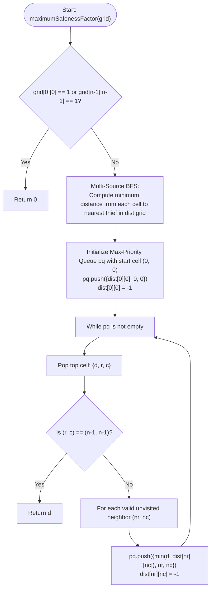

# 💡 Approach — Find the Safest Path in a Grid

| 📄 [Problem](./Problem.md) | 💡 [Approach](./Approach.md) | 🧩 [Solution](./Solution.cpp) | 🚀 [Main](./Main.cpp) |
|:--------------------------:|:-----------------------------:|:------------------------------:|:---------------------:|

---

## 📊 Metadata

---

## 🎯 Core Insight

> [!TIP]
> **Use Multi-Source BFS to precompute distances, and a Max-Priority Queue to find the safest path.**
>
> 1. **Calculate Safeness Grid**:
>    - Perform a multi-source BFS starting with all thieves (cells with value `1`) to determine the Manhattan distance from each cell to the closest thief. Let this computed grid be `dist`.
> 2. **Maximize the Minimum Distance along a Path**:
>    - Think of this as a Dijkstra-like algorithm where we want to find a path from $(0, 0)$ to $(n-1, n-1)$ that maximizes the minimum cell value (`dist[r][c]`) on the path.
>    - By using a max-priority queue (Max-Heap), we always greedily expand the path that currently has the highest possible safeness factor.
>    - Since we pop the maximum safeness value at each step, the first time we reach the destination cell $(n-1, n-1)$, the path safeness value associated with it is guaranteed to be the optimal result.

---

## 🔩 Step-by-Step Breakdown

**Step 1 — Run Multi-Source BFS for Safeness Distances**
- Initialize a 2D array `dist` of size $n \times n$ with `-1` to represent unvisited cells.
- Push all coordinates $(r, c)$ where `grid[r][c] == 1` into a queue `q` and set `dist[r][c] = 0`.
- Perform a BFS traversal:
  - Pop a cell $(r, c)$ from `q`.
  - For each of its four neighbors $(nr, nc)$ that are inside the grid and have `dist[nr][nc] == -1`:
    - Set `dist[nr][nc] = dist[r][c] + 1`.
    - Push $(nr, nc)$ into `q`.

**Step 2 — Find the Safest Path using a Max-Heap**
- If the starting cell $(0, 0)$ or the ending cell $(n - 1, n - 1)$ contains a thief, immediately return `0` (safeness factor is 0).
- Initialize a priority queue `pq` that prioritizes cells with higher safeness factors.
- Push the start cell state `(dist[0][0], 0, 0)` into `pq` and mark it visited by setting `dist[0][0] = -1`.
- While `pq` is not empty:
  - Pop the state with the maximum safeness factor: `(d, r, c)`.
  - If we have reached the destination $(n - 1, n - 1)$, return `d`.
  - For each neighbor $(nr, nc)$ that is inside the grid and has `dist[nr][nc] != -1`:
    - Calculate the safeness of the path to this neighbor: `min(d, dist[nr][nc])`.
    - Push `(min(d, dist[nr][nc]), nr, nc)` into `pq`.
    - Mark the neighbor as visited by setting `dist[nr][nc] = -1`.

**Step 3 — Fallback Return**
- If no path is found, return `0`.

---

## 🔄 Mermaid Flowchart

---

## 📊 Complexity Analysis

| Metric | Complexity | Reasoning |
| :---: | :---: | :--- |
| 🕐 Time | $$O(n^2 \log n)$$ | Multi-source BFS takes $O(n^2)$ time. The Max-Priority Queue processes each grid cell at most once, and each push/pop operation on the heap takes $O(\log n)$ time, leading to $O(n^2 \log n)$ total priority queue time. |
| 💾 Space | $$O(n^2)$$ | We allocate a 2D distance grid `dist` of size $n \times n$ and maintain queues/priority queues storing at most $O(n^2)$ elements. |

---

> *"The safest route is not always the shortest, but the one that keeps you furthest from danger."*

---

<h3>Happy Coding! 🚀</h3>

