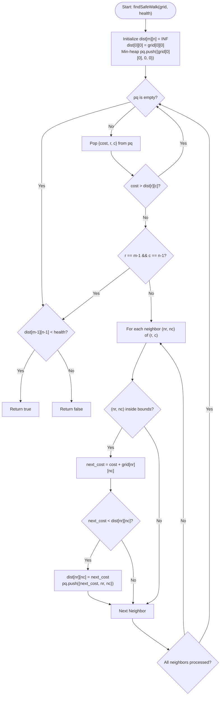

# 💡 Approach — Find a Safe Walk Through a Grid

| 📄 [Problem](./Problem.md) | 💡 [Approach](./Approach.md) | 🧩 [Solution](./Solution.cpp) | 🚀 [Main](./Main.cpp) |
|:--------------------------:|:-----------------------------:|:------------------------------:|:---------------------:|

---

## 📊 Metadata

---

## 🎯 Core Insight

> [!TIP]
> **Shortest Path on a Weighted Grid (Dijkstra's Algorithm)**
>
> 1. **Grid as a Graph:**
>    - Think of each grid cell $(r, c)$ as a graph node.
>    - The cost of entering a cell $(r, c)$ is the grid value `grid[r][c]`, which represents the health reduction ($0$ or $1$).
>    - The problem asks if we can find a path from the start $(0, 0)$ to the end $(m-1, n-1)$ such that the total path cost (health reduction) is strictly less than `health` (so that remaining health is $\ge 1$).
>
> 2. **Dijkstra's Algorithm (Min-Heap):**
>    - Because edge/node weights are non-negative ($0$ or $1$), we can find the shortest path (minimum health reduction) using **Dijkstra's Algorithm**.
>    - We maintain a distance array `dist[r][c]` representing the minimum health loss to reach $(r, c)$.
>    - We use a Min-Heap (priority queue) to process cells in increasing order of health loss.
>    - If the minimum health loss to reach the destination $(m-1, n-1)$ is strictly less than `health`, return `true`; otherwise, return `false`.

---

## 🔩 Step-by-Step Breakdown

**Step 1 — Handle Base Cases and Initialize Priority Queue**
- Create a 2D distance grid `dist` of size $m \times n$, initialized with a very large value (representing infinity).
- Initialize `dist[0][0] = grid[0][0]` since entering $(0, 0)$ immediately costs health equal to `grid[0][0]`.
- Initialize a min-heap `pq` storing tuples of the form `{cost, r, c}` and push `{grid[0][0], 0, 0}` to start the search.

**Step 2 — Run Dijkstra's Algorithm**
- While `pq` is not empty:
  - Pop the state `{cost, r, c}` with the smallest cost.
  - If `cost > dist[r][c]`, skip processing as we have already found a shorter path to $(r, c)$.
  - **Optimization:** If we reach $(m-1, n-1)$, we can break early because Dijkstra guarantees that the first time we pop a node, we have found its shortest path.
  - For each of the 4 adjacent neighbors `(nr, nc)` (Up, Down, Left, Right):
    - Calculate the path cost to the neighbor: `next_cost = cost + grid[nr][nc]`.
    - If `next_cost < dist[nr][nc]`, update `dist[nr][nc] = next_cost` and push `{next_cost, nr, nc}` into `pq`.

**Step 3 — Return Result Based on Remaining Health**
- Compare the minimum health loss to reach $(m-1, n-1)$ (stored in `dist[m-1][n-1]`) with the initial `health`.
- If `dist[m-1][n-1] < health`, return `true`. Otherwise, return `false`.

---

## 🔄 Mermaid Flowchart

---

## 🧮 Dry Run — Example 3 ($grid = \begin{bmatrix} 1 & 1 & 1 \\ 1 & 0 & 1 \\ 1 & 1 & 1 \end{bmatrix}$, $health = 5$)

- **Step 1: Initialization**
  - $m = 3, n = 3$, target destination is $(2, 2)$.
  - `dist` grid is initialized to $\infty$, except `dist[0][0] = grid[0][0] = 1`.
  - Priority Queue `pq` starts with `{(cost: 1, cell_index: 0)}` (cell index mapped by $r \times n + c$).

- **Step 2: Dijkstra Transitions**
  1. **Pop `{cost: 1, u: 0}`** (Cell $(0, 0)$):
     - Neighbor $(0, 1)$: `next_cost = 1 + grid[0][1] = 2`. Update `dist[0][1] = 2`, push `{2, 1}`.
     - Neighbor $(1, 0)$: `next_cost = 1 + grid[1][0] = 2`. Update `dist[1][0] = 2`, push `{2, 3}`.
     - `pq = [{2, 1}, {2, 3}]`.
  2. **Pop `{cost: 2, u: 1}`** (Cell $(0, 1)$):
     - Neighbor $(0, 2)$: `next_cost = 2 + grid[0][2] = 3`. Update `dist[0][2] = 3`, push `{3, 2}`.
     - Neighbor $(1, 1)$: `next_cost = 2 + grid[1][1] = 2`. Update `dist[1][1] = 2`, push `{2, 4}`.
     - `pq = [{2, 3}, {2, 4}, {3, 2}]`.
  3. **Pop `{cost: 2, u: 3}`** (Cell $(1, 0)$):
     - Neighbor $(2, 0)$: `next_cost = 2 + grid[2][0] = 3`. Update `dist[2][0] = 3`, push `{3, 6}`.
     - `pq = [{2, 4}, {3, 2}, {3, 6}]`.
  4. **Pop `{cost: 2, u: 4}`** (Cell $(1, 1)$):
     - Neighbor $(1, 2)$: `next_cost = 2 + grid[1][2] = 3`. Update `dist[1][2] = 3`, push `{3, 5}`.
     - Neighbor $(2, 1)$: `next_cost = 2 + grid[2][1] = 3`. Update `dist[2][1] = 3`, push `{3, 7}`.
     - `pq = [{3, 2}, {3, 5}, {3, 6}, {3, 7}]`.
  5. **Pop `{cost: 3, u: 5}`** (Cell $(1, 2)$):
     - Neighbor $(2, 2)$: `next_cost = 3 + grid[2][2] = 4`. Update `dist[2][2] = 4`, push `{4, 8}`.
  6. **Pop `{cost: 4, u: 8}`** (Cell $(2, 2)$):
     - Target reached! Break execution early.

- **Step 3: Check Result**
  - Minimum cost to reach $(2, 2)$ is `dist[2][2] = 4`.
  - Since $4 < \text{health}$ (5), we return `true`.

---

## 📊 Complexity Analysis

| Metric | Complexity | Reasoning |
| :---: | :---: | :--- |
| 🕐 Time | $$O(m \cdot n \log(m \cdot n))$$ | Each cell is processed at most once, and each push/pop in the min-heap takes logarithmic time relative to the grid size. |
| 💾 Space | $$O(m \cdot n)$$ | We store the `dist` grid of size $m \times n$ and the priority queue which holds at most $m \times n$ states. |

---

> *"The safest walk is not the one that avoids all obstacles, but the one taken with calculated steps."*

---

<h3>Happy Coding! 🚀</h3>

