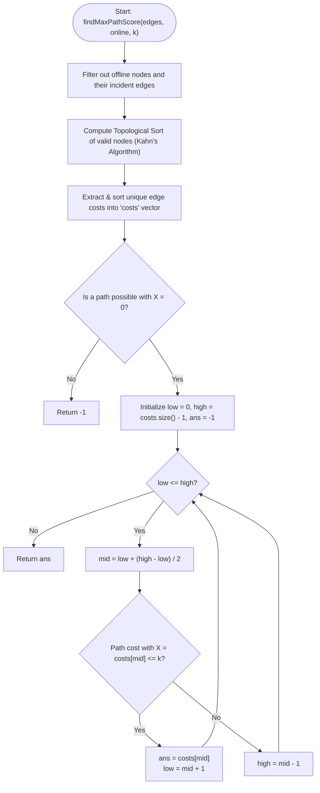

# 💡 Approach — Network Recovery Pathways

| 📄 [Problem](./Problem.md) | 💡 [Approach](./Approach.md) | 🧩 [Solution](./Solution.cpp) | 🚀 [Main](./Main.cpp) |
|:--------------------------:|:-----------------------------:|:------------------------------:|:---------------------:|

---

## 📊 Metadata

---

## 🎯 Core Insight

> [!TIP]
> **Monotonic Binary Search & Single-Pass DAG Shortest Path**
>
> 1. **Monotonicity of Scores:**
>    - If there is a valid path from $0$ to $n-1$ with recovery cost $\le k$ where every edge has cost $\ge X$, then any smaller threshold $Y < X$ is also achievable.
>    - This allows us to **Binary Search** over the unique edge costs in the graph to find the maximum possible minimum edge cost.
>
> 2. **Offline Nodes Filtering:**
>    - Intermediate offline nodes can never be visited. We can completely prune these nodes and any incident edges at the start.
>
> 3. **Topological Order DP:**
>    - The graph is a Directed Acyclic Graph (DAG). We can find a topological sort of the online/valid nodes *once* using Kahn's Algorithm.
>    - For a candidate score $X$, we only keep edges with cost $\ge X$. Finding the shortest path from $0$ to $n-1$ in a DAG takes $O(V + E)$ time by relaxing edges in topological order.
>    - If the shortest path cost does not exceed $k$, then the candidate score $X$ is achievable.

---

## 🔩 Step-by-Step Breakdown

**Step 1 — Preprocess and Filter Offline Nodes**
- Build an adjacency list `adj` only containing edges between nodes that are online.
- Intermediate nodes $u$ are valid if `online[u] == true`. Nodes $0$ and $n-1$ are always online.

**Step 2 — Compute Topological Sort**
- Compute the in-degree of all valid nodes in our pruned adjacency list.
- Run Kahn's Algorithm:
  - Push all valid nodes with in-degree 0 to a queue.
  - Process nodes from the queue to construct a topological ordering `topo_order`.

**Step 3 — Establish Search Range**
- Gather all unique edge costs from the graph, sort them, and store them in a vector `costs`.
- If a valid path is not possible even when using all valid edges (threshold $X = 0$), return `-1` immediately.

**Step 4 — Binary Search on Edge Cost Threshold**
- Set `low = 0` and `high = costs.size() - 1`.
- For `mid = low + (high - low) / 2`:
  - Check if a path from $0$ to $n-1$ exists using only edges with cost $\ge \text{costs}[mid]$ such that total path cost $\le k$.
  - To check:
    - Initialize `dist` table of size $n$ to $\infty$ ($10^{18}$ to avoid overflow). Set `dist[0] = 0`.
    - Iterate through nodes `u` in `topo_order`. If `dist[u]` is $\infty$, continue.
    - For each outgoing edge $u \to v$ with cost $\ge X$, relax `dist[v] = min(dist[v], dist[u] + cost)`.
    - Return `dist[n-1] <= k`.
  - If achievable, update `ans = costs[mid]` and search in the right half (`low = mid + 1`).
  - Otherwise, search in the left half (`high = mid - 1`).

---

## 🔄 Mermaid Flowchart

---

## 🧮 Dry Run — Example 1

- **Inputs:** `edges = [[0,1,5],[1,3,10],[0,2,3],[2,3,4]]`, `online = [T, T, T, T]`, `k = 10`
- **Unique Costs:** `[3, 4, 5, 10]`
- **Topological Order:** `[0, 1, 2, 3]`

- **Binary Search:**
  - **Check $X = 3$ (index 0):**
    - Keeping edges with cost $\ge 3$ (all edges kept).
    - `dist[0] = 0`
    - `dist[1] = 5`, `dist[2] = 3`
    - `dist[3] = min(5 + 10, 3 + 4) = 7`
    - `dist[3] = 7 <= 10` (True) $\to$ `ans = 3`, `low = 1`
  - **Check $X = 4$ (index 1):**
    - Keeping edges with cost $\ge 4$: `0 -> 1` (5), `1 -> 3` (10), `2 -> 3` (4).
    - `dist[0] = 0`
    - `dist[1] = 5`, `dist[2] = inf`
    - `dist[3] = 5 + 10 = 15`
    - `dist[3] = 15 > 10` (False) $\to$ `high = 0`
- **Termination:** `low > high`, returns `ans = 3`.

---

## 📊 Complexity Analysis

| Metric | Complexity | Reasoning |
| :---: | :---: | :--- |
| 🕐 Time | $$O((n + m) \log m)$$ | Filtering nodes and computing the topological sort takes $O(n + m)$ time. The binary search does $O(\log m)$ checks, and each check relaxes at most $m$ edges over $n$ nodes in $O(n + m)$ time. |
| 💾 Space | $$O(n + m)$$ | Dominated by the adjacency list of valid nodes and edges, in-degrees array, and topological ordering storage. |

---

> *"Paths of recovery require finding the strongest connections under the tightest constraints."*

---

<h3>Happy Coding! 🚀</h3>

