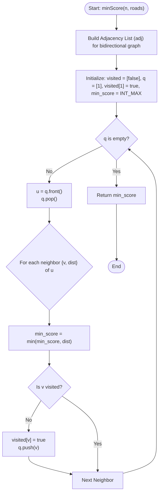

# 💡 Approach — Minimum Score of a Path Between Two Cities

| 📄 [Problem](./Problem.md) | 💡 [Approach](./Approach.md) | 🧩 [Solution](./Solution.cpp) | 🚀 [Main](./Main.cpp) |
|:--------------------------:|:-----------------------------:|:------------------------------:|:---------------------:|

---

## 📊 Metadata

---

## 🎯 Core Insight

> [!TIP]
> **Connected Components and Traversal Freedom**
>
> 1. **Path Arbitrariness:**
>    - Because we are allowed to traverse any road and visit any city **multiple times**, we do not need to find a simple path from `1` to `n`.
>    - If we can reach any city $v$ that has an incident edge with distance $d$, we can walk from `1` to $v$, cross the edge to its neighbor, walk back, and then proceed to `n`.
>
> 2. **Connected Components Rule:**
>    - The problem guarantees at least one path between `1` and `n`, meaning they belong to the same **connected component**.
>    - Thus, the minimum score of a path is simply the **minimum road distance of any road** inside the connected component containing city `1` (and thus `n`).
>    - We can run either Breadth-First Search (BFS), Depth-First Search (DFS), or Union-Find starting from node `1` to find all reachable roads and locate the minimum distance.

---

## 🔩 Step-by-Step Breakdown

**Step 1 — Build the Graph Adjacency List**
- Initialize a list `adj` of size `n + 1`. For each bidirectional road `[u, v, dist]`:
  - Append `{v, dist}` to `adj[u]`.
  - Append `{u, dist}` to `adj[v]`.

**Step 2 — Initialize Search Variables**
- Create a boolean array `visited` of size `n + 1` initialized to `false`.
- Initialize a queue `q` for BFS, push node `1` onto it, and set `visited[1] = true`.
- Initialize `min_score = INT_MAX` to keep track of the minimum edge weight seen.

**Step 3 — Run BFS / Reachability Traversal**
- While `q` is not empty:
  - Dequeue the front node `u`.
  - For each neighbor `{v, dist}` of `u`:
    - Update `min_score = min(min_score, dist)` because this edge is reachable from node `1`.
    - If `v` has not been visited yet:
      - Mark `visited[v] = true`.
      - Push `v` to the queue `q`.

**Step 4 — Return the Minimum Score**
- After the traversal completes, `min_score` will contain the smallest road distance in node 1's component. Return `min_score`.

---

## 🔄 Mermaid Flowchart

---

## 🧮 Dry Run — Example 1

- **Inputs:** `n = 4`, `roads = [[1,2,9],[2,3,6],[2,4,5],[1,4,7]]`
- **Initial state:** `visited = [F, T, F, F, F]`, `q = [1]`, `min_score = INT_MAX`.

1. **Pop `1`:**
   - Neighbors of `1`: `{2, 9}` and `{4, 7}`.
   - For neighbor `{2, 9}`: `min_score = min(INT_MAX, 9) = 9`. `2` not visited $\to$ `visited[2] = T`, `q = [2]`.
   - For neighbor `{4, 7}`: `min_score = min(9, 7) = 7`. `4` not visited $\to$ `visited[4] = T`, `q = [2, 4]`.
2. **Pop `2`:**
   - Neighbors of `2`: `{1, 9}`, `{3, 6}`, `{4, 5}`.
   - `{1, 9}`: `min_score = min(7, 9) = 7`. Already visited.
   - `{3, 6}`: `min_score = min(7, 6) = 6`. `3` not visited $\to$ `visited[3] = T`, `q = [4, 3]`.
   - `{4, 5}`: `min_score = min(6, 5) = 5`. Already visited (in step 1).
3. **Pop `4`:**
   - Neighbors of `4`: `{2, 5}`, `{1, 7}`.
   - Both edges update `min_score` but it remains `5`. Neighbors are already visited.
4. **Pop `3`:**
   - Neighbors of `3`: `{2, 6}`.
   - `min_score` remains `5`. Neighbors are already visited.
- **Queue becomes empty.** Returns `min_score = 5`.

---

## 📊 Complexity Analysis

| Metric | Complexity | Reasoning |
| :---: | :---: | :--- |
| 🕐 Time | $$O(V + E)$$ | In BFS, every reachable node is processed at most once, and every incident edge is checked twice (since the graph is bidirectional). Building the graph takes $O(E)$. |
| 💾 Space | $$O(V + E)$$ | The adjacency list stores $E$ edges across $V$ vertices. The queue and visited array take $O(V)$ space. |

---

> *"The shortest path is not always a straight line; sometimes it requires circling back to find the best way forward."*

---

<h3>Happy Coding! 🚀</h3>

