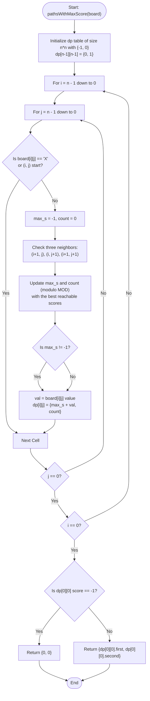

# 💡 Approach — Number of Paths with Max Score

| 📄 [Problem](./Problem.md) | 💡 [Approach](./Approach.md) | 🧩 [Solution](./Solution.cpp) | 🚀 [Main](./Main.cpp) |
|:--------------------------:|:-----------------------------:|:------------------------------:|:---------------------:|

---

## 📊 Metadata

---

## 🎯 Core Insight

> [!TIP]
> **Dynamic Programming on Grid Paths**
>
> 1. **State Definition:**
>    - Let `dp[i][j]` represent a pair `{max_score, path_count}`:
>      - `max_score`: The maximum score achievable to reach cell `(i, j)` starting from `'S'` at the bottom-right `(N-1, N-1)`.
>      - `path_count`: The number of unique paths from `'S'` to `(i, j)` that yield this maximum score.
>
> 2. **Predecessor Transitions:**
>    - Because we are allowed to move **up**, **left**, or **up-left** from any cell:
>      - The predecessors of cell `(i, j)` when traversing from bottom-right to top-left are its bottom neighbor `(i+1, j)`, its right neighbor `(i, j+1)`, and its bottom-right diagonal neighbor `(i+1, j+1)`.
>      - We transition into `(i, j)` by querying these three neighbors. If a neighbor is reachable, we calculate the potential score as `neighbor_score + current_value`.
>      - We choose the maximum score among all valid neighbors and sum their paths if they match the maximum score.
>
> 3. **Modulus:**
>    - All path counts must be calculated modulo $$10^9 + 7$$.

---

## 🔩 Step-by-Step Breakdown

**Step 1 — Initialize Arrays and Offset Variables**
- Set `n = board.size()`, and let `MOD = 1e9 + 7`.
- Create a 2D array `dp` of size `n x n` where each element is a pair `{max_score, path_count}`.
- Initialize all cells to `{-1, 0}` to denote unreachable states.
- Set the base case at the starting cell `dp[n - 1][n - 1] = {0, 1}`.

**Step 2 — Iterate Through the Matrix**
- Run a nested loop with `i` from `n - 1` down to `0` and `j` from `n - 1` down to `0`.
- Skip the start cell `(n - 1, n - 1)` and any obstacles `'X'`.

**Step 3 — Apply Constant Time State Transitions**
- Initialize a local `max_s = -1` and `count = 0`.
- Iterate through the three possible directions `dirs = {{0, 1}, {1, 0}, {1, 1}}` representing down `(i, j+1)`, right `(i+1, j)`, and diagonal-down-right `(i+1, j+1)`:
  - If the neighbor `(ni, nj)` is within bounds and reachable (`dp[ni][nj].max_score != -1`):
    - If `dp[ni][nj].max_score > max_s`:
      - Set `max_s = dp[ni][nj].max_score`.
      - Set `count = dp[ni][nj].path_count`.
    - Else if `dp[ni][nj].max_score == max_s`:
      - Add to `count`: `count = (count + dp[ni][nj].path_count) % MOD`.
- If `max_s != -1` (at least one valid path was found to this cell):
  - Determine the cell value: `val = 0` if `board[i][j] == 'E'`, otherwise `board[i][j] - '0'`.
  - Update `dp[i][j] = {max_s + val, count}`.

**Step 4 — Return the Result**
- If `dp[0][0]` is unreachable (i.e. `dp[0][0].max_score == -1`), return `{0, 0}`.
- Otherwise, return `{dp[0][0].max_score, dp[0][0].path_count}`.

---

## 🔄 Mermaid Flowchart

---

## 🧮 Dry Run — Example 1 ($board = \text{["E23","2X2","12S"]}$)

- **Initial State:**
  - `n = 3`, `MOD = 1e9 + 7`.
  - `dp` initialized with `{-1, 0}`.
  - `dp[2][2] = {0, 1}` (Base case).

- **Grid Loop Highlights:**
  - **At `(2, 1)` ('2'):**
    - Neighbors: `(2, 2)` is reachable with `{0, 1}`.
    - `dp[2][1] = {0 + 2, 1} = {2, 1}`.
  - **At `(2, 0)` ('1'):**
    - Neighbors: `(2, 1)` is reachable with `{2, 1}`.
    - `dp[2][0] = {2 + 1, 1} = {3, 1}`.
  - **At `(1, 2)` ('2'):**
    - Neighbors: `(2, 2)` is reachable with `{0, 1}`.
    - `dp[1][2] = {0 + 2, 1} = {2, 1}`.
  - **At `(1, 1)` ('X'):** Obstacle. Skips.
  - **At `(1, 0)` ('2'):**
    - Neighbors: `(2, 0)` is reachable with `{3, 1}`. `(2, 1)` is reachable with `{2, 1}`.
    - Maximum neighbor score is `3` (from `(2, 0)`).
    - `dp[1][0] = {3 + 2, 1} = {5, 1}`.
  - **At `(0, 2)` ('3'):**
    - Neighbors: `(1, 2)` is reachable with `{2, 1}`.
    - `dp[0][2] = {2 + 3, 1} = {5, 1}`.
  - **At `(0, 1)` ('2'):**
    - Neighbors: `(0, 2)` is reachable with `{5, 1}`. `(1, 2)` is reachable with `{2, 1}`.
    - Maximum neighbor score is `5` (from `(0, 2)`).
    - `dp[0][1] = {5 + 2, 1} = {7, 1}`.
  - **At `(0, 0)` ('E'):**
    - Neighbors: `(0, 1)` reachable with `{7, 1}`. `(1, 0)` reachable with `{5, 1}`.
    - Maximum neighbor score is `7` (from `(0, 1)`).
    - `dp[0][0] = {7 + 0, 1} = {7, 1}`.

- **Final Output:** `[7, 1]`.

---

## 📊 Complexity Analysis

| Metric | Complexity | Reasoning |
| :---: | :---: | :--- |
| 🕐 Time | $$O(N^2)$$ | We visit each cell in the $N \times N$ board exactly once, executing $O(1)$ operations per cell. |
| 💾 Space | $$O(N^2)$$ | We use a 2D dynamic programming array of size $N \times N$ to store the state. |

---

> *"Every obstacle presents a path, but only the optimal choice counts toward the maximum score."*

---

<h3>Happy Coding! 🚀</h3>

