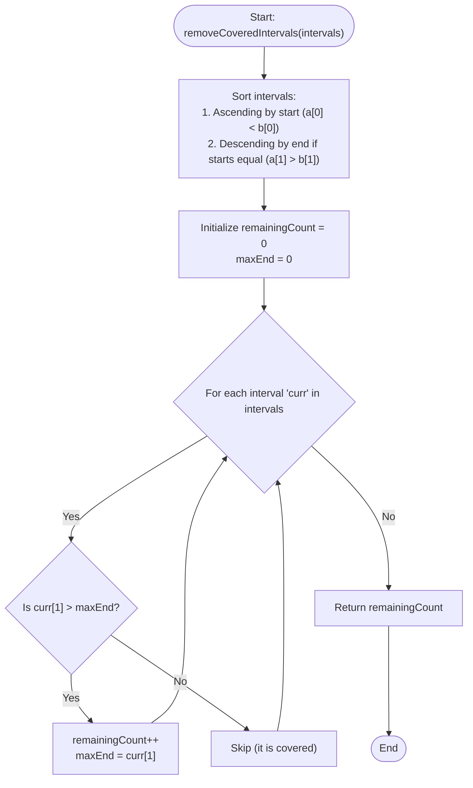

# 💡 Approach — Remove Covered Intervals

| 📄 [Problem](./Problem.md) | 💡 [Approach](./Approach.md) | 🧩 [Solution](./Solution.cpp) | 🚀 [Main](./Main.cpp) |
|:--------------------------:|:-----------------------------:|:------------------------------:|:---------------------:|

---

## 📊 Metadata

---

## 🎯 Core Insight

> [!TIP]
> **Sort-Based Greedy Boundary Tracking**
>
> 1. **Establish Sorting Order:**
>    - Sort the intervals by their start points in **ascending order** ($a[0] < b[0]$).
>    - If two intervals share the same start point, sort them by their end points in **descending order** ($a[1] > b[1]$).
> 
> 2. **Eliminate Containment Decisions:**
>    - Due to the start-time sort, any previously processed interval `prev` will always have `prev[0] <= curr[0]`.
>    - If we process the longer interval first when start points are identical (thanks to descending end points), any subsequent interval starting at the same point will have a smaller or equal end point, meaning it is guaranteed to be covered.
> 
> 3. **Single Scan Filtering:**
>    - Maintain a running `maxEnd` tracking the furthest right bound of any valid interval processed so far.
>    - An interval is covered if and only if its end point is less than or equal to `maxEnd`. If its end point exceeds `maxEnd`, it must be a unique non-covered interval, so we increment our count and update `maxEnd`.

---

## 🔩 Step-by-Step Breakdown

**Step 1 — Sort the Intervals**
- Sort `intervals` using a custom comparator:
  - If `a[0] == b[0]`, return `a[1] > b[1]`.
  - Otherwise, return `a[0] < b[0]`.

**Step 2 — Initialize Counters and Trackers**
- Set `maxEnd = 0` to record the furthest right boundary of any interval selected so far.
- Set `remainingCount = 0` to count intervals that are not covered.

**Step 3 — Iterate and Filter Covered Intervals**
- Loop through each interval `curr` in `intervals`:
  - If `curr[1] > maxEnd` (the current interval extends past our furthest right boundary):
    - It is not covered by any previous interval. Increment `remainingCount`.
    - Update the rightmost boundary: `maxEnd = curr[1]`.
  - Otherwise, `curr[1] <= maxEnd` which implies it is fully covered by a previously processed interval. We skip it.

**Step 4 — Return the Count**
- Return `remainingCount`.

---

## 🔄 Mermaid Flowchart

---

## 🧮 Dry Run — Example 1

- **Inputs:** `intervals = [[1,4],[3,6],[2,8]]`

1. **Sort Step:**
   - Starts are `1`, `3`, `2`. Sorted starts: `1`, `2`, `3`.
   - Sorted `intervals` list: `[[1, 4], [2, 8], [3, 6]]`

2. **Traversal Trace:**

| Iteration | `curr` | `curr[1]` | `maxEnd` | Comparison | Action | `remainingCount` | Updated `maxEnd` |
| :---: | :---: | :---: | :---: | :--- | :--- | :---: | :---: |
| **Initial**| - | - | 0 | - | Initialize trackers | 0 | 0 |
| **1** | `[1, 4]` | 4 | 0 | `4 > 0` | Increment count, update `maxEnd` | 1 | 4 |
| **2** | `[2, 8]` | 8 | 4 | `8 > 4` | Increment count, update `maxEnd` | 2 | 8 |
| **3** | `[3, 6]` | 6 | 8 | `6 <= 8` | Covered interval, skip | 2 | 8 |

- **Final Answer:** `2`.

---

## 📊 Complexity Analysis

| Metric | Complexity | Reasoning |
| :---: | :---: | :--- |
| 🕐 Time | $$O(N \log N)$$ | Sorting the list of $N$ intervals takes $O(N \log N)$ time. The subsequent single scan linear traversal takes $O(N)$ time. |
| 💾 Space | $$O(1)$$ | We use a constant amount of auxiliary memory for tracking boundaries and counting. (Note: Sorting may require $O(\log N)$ or $O(N)$ stack/heap space depending on compiler implementation). |

---

> *"Filter out the redundancies in life so that only what is truly essential remains."*

---

<h3>Happy Coding! 🚀</h3>

