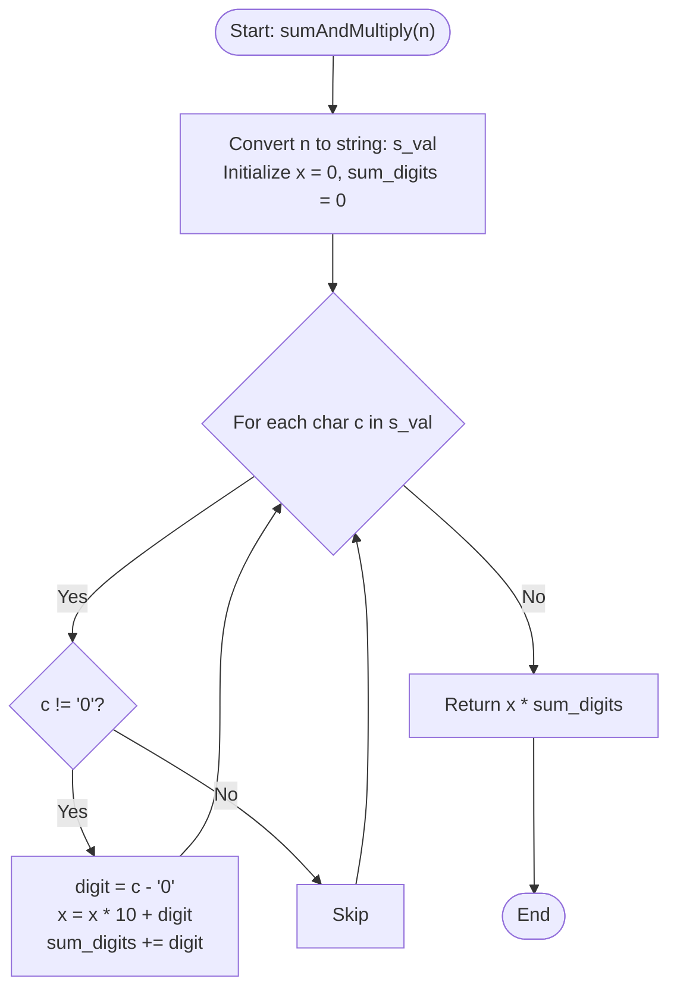

# 💡 Approach — Concatenate Non-Zero Digits and Multiply by Sum I

| 📄 [Problem](./Problem.md) | 💡 [Approach](./Approach.md) | 🧩 [Solution](./Solution.cpp) | 🚀 [Main](./Main.cpp) |
|:--------------------------:|:-----------------------------:|:------------------------------:|:---------------------:|

---

## 📊 Metadata

---

## 🎯 Core Insight

> [!TIP]
> **Left-to-Right Digit Filtering & Reconstruction**
>
> 1. **Traversal Direction:**
>    - Because $x$ needs to retain the original order of digits in $n$, we process $n$ from left to right.
>    - Converting $n$ to a string representation offers a clean, elegant way to traverse digits from most to least significant.
>
> 2. **Building the Number:**
>    - For each non-zero digit, we shift the existing value of $x$ to the left by one decimal place and add the digit:
>      $$x \leftarrow x \times 10 + \text{digit}$$
>    - At the same time, we add the digit to our running sum:
>      $$\text{sum} \leftarrow \text{sum} + \text{digit}$$
>
> 3. **Avoid Overflow:**
>    - Since $n \le 10^9$, the maximum possible value for $x$ is $999,999,999$ (for $n = 999,999,999$).
>    - The product of $x \times \text{sum}$ can be up to $999,999,999 \times 81 \approx 8.1 \times 10^{10}$, which exceeds the 32-bit signed integer limit ($\approx 2 \times 10^9$). Using `long long` for $x$, $\text{sum}$, and the return type is essential.

---

## 🔩 Step-by-Step Breakdown

**Step 1 — String Conversion**
- Convert the integer `n` into a string using `to_string(n)` to easily loop through characters from left to right.
- Initialize `x = 0` and `sum_digits = 0` to store the reconstructed integer and sum of digits respectively.

**Step 2 — Traversal and Filtering**
- Iterate through each character `c` in the string:
  - Check if `c` is not `'0'`.
  - If it's a non-zero digit, convert the character to its numeric value: `digit = c - '0'`.
  - Shift `x` and add the digit: `x = x * 10 + digit`.
  - Add the digit value to our running sum: `sum_digits += digit`.

**Step 3 — Multiply and Return**
- Calculate the final product `x * sum_digits` using 64-bit integer multiplication.
- Return the final result.

---

## 🔄 Mermaid Flowchart

---

## 🧮 Dry Run — Example 1

- **Input:** $n = 10203004$
- **String Conversion:** $s\_val = \text{"10203004"}$

| Iteration | Char `c` | Is Non-Zero? | Action | `x` | `sum_digits` |
| :---: | :---: | :---: | :--- | :---: | :---: |
| Initial | - | - | Initialize variables | 0 | 0 |
| 1 | `'1'` | Yes | `x = 0*10 + 1 = 1`, `sum_digits = 0 + 1 = 1` | 1 | 1 |
| 2 | `'0'` | No | Skip | 1 | 1 |
| 3 | `'2'` | Yes | `x = 1*10 + 2 = 12`, `sum_digits = 1 + 2 = 3` | 12 | 3 |
| 4 | `'0'` | No | Skip | 12 | 3 |
| 5 | `'3'` | Yes | `x = 12*10 + 3 = 123`, `sum_digits = 3 + 3 = 6` | 123 | 6 |
| 6 | `'0'` | No | Skip | 123 | 6 |
| 7 | `'0'` | No | Skip | 123 | 6 |
| 8 | `'4'` | Yes | `x = 123*10 + 4 = 1234`, `sum_digits = 6 + 4 = 10` | 1234 | 10 |

- **Final Calculation:** `x * sum_digits` = $1234 \times 10 = 12340$

---

## 📊 Complexity Analysis

| Metric | Complexity | Reasoning |
| :---: | :---: | :--- |
| 🕐 Time | $$O(\log_{10} n)$$ | The number of digits in $n$ is proportional to $\log_{10} n$. We loop through these digits exactly once. |
| 💾 Space | $$O(\log_{10} n)$$ | We store the string representation of $n$, which uses memory proportional to the number of digits in $n$. |

---

> *"Every digit counts, but only the non-zero ones shape our final sum."*

---

<h3>Happy Coding! 🚀</h3>

