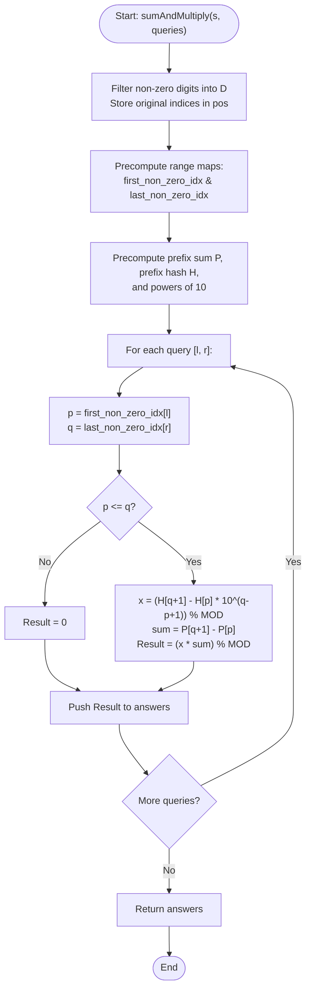

# 💡 Approach — Concatenate Non-Zero Digits and Multiply by Sum II

| 📄 [Problem](./Problem.md) | 💡 [Approach](./Approach.md) | 🧩 [Solution](./Solution.cpp) | 🚀 [Main](./Main.cpp) |
|:--------------------------:|:-----------------------------:|:------------------------------:|:---------------------:|

---

## 📊 Metadata

---

## 🎯 Core Insight

> [!TIP]
> **Prefix Hash & Prefix Sum (O(1) Range Queries)**
>
> 1. **Isolate Non-Zero Digits:**
>    - Let $D$ be the array of only the non-zero digits in $s$.
>    - For any query range `[l, r]`, the non-zero digits falling inside this range form a contiguous subarray $D[p..q]$.
> 
> 2. **Efficient Range Localization:**
>    - Precompute `first_non_zero_idx[i]`: the index in $D$ of the first non-zero digit at or after $i$.
>    - Precompute `last_non_zero_idx[i]`: the index in $D$ of the last non-zero digit at or before $i$.
>    - For a query `[l, r]`, $p = \text{first\_non\_zero\_idx}[l]$ and $q = \text{last\_non\_zero\_idx}[r]$. If $p > q$, the substring has no non-zero digits (result is 0).
> 
> 3. **Rolling Hash / Concatenation Formula:**
>    - Compute the concatenated number $x$ of $D[p..q]$ using a prefix rolling hash array $H$:
>      $$x = (H[q+1] - H[p] \cdot 10^{q - p + 1}) \pmod{10^9+7}$$
>    - Compute the digit sum using standard prefix sums $P$:
>      $$\text{sum} = P[q+1] - P[p]$$
>    - The answer is $(x \cdot \text{sum}) \pmod{10^9+7}$.

---

## 🔩 Step-by-Step Breakdown

**Step 1 — Non-Zero Digits and Indices Filtering**
- Iterate through the string `s`.
- Save all digits other than `'0'` in a vector `D`.
- Save their original indices in `pos` to assist boundary mappings.

**Step 2 — Prefix Sum and Hash Precomputation**
- Construct the prefix sum array `P` and prefix rolling hash array `H` of `D`:
  - $P[i+1] = P[i] + D[i]$
  - $H[i+1] = (H[i] \cdot 10 + D[i]) \pmod{10^9+7}$
- Precompute the powers of 10 modulo $10^9+7$ to perform range shifts in $O(1)$ time.

**Step 3 — Query Range Mapping**
- Build mapping arrays `first_non_zero_idx` and `last_non_zero_idx` of size $m$:
  - `first_non_zero_idx[i]` tells us the index in `D` of the first non-zero character on or to the right of `i`.
  - `last_non_zero_idx[i]` tells us the index in `D` of the last non-zero character on or to the left of `i`.

**Step 4 — Constant-Time Query Evaluation**
- For each query `[l, r]`, obtain the indices $p$ and $q$ in $D$.
- If $p > q$, no non-zero digits are in the range, return `0`.
- Else, calculate $x = (H[q+1] - H[p] \cdot 10^{q - p + 1}) \pmod{10^9+7}$ (making sure to handle negative modulo subtraction in C++ by adding MOD).
- Calculate the digit sum $sum = P[q+1] - P[p]$.
- Store $(x \cdot sum) \pmod{10^9+7}$ as the answer for this query.

---

## 🔄 Mermaid Flowchart

---

## 📊 Complexity Analysis

| Metric | Complexity | Reasoning |
| :---: | :---: | :--- |
| 🕐 Time | $$O(m + q)$$ | $O(m)$ preprocessing for prefix arrays and index mappings, followed by $O(1)$ range evaluations per query. |
| 💾 Space | $$O(m)$$ | Space used to store prefix arrays, powers of 10, and range mapping arrays. |

---

> *"By mapping the complex to the structured, we transform exponential queries into constant time steps."*

---

<h3>Happy Coding! 🚀</h3>

