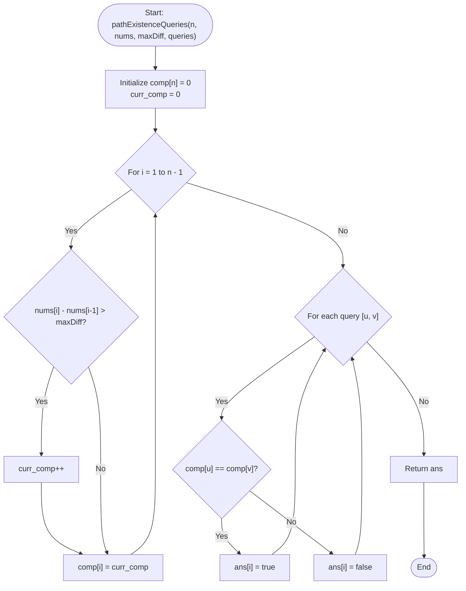

# 💡 Approach — Path Existence Queries in a Graph I

| 📄 [Problem](./Problem.md) | 💡 [Approach](./Approach.md) | 🧩 [Solution](./Solution.cpp) | 🚀 [Main](./Main.cpp) |
|:--------------------------:|:-----------------------------:|:------------------------------:|:---------------------:|

---

## 📊 Metadata

---

## 🎯 Core Insight

> [!TIP]
> **Component Grouping via Contiguous Connectivity**
>
> 1. **Sorted Ordering Property:**
>    - Since `nums` is sorted in non-decreasing order, the absolute difference between any two elements `nums[i]` and `nums[j]` ($i < j$) is simply $nums[j] - nums[i]$.
>    - An edge exists between $i$ and $j$ if and only if $nums[j] - nums[i] \le maxDiff$.
>
> 2. **Interval-Based Connected Components:**
>    - If an edge exists between $i$ and $j$ ($i < j$), then for any intermediate node $k$ ($i < k \le j$), the adjacent difference $nums[k] - nums[k-1]$ must also be $\le maxDiff$ (since all differences are non-negative and sum to $nums[j] - nums[i] \le maxDiff$).
>    - This implies that if any path exists between $u$ and $v$, they must be connected through a chain of adjacent edges.
>    - Therefore, the graph's connected components form contiguous intervals of indices.
>    - A boundary between two components occurs at index $i$ if $nums[i] - nums[i-1] > maxDiff$.
>
> 3. **Linear Time Labeling:**
>    - We can label each node with a component ID in a single pass.
>    - Nodes $u$ and $v$ have a path between them if and only if they belong to the same component (i.e., `comp[u] == comp[v]`).

---

## 🔩 Step-by-Step Breakdown

**Step 1: Component Labels Initialization**
- Create an array/vector `comp` of size $n$, initialized to `0` for the first element.
- Maintain a counter `curr_comp = 0` to assign component IDs.

**Step 2: Contiguous Grouping Pass**
- Traverse the array `nums` from index `1` to `n - 1`:
  - Check if the difference between current element and previous element exceeds `maxDiff`: `nums[i] - nums[i-1] > maxDiff`.
  - If yes, increment `curr_comp` to mark the start of a new connected component.
  - Assign `comp[i] = curr_comp`.

**Step 3: Query Processing**
- Initialize a boolean result vector `ans` of size equal to `queries.size()`.
- For each query `queries[i] = [u, v]`:
  - Check if `comp[u] == comp[v]`.
  - Set `ans[i]` to `true` if equal, else `false`.
- Return the `ans` vector.

---

## 🔄 Mermaid Flowchart

---

## 🧮 Dry Run — Example 2

- **Input:** `n = 4`, `nums = [2, 5, 6, 8]`, `maxDiff = 2`, `queries = [[0, 1], [0, 2], [1, 3], [2, 3]]`

### Component Labeling Phase
- `comp[0] = 0`
- `i = 1`: `nums[1] - nums[0] = 5 - 2 = 3 > 2` $\rightarrow$ `curr_comp = 1`, `comp[1] = 1`
- `i = 2`: `nums[2] - nums[1] = 6 - 5 = 1 <= 2` $\rightarrow$ `comp[2] = 1`
- `i = 3`: `nums[3] - nums[2] = 8 - 6 = 2 <= 2` $\rightarrow$ `comp[3] = 1`

**Final Component Labels:** `comp = [0, 1, 1, 1]`

### Query Processing Phase
- Query `[0, 1]`: `comp[0] == comp[1]` $\rightarrow$ `0 == 1` (False) $\rightarrow$ `false`
- Query `[0, 2]`: `comp[0] == comp[2]` $\rightarrow$ `0 == 1` (False) $\rightarrow$ `false`
- Query `[1, 3]`: `comp[1] == comp[3]` $\rightarrow$ `1 == 1` (True) $\rightarrow$ `true`
- Query `[2, 3]`: `comp[2] == comp[3]` $\rightarrow$ `1 == 1` (True) $\rightarrow$ `true`

- **Output:** `[false, false, true, true]`

---

## 📊 Complexity Analysis

| Metric | Complexity | Reasoning |
| :---: | :---: | :--- |
| 🕐 Time | $$O(n + q)$$ | Single $O(n)$ pass to construct component IDs and $O(1)$ lookup for each of the $q$ queries. |
| 💾 Space | $$O(n)$$ | Auxiliary space used by the `comp` array to store component labels. |

---

> *"By sorting the graph by values, we group the nodes: the path to connectivity is simplified down to intervals."*

---

<h3>Happy Coding! 🚀</h3>

