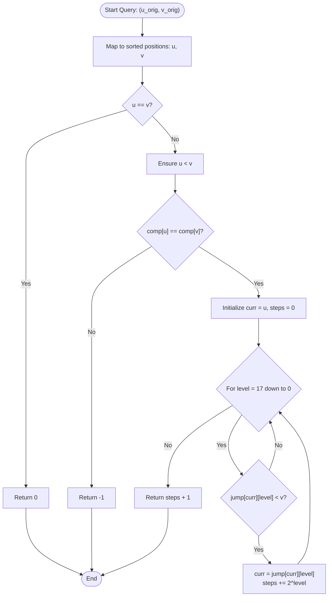

# 💡 Approach — Path Existence Queries in a Graph II

| 📄 [Problem](./Problem.md) | 💡 [Approach](./Approach.md) | 🧩 [Solution](./Solution.cpp) | 🚀 [Main](./Main.cpp) |
|:--------------------------:|:-----------------------------:|:------------------------------:|:---------------------:|

---

## 📊 Metadata

---

## 🎯 Core Insight

> [!TIP]
> **Greedy Monotonic Jumps & Binary Lifting**
>
> 1. **Graph Simplification by Sorting:**
>    - Because edges exist between nodes $i$ and $j$ if $|nums[i] - nums[j]| \le maxDiff$, sorting the values of the nodes creates a sequence of ordered values $v_0 \le v_1 \le \dots \le v_{n-1}$.
>    - This simplifies traversal. If we want to reach a larger value from a smaller value, we can always jump to the right (towards larger values).
>
> 2. **Connected Components:**
>    - If there is any gap where $v_i - v_{i-1} > maxDiff$, no edge can cross this gap. The graph is split into isolated components.
>    - We precompute component labels: if $u$ and $v$ have different component labels, they are disconnected (distance is $-1$).
>
> 3. **Greedy Traversal (Binary Lifting):**
>    - To minimize the number of steps (unweighted shortest path) from $u$ to $v$ (where $u < v$ in sorted indices), we should greedily jump to the furthest possible node to the right in each step.
>    - Simulating this jump-by-jump takes $O(n)$ time per query.
>    - By precomputing a binary lifting jump table `jump[i][level]` (where `jump[i][level]` is the index reached in $2^{level}$ greedy jumps from $i$), we can jump across the sorted array in $O(\log n)$ time.

---

## 🔩 Step-by-Step Breakdown

**Step 1: Sorting and Index Mapping**
- Create a list of pairs `{nums[i], i}` and sort it in non-decreasing order.
- Store the sorted values in `sortedNums` and build `indexMap` to map original indices to sorted positions.

**Step 2: Precomputing Component Labels**
- Iterate through `sortedNums`. Increment the component ID whenever `sortedNums[i] - sortedNums[i-1] > maxDiff`. Store these IDs in a `comp` array.

**Step 3: Precomputing Binary Lifting Jump Table**
- Initialize a two-pointer variable `right = 0`. For each index `i`, increment `right` as long as `sortedNums[right+1] - sortedNums[i] <= maxDiff`.
- Set `jump[i][0] = right` as the furthest single step reachable.
- Precompute the higher-level jump pointers: `jump[i][level] = jump[jump[i][level - 1]][level - 1]`.

**Step 4: Answering Queries with Binary Lifting**
- For each query `[ui, vi]`, obtain their sorted indices $u = indexMap[ui]$ and $v = indexMap[vi]$.
- If $u == v$, the distance is $0$.
- Ensure $u < v$ by swapping if necessary. If `comp[u] != comp[v]`, return $-1$.
- Perform binary lifting: starting at `curr = u`, try to jump using powers of $2$ from $17$ down to $0$. If `jump[curr][level] < v`, update `curr = jump[curr][level]` and add $2^{level}$ to `steps`.
- Once the loop finishes, we are at the furthest possible index `curr` that is still $< v$. Since they are in the same component, one more single step from `curr` will reach/exceed $v$. Return `steps + 1`.

---

## 🔄 Mermaid Flowchart

---

## 🧮 Dry Run — Example 2

- **Input:** `nums = [5, 3, 1, 9, 10]`, `maxDiff = 2`
- **Sorted Values:** `[1, 3, 5, 9, 10]` at indices `[0, 1, 2, 3, 4]`
- **Components:** `comp = [0, 0, 0, 1, 1]`
- **Base Jumps:** `jump[i][0] = [1, 2, 2, 4, 4]`

| Query | Original $u_{orig}, v_{orig}$ | Sorted $u, v$ | Component Match | Binary Lifting Process | Steps + 1 | Result |
|:---:|:---:|:---:|:---:|:---|:---:|:---:|
| **#1** | $0, 1$ | $1, 2$ | Yes (`0 == 0`) | `jump[1][level]` is always $\ge 2$. No jump taken. | $0 + 1$ | **1** |
| **#2** | $0, 2$ | $0, 2$ | Yes (`0 == 0`) | `level = 0`: `jump[0][0] = 1 < 2` $\to$ `curr = 1`, `steps = 1`. | $1 + 1$ | **2** |
| **#3** | $2, 3$ | $0, 3$ | No (`0 != 1`) | Disconnected components. | — | **-1** |
| **#4** | $4, 3$ | $3, 4$ | Yes (`1 == 1`) | `jump[3][level]` is always $\ge 4$. No jump taken. | $0 + 1$ | **1** |

---

## 📊 Complexity Analysis

| Metric | Complexity | Reasoning |
| :---: | :---: | :--- |
| 🕐 Time | $$O((n + q) \log n)$$ | Precomputation takes $O(n \log n)$ due to sorting and jump table construction. Each of the $q$ queries takes $O(\log n)$ using binary lifting. |
| 💾 Space | $$O(n \log n)$$ | Storing the jump table of dimensions $n \times 18$ requires $O(n \log n)$ auxiliary space. |

---

> *"In graph theory, jumping by powers of two is like using a warp drive: it shrinks linear searches into lightning-fast hops."*

---

<h3>Happy Coding! 🚀</h3>

