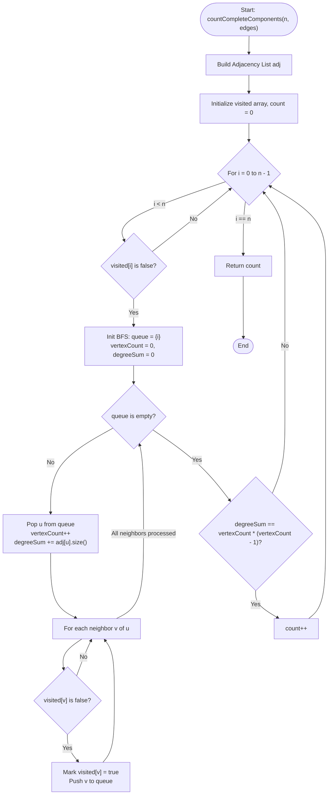

# 💡 Approach — Count the Number of Complete Components

| 📄 [Problem](./Problem.md) | 💡 [Approach](./Approach.md) | 🧩 [Solution](./Solution.cpp) | 🚀 [Main](./Main.cpp) |
|:--------------------------:|:-----------------------------:|:------------------------------:|:---------------------:|

---

## 📊 Metadata

---

## 🎯 Core Insight

> [!TIP]
> **Complete Components Check via Vertex Degrees**
>
> 1. **Complete Connected Components:**
>    - A connected component is a maximal set of vertices such that there is a path between any two.
>    - A connected component of size $V$ is **complete** (a clique) if every pair of vertices shares an edge. This means the component contains exactly $E = \frac{V(V-1)}{2}$ edges.
> 2. **Degree Sum Identity:**
>    - By the Handshaking Lemma, the sum of the degrees of all vertices in a component is equal to $2 \times E$.
>    - Therefore, a component of size $V$ is complete if and only if the sum of the degrees of its vertices is exactly $V(V-1)$.
> 3. **Traversal Strategy:**
>    - Use Breadth-First Search (BFS) or Depth-First Search (DFS) to identify connected components. 
>    - For each component, count the number of nodes ($V$) and sum up their degrees in the adjacency list.
>    - If the sum matches $V(V-1)$, the component is complete.

---

## 🔩 Step-by-Step Breakdown

**Step 1: Build Adjacency List**
- Construct an adjacency list `adj` for the undirected graph from the given `edges` array.

**Step 2: Traverse Graph using BFS/DFS**
- Maintain a boolean `visited` array to keep track of visited nodes.
- Loop through each node $i$ from $0$ to $n - 1$:
  - If node $i$ has not been visited, start a BFS to explore its entire component.
  - Maintain `vertexCount` (number of nodes in the component) and `degreeSum` (sum of degrees of all nodes in this component).
  - Pop nodes from the queue, increment `vertexCount`, and add `adj[u].size()` to `degreeSum`.
  - Push all unvisited neighbors to the queue and mark them as visited.

**Step 3: Check Completeness Condition**
- Once a component is fully traversed, check if:
  $$\text{degreeSum} == \text{vertexCount} \times (\text{vertexCount} - 1)$$
- If the condition is met, increment the `completeComponentsCount`.

**Step 4: Return Result**
- Return the final value of `completeComponentsCount`.

---

## 🔄 Mermaid Flowchart

---

## 🧮 Dry Run — Example 2

- **Input:** `n = 6`, `edges = [[0,1],[0,2],[1,2],[3,4],[3,5]]`
- **Adjacency Degrees:** `deg(0)=2, deg(1)=2, deg(2)=2, deg(3)=2, deg(4)=1, deg(5)=1`

| Node $i$ | Traversal Status | Component Nodes | `vertexCount` ($V$) | `degreeSum` ($S$) | Completeness Check ($S == V(V-1)$) | Complete Component Count |
|:---:|:---|:---|:---:|:---:|:---|:---:|
| **0** | Not Visited | `{0, 1, 2}` | 3 | $2+2+2 = 6$ | $6 == 3 \times 2$ (True) | **1** |
| **1** | Visited | — | — | — | — | 1 |
| **2** | Visited | — | — | — | — | 1 |
| **3** | Not Visited | `{3, 4, 5}` | 3 | $2+1+1 = 4$ | $4 == 3 \times 2$ (False) | 1 |
| **4** | Visited | — | — | — | — | 1 |
| **5** | Visited | — | — | — | — | 1 |

- **Output:** `1`

---

## 📊 Complexity Analysis

| Metric | Complexity | Reasoning |
| :---: | :---: | :--- |
| 🕐 Time | $$O(V + E)$$ | Standard graph traversal (BFS) checks every vertex and edge once. |
| 💾 Space | $$O(V + E)$$ | The adjacency list stores $V$ vertices and $2E$ directed edge entries. |

---

> *"In the search for completeness, we find that harmony is achieved when every connection is fully realized."*

---

<h3>Happy Coding! 🚀</h3>

