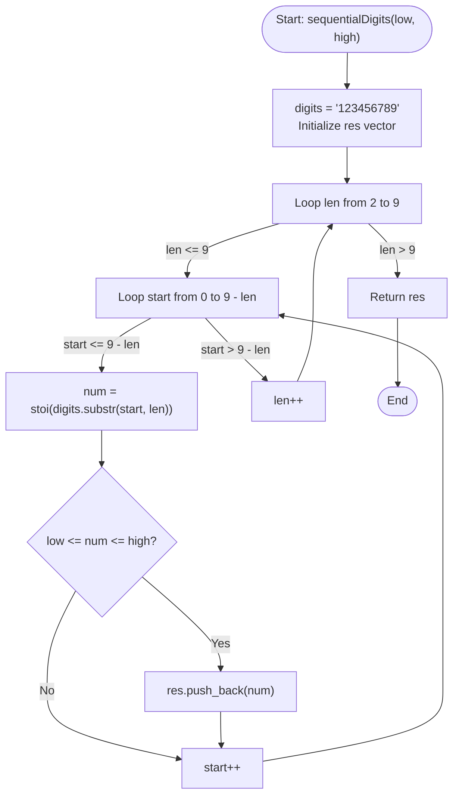

# 💡 Approach — Sequential Digits

| 📄 [Problem](./Problem.md) | 💡 [Approach](./Approach.md) | 🧩 [Solution](./Solution.cpp) | 🚀 [Main](./Main.cpp) |
|:--------------------------:|:-----------------------------:|:------------------------------:|:---------------------:|

---

## 📊 Metadata

---

## 🎯 Core Insight

> [!TIP]
> **Candidate Generation via Sliding Window**
>
> 1. **Extremely Small Domain:** The maximum value of `high` is $10^9$ (10 digits). Since the digits in sequential numbers must strictly increase, the length of valid numbers can only range from $2$ to $9$ (e.g. $12$ to $123456789$).
> 2. **Predefined Candidates:** In total, there are only 36 possible numbers with sequential digits across all lengths:
>    - Length 2: $12, 23, \dots, 89$ (8 candidates)
>    - Length 3: $123, 234, \dots, 789$ (7 candidates)
>    - ...
>    - Length 9: $123456789$ (1 candidate)
> 3. **Sliding Window:** We can slide a window of length `len` (from $2$ to $9$) over the template string `"123456789"`.
> 4. **Natural Sorting:** By generating candidates with length increasing from 2 to 9, and sliding left-to-right (starting digit 1 to 9), the candidate list is generated in strictly sorted order. Thus, we require **no sorting** at the end.

---

## 🔩 Step-by-Step Breakdown

**Step 1: Iterate over Candidates' Lengths**
- Let the template string be `digits = "123456789"`.
- Loop candidate length `len` from `2` to `9`.

**Step 2: Slide Window for Each Starting Index**
- For a fixed length `len`, the window can start at index `start` from `0` to `9 - len`.
- Extract the substring of length `len` starting at index `start` using `digits.substr(start, len)`.

**Step 3: Verify Range & Accumulate**
- Convert the extracted substring to an integer using `std::stoi`.
- Check if `num` is within the range `[low, high]`.
- If `num >= low && num <= high`, append it to the result list `res`.

---

## 🔄 Mermaid Flowchart

---

## 🧮 Dry Run — Example 1

- **Input:** `low = 100`, `high = 300`
- **Candidate Generation:**
  - `len = 2`:
    - Candidates: `12, 23, 34, 45, 56, 67, 78, 89`. None in range `[100, 300]`.
  - `len = 3`:
    - `start = 0` $\implies$ `123`. `low <= 123 <= high` $\implies$ Add `123`.
    - `start = 1` $\implies$ `234`. `low <= 234 <= high` $\implies$ Add `234`.
    - `start = 2` $\implies$ `345`. Exceeds `high` $\implies$ Ignore.
    - Other starts (`456, 567, ...`) exceed `high` $\implies$ Ignore.
  - `len >= 4`: All exceed `high` $\implies$ Ignore.
- **Result:** `[123, 234]`.

---

## 📊 Complexity Analysis

| Metric | Complexity | Reasoning |
| :---: | :---: | :--- |
| 🕐 Time | $$O(1)$$ | The total number of sequential numbers is constant (at most 36 candidates). Thus, the loops run a fixed number of times regardless of `low` and `high`. |
| 💾 Space | $$O(1)$$ | The auxiliary space is constant since we only use a few loop indices and substring extractions. |

---

> *"Systematic generation is always more elegant than brute-force filtering."*

---

<h3>Happy Coding! 🚀</h3>

