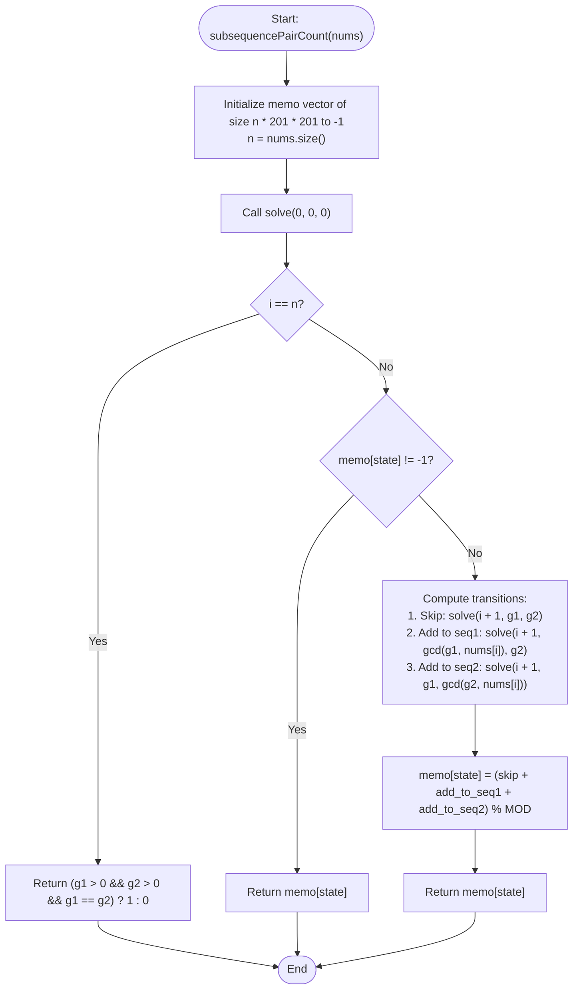

# 💡 Approach — Find the Number of Subsequences With Equal GCD

| 📄 [Problem](./Problem.md) | 💡 [Approach](./Approach.md) | 🧩 [Solution](./Solution.cpp) | 🚀 [Main](./Main.cpp) |
|:--------------------------:|:-----------------------------:|:------------------------------:|:---------------------:|

---

## 📊 Metadata

---

## 🎯 Core Insight

> [!TIP]
> **3D State Space Memoization**
>
> 1. **Bounded State Space:**
>    - The input constraints are $N \le 200$ and $nums[i] \le 200$. 
>    - This implies that the Greatest Common Divisor (GCD) of any subset of elements will never exceed $200$. Thus, $g1$ and $g2$ are always bounded by $200$.
>
> 2. **State Representation:**
>    - Let $dp(i, g1, g2)$ represent the number of ways to form two disjoint subsequences from the suffix starting at index $i$, where the current GCD of subsequence 1 is $g1$ and subsequence 2 is $g2$ (using $0$ to indicate an empty subsequence).
>
> 3. **Disjoint Choices:**
>    - For each element $nums[i]$, we have three choices:
>      1. **Skip:** Do not include $nums[i]$ in either subsequence $\implies dp(i+1, g1, g2)$.
>      2. **Add to Subsequence 1:** $dp(i+1, \text{gcd}(g1, nums[i]), g2)$.
>      3. **Add to Subsequence 2:** $dp(i+1, g1, \text{gcd}(g2, nums[i]))$.
>
> 4. **Flat Memoization Array:**
>    - Multi-dimensional vector allocations have significant pointer overhead. To optimize speed, we flatten the memoization table into a 1D vector of size $N \times 201 \times 201$.

---

## 🔩 Step-by-Step Breakdown

**Step 1: Initialize Memoization Table**
- Allocate a flat 1D vector `memo` of size $n \times 201 \times 201$, initialized to `-1`.

**Step 2: Recursive DP with Memoization**
- For each state $(i, g1, g2)$:
  - **Base Case:** If $i == n$, both subsequences must be non-empty and have the same GCD. Return $1$ if $g1 == g2$ and $g1 > 0$, else return $0$.
  - **Cache Hit:** If `memo[state] != -1`, return the cached value.
  - **Transitions:** Combine the results of the three disjoint choices:
    - `skip = solve(i + 1, g1, g2)`
    - `add_to_seq1 = solve(i + 1, gcd(g1, nums[i]), g2)`
    - `add_to_seq2 = solve(i + 1, g1, gcd(g2, nums[i]))`
  - Take the sum modulo $10^9 + 7$ and store it in `memo[state]`.

**Step 3: Start and Return**
- Initiate the recursion with `solve(0, 0, 0, nums)` and return the result.

---

## 🔄 Mermaid Flowchart

---

## 📊 Complexity Analysis

| Metric | Complexity | Reasoning |
| :---: | :---: | :--- |
| 🕐 Time | $$O(n \cdot M^2)$$ | There are $$n \cdot 201 \cdot 201$$ states. For each state, we perform a constant number of transitions, computing the GCD in $$O(\log M)$$ time. Using `std::gcd` on small inputs runs in negligible time. |
| 💾 Space | $$O(n \cdot M^2)$$ | The flat `memo` vector requires $$n \times 201 \times 201$$ integers. The call stack depth is bounded by $$n$$. |

---

> *"Complex structures are built from the simplest divisions. By mapping each choice to its independent state, we uncover the hidden harmony of numbers."*

---

<h3>Happy Coding! 🚀</h3>

