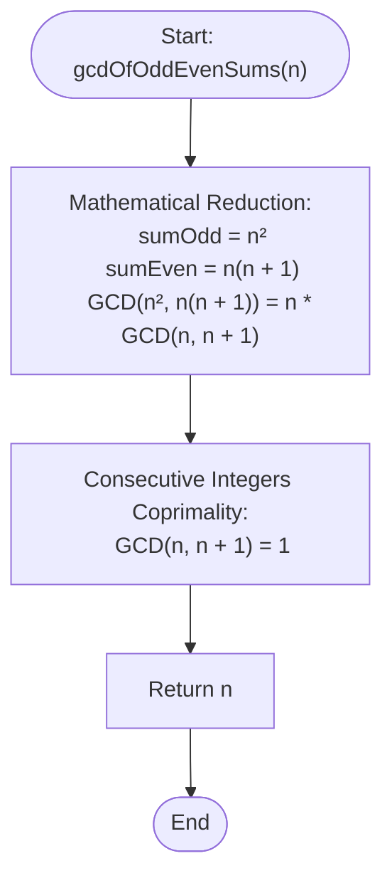

# 💡 Approach — GCD of Odd and Even Sums

| 📄 [Problem](./Problem.md) | 💡 [Approach](./Approach.md) | 🧩 [Solution](./Solution.cpp) | 🚀 [Main](./Main.cpp) |
|:--------------------------:|:-----------------------------:|:------------------------------:|:---------------------:|

---

## 📊 Metadata

---

## 🎯 Core Insight

> [!TIP]
> **Mathematical Reduction via Coprimality**
>
> 1. **Formula for Odd Sum:**
>    - The sum of the first $n$ odd positive integers is:
>      $$\text{sumOdd} = 1 + 3 + 5 + \dots + (2n-1) = n^2$$
>
> 2. **Formula for Even Sum:**
>    - The sum of the first $n$ even positive integers is:
>      $$\text{sumEven} = 2 + 4 + 6 + \dots + 2n = n(n+1)$$
>
> 3. **Algebraic Simplification:**
>    - We are asked to compute:
>      $$\text{GCD}(\text{sumOdd}, \text{sumEven}) = \text{GCD}(n^2, n(n+1))$$
>    - Using the GCD distributive property:
>      $$\text{GCD}(n^2, n(n+1)) = n \cdot \text{GCD}(n, n+1)$$
>    - Because $n$ and $n+1$ are consecutive positive integers, they are **coprime** ($\text{GCD}(n, n+1) = 1$).
>    - Therefore, the expression simplifies directly to:
>      $$\text{GCD}(n^2, n(n+1)) = n \cdot 1 = n$$
>    - Hence, the greatest common divisor is always $n$.

---

## 🔩 Step-by-Step Breakdown

**Step 1: Simplify Mathematically**

- Establish that $\text{sumOdd} = n^2$ and $\text{sumEven} = n(n+1)$.

**Step 2: Apply Coprimality**

- Recognize that consecutive numbers $n$ and $n+1$ always have a greatest common divisor of $1$.

**Step 3: Return Result**

- Return $n$ directly, bypassing any sequential addition or division cycles.

---

## 🔄 Mermaid Flowchart

---

## 📊 Complexity Analysis

| Metric | Complexity | Reasoning |
| :---: | :---: | :--- |
| 🕐 Time | $$O(1)$$ | The result is obtained directly in constant time by returning $n$. |
| 💾 Space | $$O(1)$$ | No auxiliary memory is allocated. |

---

> *"Mathematics is the language in which God has written the universe. By simplifying the equations of nature, the most daunting tasks yield to the simplest truths."*

---

<h3>Happy Coding! 🚀</h3>

