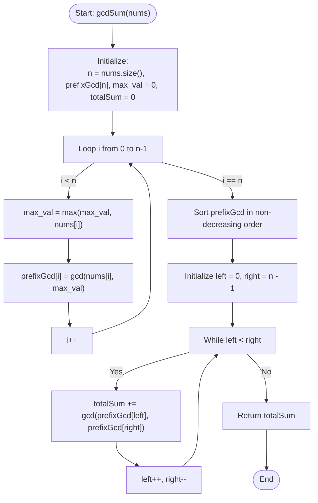

# 💡 Approach — Sum of GCD of Formed Pairs

| 📄 [Problem](./Problem.md) | 💡 [Approach](./Approach.md) | 🧩 [Solution](./Solution.cpp) | 🚀 [Main](./Main.cpp) |
|:--------------------------:|:-----------------------------:|:------------------------------:|:---------------------:|

---

## 📊 Metadata

---

## 🎯 Core Insight

> [!TIP]
> **Greedy Pairing with Sorting and Two Pointers**
> 
> The problem asks us to pair elements of a modified array `prefixGcd` by matching the smallest available element with the largest available element. This pairing strategy is naturally solved using sorting and the two-pointer technique:
> 
> 1. **Prefix Max and GCD:** 
>    - First, we construct the `prefixGcd` array. As we traverse `nums`, we keep track of the maximum element seen so far (`max_val`) and calculate `gcd(nums[i], max_val)`.
> 
> 2. **Sorting for Order:**
>    - Sorting the `prefixGcd` array allows us to quickly access the smallest and largest unpaired elements from the two ends of the array.
> 
> 3. **Two-Pointer Pairing:**
>    - Initialize two pointers: `left = 0` and `right = n - 1`.
>    - In each step, we pair `prefixGcd[left]` and `prefixGcd[right]`, compute their GCD, add it to our sum, and move the pointers inward (`left++`, `right--`).
>    - If the number of elements `n` is odd, the middle element at index `n / 2` will remain unpaired because `left` and `right` will meet at the same element and the loop `while (left < right)` will terminate. This correctly ignores the unpaired middle element.

---

## 🔩 Step-by-Step Breakdown

**Step 1: Initialize helper variables**
- Get the size `n` of the input array `nums`.
- Initialize `prefixGcd` array of size `n` to store the calculated GCDs.
- Initialize `max_val` to `0` to keep track of the running prefix maximum.

**Step 2: Construct the prefixGcd array**
- Traverse the array `nums` from index `0` to `n - 1`:
  - Update `max_val = max(max_val, nums[i])`.
  - Compute `prefixGcd[i] = gcd(nums[i], max_val)` using a custom Euclidean GCD algorithm.

**Step 3: Sort the prefixGcd array**
- Sort the `prefixGcd` array in non-decreasing order to organize elements from smallest to largest.

**Step 4: Pair elements and sum their GCDs**
- Set `totalSum = 0`.
- Initialize pointers `left = 0` and `right = n - 1`.
- While `left < right`:
  - Compute `gcd(prefixGcd[left], prefixGcd[right])` and add it to `totalSum`.
  - Advance `left` and decrement `right` to move to the next pair.
- Return `totalSum`.

---

## 🔄 Mermaid Flowchart

---

## 🧮 Dry Run — Example 1

- **Input:** `nums = [2, 6, 4]`

### 1. Construct `prefixGcd`
- `i = 0`: `nums[0] = 2`, `max_val = 2` $\implies$ `prefixGcd[0] = gcd(2, 2) = 2`
- `i = 1`: `nums[1] = 6`, `max_val = 6` $\implies$ `prefixGcd[1] = gcd(6, 6) = 6`
- `i = 2`: `nums[2] = 4`, `max_val = 6` $\implies$ `prefixGcd[2] = gcd(4, 6) = 2`
- Resulting `prefixGcd = [2, 6, 2]`

### 2. Sort `prefixGcd`
- Sorted `prefixGcd = [2, 2, 6]`

### 3. Pairing
- `left = 0`, `right = 2` (`prefixGcd[left] = 2`, `prefixGcd[right] = 6`)
  - `left < right` is true.
  - `totalSum += gcd(2, 6) = 2`. `totalSum = 2`.
  - `left++` (1), `right--` (1).
- `left = 1`, `right = 1`
  - `left < right` is false. Loop terminates.
  - Middle element at index `1` (which is `2`) is ignored.

**Final Sum:** `2`.

---

## 📊 Complexity Analysis

| Metric | Complexity | Reasoning |
| :---: | :---: | :--- |
| 🕐 Time | $$O(n \log n + n \log(\max(nums)))$$ | Constructing `prefixGcd` takes $O(n \log(\max(nums)))$ due to the GCD calculation on each element. Sorting `prefixGcd` takes $O(n \log n)$ time. The two-pointer traversal takes $O(n \log(\max(nums)))$ time. Thus, the total time complexity is bounded by $O(n \log n + n \log(\max(nums)))$. |
| 💾 Space | $$O(n)$$ | We allocate an auxiliary vector of size $n$ to store the `prefixGcd` values. |

---

> *"Pairs are formed from the extremes, but their true alignment is found in the common ground of division."*

---

<h3>Happy Coding! 🚀</h3>

