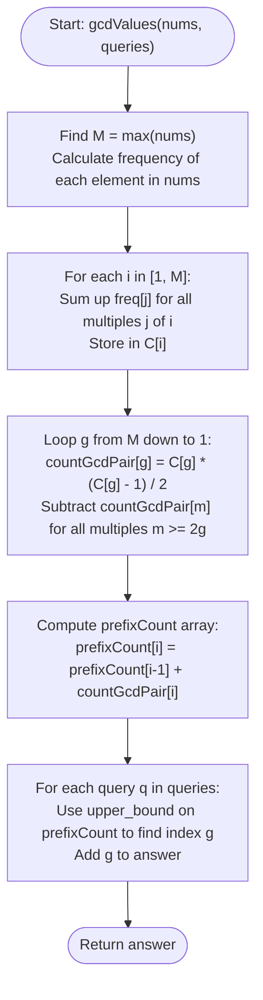

# 💡 Approach — Sorted GCD Pair Queries

| 📄 [Problem](./Problem.md) | 💡 [Approach](./Approach.md) | 🧩 [Solution](./Solution.cpp) | 🚀 [Main](./Main.cpp) |
|:--------------------------:|:-----------------------------:|:------------------------------:|:---------------------:|

---

## 📊 Metadata

---

## 🎯 Core Insight

> [!TIP]
> **Divisor Frequency & Sieve-Based Inclusion-Exclusion**
> 
> Generating all pairs takes $O(n^2)$ time, which is too slow since $n \le 10^5$. However, the maximum number in the array $M = \max(nums)$ is relatively small ($M \le 5 \times 10^4$). We can count the number of pairs having GCD equal to each value $g \in [1, M]$.
> 
> 1. Let $C[g]$ be the count of elements in `nums` that are divisible by $g$. For a divisor $g$, the number of pairs where both elements are multiples of $g$ is $\frac{C[g] \times (C[g] - 1)}{2}$.
> 2. This count includes pairs whose GCD is a multiple of $g$ (e.g., $g, 2g, 3g, \dots$).
> 3. To find the count of pairs with GCD **exactly** equal to $g$ (let's call it $F[g]$), we subtract all pairs with GCD equal to multiples of $g$ that are larger than $g$:
>    $$F[g] = \frac{C[g] \times (C[g] - 1)}{2} - \sum_{k \ge 2, k \cdot g \le M} F[k \cdot g]$$
>    By computing this backwards from $M$ down to 1, we can compute all $F[g]$ values in $O(M \log M)$ time.
> 4. Finally, build a prefix sum array of $F[g]$ and use binary search (`upper_bound`) to answer each query in $O(\log M)$ time.

---

## 🔩 Step-by-Step Breakdown

**Step 1: Calculate Frequency & Find Maximum Value**
- Find $M = \max(nums)$.
- Maintain a frequency array `freq` of size $M + 1$ where `freq[x]` is the occurrences of $x$ in `nums`.

**Step 2: Count Divisor Multiples**
- For each integer $i$ from 1 to $M$, count how many elements in `nums` are divisible by $i$.
- We can do this efficiently using a harmonic sieve:
  $$C[i] = \sum_{j \text{ is a multiple of } i} \text{freq}[j]$$

**Step 3: Count Exact GCD Pairs (Inclusion-Exclusion via Harmonic Sieve)**
- Let `countGcdPair[g]` store the number of pairs with GCD exactly $g$.
- Iterate $g$ from $M$ down to 1:
  - Initialize `countGcdPair[g] = C[g] * (C[g] - 1) / 2`.
  - For each multiple $m = 2g, 3g, \dots \le M$, subtract `countGcdPair[m]`.

**Step 4: Compute Prefix Sums of GCD Pairs**
- Create a prefix sum array `prefixCount` where `prefixCount[i]` is the cumulative number of pairs with GCD $\le i$.

**Step 5: Answer Queries via Binary Search (`upper_bound`)**
- For each query $q$, use binary search (`upper_bound`) on `prefixCount` to locate the smallest $g$ such that `prefixCount[g] > q`.
- That index $g$ is the GCD value for the sorted pair at position $q$.

---

## 🔄 Mermaid Flowchart

---

## 🧮 Dry Run — Example 1

### Input
`nums = [2, 3, 4]`, `queries = [0, 2, 2]`  
$N = 3$, $M = 4$

### 1. Frequency Array
`freq = [0, 0, 1, 1, 1]` (frequencies of 0, 1, 2, 3, 4)

### 2. Multiples Count $C[g]$
- $C[4] = \text{freq}[4] = 1$
- $C[3] = \text{freq}[3] = 1$
- $C[2] = \text{freq}[2] + \text{freq}[4] = 1 + 1 = 2$
- $C[1] = \text{freq}[1] + \text{freq}[2] + \text{freq}[3] + \text{freq}[4] = 3$

### 3. Exact GCD Pairs $F[g]$ (Backwards from 4 to 1)
- **$g = 4$:**  
  $F[4] = C[4] \times (C[4] - 1) / 2 = 1 \times 0 / 2 = 0$
- **$g = 3$:**  
  $F[3] = C[3] \times (C[3] - 1) / 2 = 1 \times 0 / 2 = 0$
- **$g = 2$:**  
  $F[2] = C[2] \times (C[2] - 1) / 2 - F[4] = 2 \times 1 / 2 - 0 = 1$
- **$g = 1$:**  
  $F[1] = C[1] \times (C[1] - 1) / 2 - (F[2] + F[3] + F[4]) = 3 - (1 + 0 + 0) = 2$

### 4. Prefix Sums of $F$
- `prefixCount` = `[0, 2, 3, 3, 3]`

### 5. Queries Resolution
- `queries[0] = 0` $\implies$ First index in `prefixCount` where value $> 0$ is index $1$ (GCD = 1).
- `queries[1] = 2` $\implies$ First index in `prefixCount` where value $> 2$ is index $2$ (GCD = 2).
- `queries[2] = 2` $\implies$ First index in `prefixCount` where value $> 2$ is index $2$ (GCD = 2).

**Output:** `[1, 2, 2]`.

---

## 📊 Complexity Analysis

| Metric | Complexity | Reasoning |
| :---: | :---: | :--- |
| 🕐 Time | $$O(n + M \log M + q \log M)$$ | Counting frequencies takes $O(n)$. The sifting loops for divisor counts and exact GCD pairs both take $O(M \log M)$ by harmonic series sum. Responding to $q$ queries using binary search takes $O(q \log M)$. |
| 💾 Space | $$O(M)$$ | We maintain arrays of size $M + 1$ for frequencies, divisor counts, pair counts, and prefix sums. |

---

> *"Sieving through divisors and extracting the exact pairs of greatest commonality allows us to transform a quadratic pairs problem into a fast logarithmic query search."*

---

<h3>Happy Coding! 🚀</h3>

