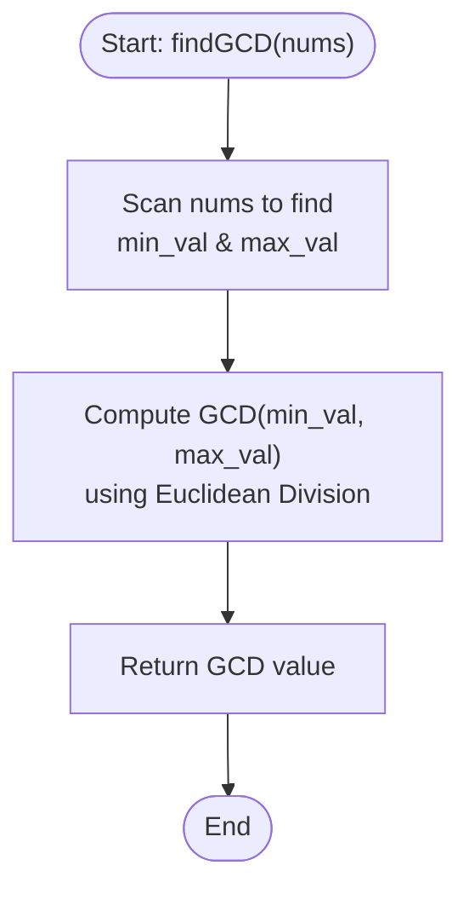

# 💡 Approach — Find Greatest Common Divisor of Array

| 📄 [Problem](./Problem.md) | 💡 [Approach](./Approach.md) | 🧩 [Solution](./Solution.cpp) | 🚀 [Main](./Main.cpp) |
|:--------------------------:|:-----------------------------:|:------------------------------:|:---------------------:|

---

## 📊 Metadata

---

## 🎯 Core Insight

> [!TIP]
> **Single Pass Extremum Search + Euclidean GCD Algorithm**
> 
> The problem requires finding the Greatest Common Divisor (GCD) of the smallest and largest elements in the array.
> 
> 1. Find the extremums:
>    - Scan the array to find the minimum element ($$min\_val$$) and the maximum element ($$max\_val$$).
>    - We can do this in $$O(n)$$ time by using standard algorithms `std::min_element` and `std::max_element` (or a custom single pass).
> 2. Calculate the GCD:
>    - Compute the greatest common divisor of $$min\_val$$ and $$max\_val$$ using the **Euclidean Division Algorithm**.
>    - The Euclidean algorithm repeatedly replaces $$(a, b)$$ with $$(b, a \pmod b)$$ until $$b = 0$$, at which point $$a$$ is the GCD.
>    - Since the numbers are small ($$\le 1000$$), this step runs in $$O(\log(\min(min\_val, max\_val)))$$ which is virtually instantaneous.

---

## 🔩 Step-by-Step Breakdown

**Step 1: Find the Minimum and Maximum Elements**
- Use standard algorithms `std::min_element` and `std::max_element` to find the minimum and maximum elements in `nums` respectively.

**Step 2: Calculate the Greatest Common Divisor**
- Compute the GCD of the two elements using the Euclidean algorithm:
  - If we use standard C++ libraries, we can invoke `__gcd` (or C++17's `std::gcd`).
  - To be safe and clean, we can implement it recursively:
    $$\text{gcd}(a, b) = \text{gcd}(b, a \pmod b) \quad \text{with base case } \text{gcd}(a, 0) = a$$

**Step 3: Return the Result**
- Return the computed greatest common divisor.

---

## 🔄 Mermaid Flowchart

---

## 🧮 Dry Run — Example 1

### Input
`nums = [2, 5, 6, 9, 10]`

### 1. Find Extremums
- Smallest element ($$min\_val$$) = `2`
- Largest element ($$max\_val$$) = `10`

### 2. Compute GCD
- $$\text{gcd}(10, 2):$$
  - $$10 \pmod 2 = 0 \implies \text{gcd}(2, 0) = 2$$
- GCD is `2`.

**Final Result:** `2`.

---

## 📊 Complexity Analysis

| Metric | Complexity | Reasoning |
| :---: | :---: | :--- |
| 🕐 Time | $$O(n)$$ | Scanning the array of size $$n$$ to find the minimum and maximum elements takes linear time. The GCD step takes logarithmic time relative to the number magnitude, which is $$O(\log(\min(min\_val, max\_val)))$$. |
| 💾 Space | $$O(1)$$ | Only a few integer variables are kept in memory. |

---

> *"The greatest divider of complex problems is the simplest common divisor of their extremes."*

---

<h3>Happy Coding! 🚀</h3>

