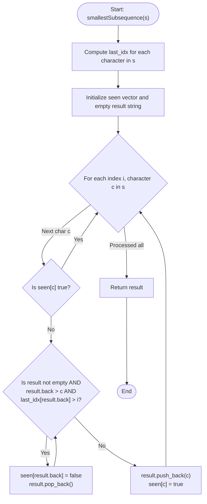

# 💡 Approach — Smallest Subsequence of Distinct Characters

| 📄 [Problem](./Problem.md) | 💡 [Approach](./Approach.md) | 🧩 [Solution](./Solution.cpp) | 🚀 [Main](./Main.cpp) |
|:--------------------------:|:-----------------------------:|:------------------------------:|:---------------------:|

---

## 📊 Metadata

---

## 🎯 Core Insight

> [!TIP]
> **Greedy Strategy with a Monotonic Stack and Forward Index Lookup**
> 
> The goal is to build the lexicographically smallest subsequence of unique characters from the string `s`.
> 
> **Key Observations:**
> 1. To make the subsequence lexicographically smallest, we want smaller characters at earlier positions.
> 2. We can only remove a character from an earlier position if we know it will appear again later in the string.
> 3. We should not add a character if it is already present in our subsequence (since we only need distinct characters exactly once).
> 
> **Strategy:**
> - Precompute the last occurrence index of each character in `s`.
> - Use a stack (represented by a string `result` for ease of C++ conversions) to maintain the monotonic increasing sequence of distinct characters.
> - Iterate through the string:
>   - For each character `c`, if it is already in the stack (`seen[c] == true`), skip it.
>   - Otherwise, check if the current character `c` is smaller than the stack's top character.
>   - If `result.back() > c` and the top character will appear later in `s` (i.e. `last_idx[result.back()] > current_idx`), we can safely pop the top character from the stack and mark it as unseen.
>   - Repeat this check until the stack is empty or the condition is false.
>   - Push the current character `c` onto the stack and mark it as seen.

---

## 🔩 Step-by-Step Breakdown

**Step 1: Track Last Occurrences**
- Create a vector/array `last_idx` of size 26 initialized to `-1`.
- Traverse `s` and update `last_idx[s[i] - 'a'] = i` for all indices $$i$$.

**Step 2: Initialize helpers**
- Create a boolean visited array `seen` of size 26 set to `false`.
- Create a string/stack `result` to store the active subsequence characters.

**Step 3: Process characters**
- Loop through each character `c` in `s` at index `i`:
  - If `seen[c - 'a']` is `true`, skip the character.
  - Otherwise, while `result` is not empty, `result.back() > c`, and `last_idx[result.back() - 'a'] > i` (the top character appears again later):
    - Mark `seen[result.back() - 'a'] = false`.
    - Pop the last character from `result`.
  - Push `c` to `result` and set `seen[c - 'a'] = true`.

---

## 🔄 Mermaid Flowchart

---

## 🧮 Dry Run — Example 2

### Input
`s = "cbacdcbc"`

### 1. Precomputations
- `last_idx`:
  - `c`: last seen at index `6`
  - `b`: last seen at index `7`
  - `a`: last seen at index `2`
  - `d`: last seen at index `4`

### 2. Processing Loop
| Index `i` | Char `c` | Stack (`result`) | Seen Set | Action |
| :---: | :---: | :---: | :---: | :--- |
| 0 | `c` | `""` | `{}` | Push `c`. |
| 1 | `b` | `"c"` | `{"c"}` | `c` > `b` and `last_idx[c] (6) > 1` $$\implies$$ Pop `c`. Push `b`. |
| 2 | `a` | `"b"` | `{"b"}` | `b` > `a` and `last_idx[b] (7) > 2` $$\implies$$ Pop `b`. Push `a`. |
| 3 | `c` | `"a"` | `{"a"}` | Push `c`. |
| 4 | `d` | `"ac"` | `{"a", "c"}` | Push `d`. |
| 5 | `c` | `"acd"` | `{"a", "c", "d"}` | Skip (already in seen). |
| 6 | `b` | `"acd"` | `{"a", "c", "d"}` | `d` > `b` but `last_idx[d] (4) < 6` $$\implies$$ Stop popping. Push `b`. |
| 7 | `c` | `"acdb"` | `{"a", "b", "c", "d"}` | Skip (already in seen). |

**Final Result:** `"acdb"`.

---

## 📊 Complexity Analysis

| Metric | Complexity | Reasoning |
| :---: | :---: | :--- |
| 🕐 Time | $$O(n)$$ | We make a single pass to build `last_idx` and another pass to process each character. Each character is pushed and popped from the stack at most once. |
| 💾 Space | $$O(1)$$ | The `last_idx` and `seen` vectors have a fixed size of 26, which is constant space. |

---

> *"In coding, as in life, removing duplicates early and sorting with foresight leads to the cleanest, most optimal outcome."*

---

<h3>Happy Coding! 🚀</h3>

