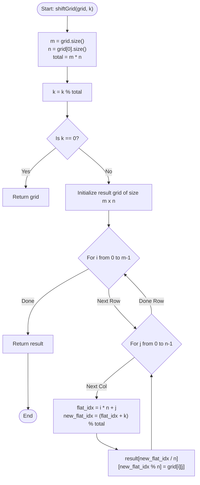

# 💡 Approach — Shift 2D Grid

| 📄 [Problem](./Problem.md) | 💡 [Approach](./Approach.md) | 🧩 [Solution](./Solution.cpp) | 🚀 [Main](./Main.cpp) |
|:--------------------------:|:-----------------------------:|:------------------------------:|:---------------------:|

---

## 📊 Metadata

---

## 🎯 Core Insight

> [!TIP]
> **Linear Flattening and Modulo Arithmetic**
> 
> Shifting elements in a 2D grid cell by cell resembles rotation in a 1D array:
> 1. Elements in a row move right.
> 2. The last element of a row wraps to the first element of the next row.
> 3. The last element of the entire grid wraps to the first element of the first row.
> 
> This can be simulated perfectly by flattening the $m \times n$ grid into a 1D list of size $m \times n$:
> - A 2D coordinate $(i, j)$ corresponds to flat index:
>   $$\text{flat\_index} = i \times n + j$$
> - After $k$ shifts, the new flat index is:
>   $$\text{new\_flat\_index} = (\text{flat\_index} + k) \bmod (m \times n)$$
> - The new flat index maps back to 2D coordinates:
>   $$\text{new\_row} = \text{new\_flat\_index} \div n$$
>   $$\text{new\_col} = \text{new\_flat\_index} \bmod n$$
> 
> Thus, we can directly place each element from the original grid into its final destination in a single pass without performing step-by-step simulations.

---

## 🔩 Step-by-Step Breakdown

1. **Initialize Parameters:**
   - Retrieve rows $m$ and columns $n$.
   - Compute total elements $\text{total} = m \times n$.
   - Reduce $k$ using modulo arithmetic: $k = k \bmod \text{total}$. If $k = 0$, return the grid immediately as no shifting changes the grid.

2. **Compute New Grid Positions:**
   - Instantiate a result grid of size $m \times n$.
   - Iterate through every cell $(i, j)$ in the original grid:
     - Compute its 1D flattened index: $\text{flat\_idx} = i \times n + j$.
     - Find the new 1D index: $\text{new\_flat\_idx} = (\text{flat\_idx} + k) \bmod \text{total}$.
     - Store the value at the computed 2D cell:
       $$\text{result}[\text{new\_flat\_idx} \div n][\text{new\_flat\_idx} \bmod n] = \text{grid}[i][j]$$

3. **Return:**
   - Return the populated `result` grid.

---

## 🔄 Mermaid Flowchart

---

## 🧮 Dry Run — Example 1

### Input
`grid = [[1, 2, 3], [4, 5, 6], [7, 8, 9]]`, `k = 1`
- $m = 3$, $n = 3$, $\text{total} = 9$.
- $k = 1 \bmod 9 = 1$.

| Element | 2D Coords $(i, j)$ | Flat Index $(i \times n + j)$ | New Flat Index $(+1) \bmod 9$ | New 2D Coords $(\text{div } n, \text{mod } n)$ |
| :---: | :---: | :---: | :---: | :---: |
| 1 | $(0, 0)$ | 0 | 1 | $(0, 1)$ |
| 2 | $(0, 1)$ | 1 | 2 | $(0, 2)$ |
| 3 | $(0, 2)$ | 2 | 3 | $(1, 0)$ |
| 4 | $(1, 0)$ | 3 | 4 | $(1, 1)$ |
| 5 | $(1, 1)$ | 4 | 5 | $(1, 2)$ |
| 6 | $(1, 2)$ | 5 | 6 | $(2, 0)$ |
| 7 | $(2, 0)$ | 6 | 7 | $(2, 1)$ |
| 8 | $(2, 1)$ | 7 | 8 | $(2, 2)$ |
| 9 | $(2, 2)$ | 8 | 0 | $(0, 0)$ |

### Final Output Grid
`[[9, 1, 2], [3, 4, 5], [6, 7, 8]]`

---

## 📊 Complexity Analysis

| Metric | Complexity | Reasoning |
| :---: | :---: | :--- |
| 🕐 Time | $O(m \times n)$ | We visit every cell of the grid exactly once to calculate its new position in $O(1)$ time. |
| 💾 Space | $O(m \times n)$ | We store the shifted elements in a new grid of the same dimensions. |

---

<h3>Happy Coding! 🚀</h3>

