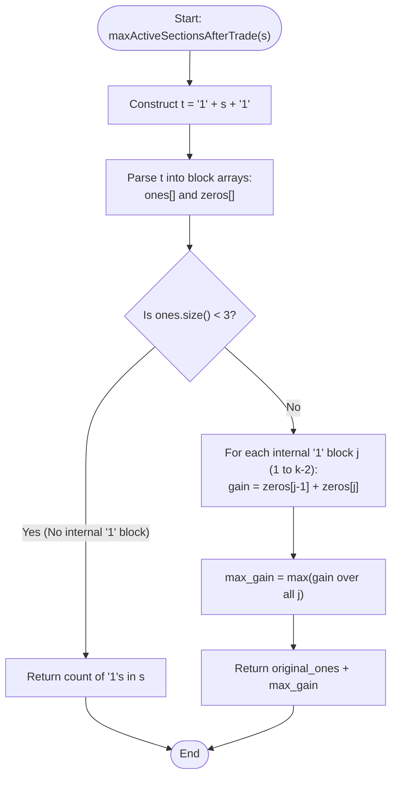

# 💡 Approach — Maximize Active Section with Trade I

| 📄 [Problem](./Problem.md) | 💡 [Approach](./Approach.md) | 🧩 [Solution](./Solution.cpp) | 🚀 [Main](./Main.cpp) |
|:--------------------------:|:-----------------------------:|:------------------------------:|:---------------------:|

---

## 📊 Metadata

---

## 🎯 Core Insight

> [!TIP]
> **Augmented String Block Merging Analysis**
> 
> 1. **Augmentation Representation**:
>    - Form $t = \text{"1"} + s + \text{"1"}$. Since $t$ starts and ends with `'1'`, it can be decomposed into $k$ contiguous blocks of `'1'`s ($O_0, O_1, \dots, O_{k-1}$) separated by $k-1$ contiguous blocks of `'0'`s ($Z_0, Z_1, \dots, Z_{k-2}$).
> 
> 2. **Valid Trade Prerequisite**:
>    - Step 1 requires converting a contiguous block of `'1'`s **surrounded by `'0'`s** to `'0'`s.
>    - The outer blocks of `'1'`s ($O_0$ and $O_{k-1}$) touch boundaries and are NOT surrounded by `'0'`s.
>    - Only internal blocks of `'1'`s $O_j$ ($1 \le j \le k-2$) are surrounded by `'0'`s ($Z_{j-1}$ on the left and $Z_j$ on the right).
>    - If $k < 3$, no internal block of `'1'`s exists, making a trade impossible. We simply return the original count of `'1'`s in $s$.
> 
> 3. **The Merging Effect**:
>    - Converting an internal block $O_j$ to `'0'`s merges $Z_{j-1}$, $O_j$, and $Z_j$ into a single contiguous block of `'0'`s.
>    - This merged block of `'0'`s is surrounded by $O_{j-1}$ and $O_{j+1}$ (which are `'1'`s).
>    - Converting this merged block to `'1'`s turns all $'0'$s in $Z_{j-1}$ and $Z_j$ into active sections!
>    - The net gain in active sections is $\text{len}(Z_{j-1}) + \text{len}(Z_j)$.
> 
> 4. **Optimal Trade Selection**:
>    - To maximize active sections, we maximize the combined length $\text{len}(Z_{j-1}) + \text{len}(Z_j)$ over all $1 \le j \le k-2$.

---

## 🔩 Step-by-Step Breakdown

### 1. Construct Augmented String
- Form $t = \text{"1"} + s + \text{"1"}$.

### 2. Parse Block Lengths
- Traverse $t$ to extract alternating block lengths of `'1'`s into `ones` vector and `'0'`s into `zeros` vector.

### 3. Check Trade Validity
- Count the original number of `'1'`s in $s$ (`original_ones`).
- Let $k = \text{ones.size()}$.
- If $k < 3$, return `original_ones`.

### 4. Find Maximum Gain
- Iterate $j$ from $1$ to $k-2$:
  - Calculate `gain = zeros[j - 1] + zeros[j]`.
  - Update `max_gain = max(max_gain, gain)`.

### 5. Return Total
- Return `original_ones + max_gain`.

---

## 🔄 Mermaid Flowchart

---

## 🧮 Dry Run — Example 2 & 3

### Example 2: `s = "0100"`
1. $t = \text{"101001"}$
2. `ones = [1, 1, 1]` ($k = 3$), `zeros = [1, 2]`.
3. `original_ones = 1`.
4. Internal block $j = 1$: `gain = zeros[0] + zeros[1] = 1 + 2 = 3`.
5. `max_gain = 3`.
6. Result: $1 + 3 = 4$.

---

### Example 3: `s = "1000100"`
1. $t = \text{"110001001"}$
2. `ones = [2, 1, 1]` ($k = 3$), `zeros = [3, 2]`.
3. `original_ones = 2`.
4. Internal block $j = 1$: `gain = zeros[0] + zeros[1] = 3 + 2 = 5`.
5. `max_gain = 5`.
6. Result: $2 + 5 = 7$.

---

## 📊 Complexity Analysis

| Metric | Complexity | Reasoning |
| :---: | :---: | :--- |
| 🕐 Time | $O(N)$ | String decomposition takes $O(N)$ time. Finding the maximum gain traverses arrays of size $O(N)$ once. |
| 💾 Space | $O(N)$ | Vector arrays `ones` and `zeros` store block lengths proportional to string size $N$. |

---

<h3>Happy Coding! 🚀</h3>

