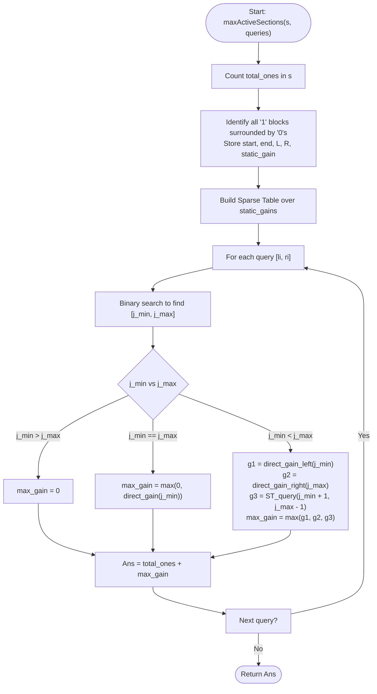

# 💡 Approach — Maximize Active Section with Trade II

| 📄 [Problem](./Problem.md) | 💡 [Approach](./Approach.md) | 🧩 [Solution](./Solution.cpp) | 🚀 [Main](./Main.cpp) |
|:--------------------------:|:-----------------------------:|:------------------------------:|:---------------------:|

---

## 📊 Metadata

---

## 🎯 Core Insight

> [!TIP]
> **Reducing Substring Trade to Global Gain using Precomputed Block Boundaries**
> 
> 1. **Block Representation**:
>    - We can view the binary string $s$ as alternating blocks of `'1'`s and `'0'`s.
>    - A block of `'1'`s, say $O_j$ spanning indices $[start_j, end_j]$, is surrounded by `'0'`s if its left neighbor $s[start_j - 1] = '0'$ and its right neighbor $s[end_j + 1] = '0'$.
> 
> 2. **Gain of a Trade**:
>    - Under the trade operation on $s[li...ri]$ (augmented to $t$), converting $O_j$ to `'0'`s and then converting the entire merged block of `'0'`s (bounded by the query $li$ and $ri$) to `'1'`s yields a net gain in the total number of `'1'`s:
>      $$\text{gain}_j(li, ri) = \min(ri, R_j) - \max(li, L_j) - (end_j - start_j)$$
>      where $L_j$ is the starting index of the left neighbor `'0'`s block, and $R_j$ is the ending index of the right neighbor `'0'`s block.
> 
> 3. **Valid Candidates for Query $[li, ri]$**:
>    - A block $O_j$ can be targeted by a trade on $s[li...ri]$ if and only if it is surrounded by `'0'`s and is entirely internal to $s[li...ri]$ (meaning $li \le start_j - 1$ and $end_j + 1 \le ri$).
>    - Since blocks are ordered from left to right, this condition defines a contiguous range of valid blocks $j \in [j_{min}, j_{max}]$. We can find $j_{min}$ and $j_{max}$ using binary search (`std::lower_bound` / `std::upper_bound`).
> 
> 4. **Sparse Table optimization for RMQ**:
>    - For any block $j$ that is strictly internal to the query (i.e. $j_{min} < j < j_{max}$), we have $L_j > li$ and $R_j < ri$. Thus, its gain simplifies to:
>      $$\text{static\_gain}_j = R_j - L_j - (end_j - start_j)$$
>      which is independent of $li$ and $ri$.
>    - We can precompute $\text{static\_gain}_j$ for all blocks and build a **Sparse Table** to query the range maximum over $[j_{min} + 1, j_{max} - 1]$ in $O(1)$ time.
>    - The boundary blocks $j_{min}$ and $j_{max}$ are queried and evaluated directly.

---

## 🔩 Step-by-Step Breakdown

### 1. Group String into Blocks
- Group $s$ into contiguous runs of the same character.
- Identify all `'1'`s blocks that have `'0'`s blocks directly adjacent on both sides. Let these blocks be $O_0, O_1, \dots, O_{m-1}$.
- For each $O_j$, store its interval $[start_j, end_j]$, the start $L_j$ of the left `'0'` block, the end $R_j$ of the right `'0'` block, and $\text{static\_gain}_j = R_j - L_j - (end_j - start_j)$.

### 2. Build Range Maximum Query Structure (Sparse Table)
- Construct a Sparse Table `st` where `st[i][k]` stores the maximum value of `static_gain` in range $[i, i + 2^k - 1]$.
- This allows finding the maximum static gain of any internal block in $O(1)$ time.

### 3. Answer Queries in $O(1)$
For each query $[li, ri]$:
- Use binary search on candidates' start indices to find the smallest $j$ such that $start_j - 1 \ge li$ (this is $j_{min}$).
- Use binary search on candidates' end indices to find the largest $j$ such that $end_j + 1 \le ri$ (this is $j_{max}$).
- If $j_{min} > j_{max}$: No candidate is internal to the query. Maximum active sections is $\text{Total 1s}$.
- If $j_{min} == j_{max}$: Calculate the gain for this single block directly.
- If $j_{min} < j_{max}$: Calculate the direct gains for boundary blocks $j_{min}$ and $j_{max}$, and query the Sparse Table for the maximum of the internal range $[j_{min} + 1, j_{max} - 1]$. Add the maximum of these gains to $\text{Total 1s}$.

---

## 🔄 Mermaid Flowchart

---

## 🧮 Dry Run — Example 3

### Preprocessing
- **Input String**: `s = "1000100"`, `total_ones = 2` (at indices $0$ and $4$).
- **Blocks**:
  1. $B_0$: `'1'` at $[0, 0]$
  2. $B_1$: `'0'` at $[1, 3]$
  3. $B_2$: `'1'` at $[4, 4]$
  4. $B_3$: `'0'` at $[5, 6]$
- **Candidates**: Only $B_2$ is a `'1'` block surrounded by `'0'`s on both sides.
  - Candidate $j = 0$: $start_0 = 4, end_0 = 4, L_0 = 1, R_0 = 6$.
  - Binary search indices: `start_minus_one = [3]`, `end_plus_one = [5]`.

---

### Query 1: `[1, 5]` ($li = 1, ri = 5$)
1. **Binary Search**:
   - $j_{min} \rightarrow$ lower bound of $1$ on `start_minus_one` $\implies 0$.
   - $j_{max} \rightarrow$ upper bound of $5$ on `end_plus_one` minus $1 \implies 0$.
2. **Evaluation**: $j_{min} == j_{max} == 0$.
3. **Gain**:
   $$\text{gain} = \min(5, 6) - \max(1, 1) - (4 - 4) = 5 - 1 = 4$$
4. **Active Sections**: $\text{total\_ones} + \text{gain} = 2 + 4 = 6$.

---

### Query 2: `[0, 6]` ($li = 0, ri = 6$)
1. **Binary Search**:
   - $j_{min} \rightarrow$ lower bound of $0$ on `start_minus_one` $\implies 0$.
   - $j_{max} \rightarrow$ upper bound of $6$ on `end_plus_one` minus $1 \implies 0$.
2. **Evaluation**: $j_{min} == j_{max} == 0$.
3. **Gain**:
   $$\text{gain} = \min(6, 6) - \max(0, 1) - (4 - 4) = 6 - 1 = 5$$
4. **Active Sections**: $\text{total\_ones} + \text{gain} = 2 + 5 = 7$.

---

### Query 3: `[0, 4]` ($li = 0, ri = 4$)
1. **Binary Search**:
   - $j_{min} \rightarrow$ lower bound of $0$ on `start_minus_one` $\implies 0$.
   - $j_{max} \rightarrow$ upper bound of $4$ on `end_plus_one` minus $1 \implies -1$.
2. **Evaluation**: $j_{min} > j_{max}$ ($0 > -1$). No candidates are fully internal to the query.
3. **Active Sections**: $\text{total\_ones} + 0 = 2$.

---

## ⏱️ Complexity Analysis

- **Time Complexity**:
  - Preprocessing: $O(n \log n)$ to group characters, find candidates, and build the Sparse Table.
  - Queries: $O(q \log n)$ because for each query we do two binary searches, followed by $O(1)$ Sparse Table lookups.
  - Total Time Complexity: $O((n + q) \log n)$, which is extremely efficient and comfortably passes within the time limit.
- **Auxiliary Space**: $O(n \log n)$ to store the Sparse Table.
   
---

<h3>Happy Coding! 🚀</h3>

