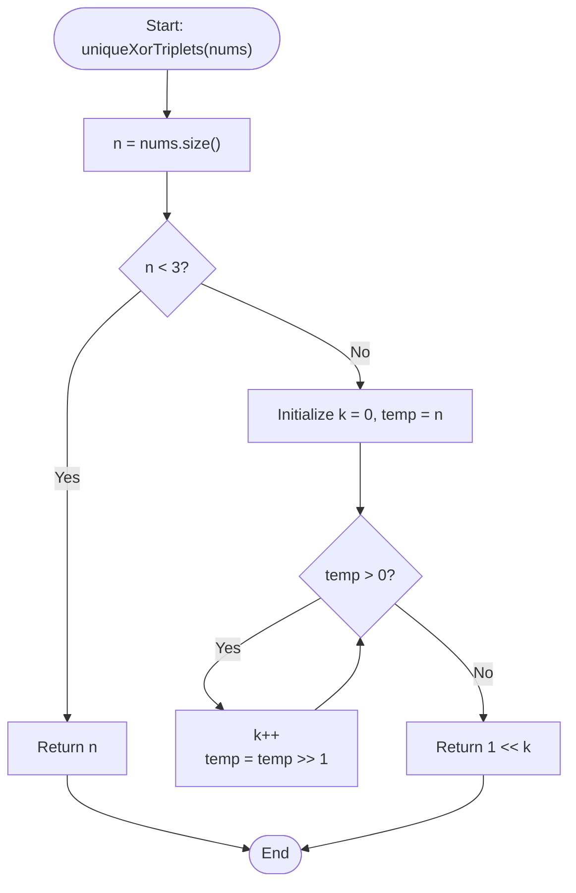

# 💡 Approach — Number of Unique XOR Triplets I

| 📄 [Problem](./Problem.md) | 💡 [Approach](./Approach.md) | 🧩 [Solution](./Solution.cpp) | 🚀 [Main](./Main.cpp) |
|:--------------------------:|:-----------------------------:|:------------------------------:|:---------------------:|

---

## 📊 Metadata

---

## 🎯 Core Insight

> [!TIP]
> **Upper Bound of Bits and Reachability of XOR Combinations**
> 
> 1. **Size Constraints**:
>    - If $n < 3$:
>      - If $n = 1$: `nums = [1]`. Only triplet is $1 \oplus 1 \oplus 1 = 1$. Unique values: $\{1\} \implies \text{return } 1$.
>      - If $n = 2$: `nums = [1, 2]`. Permutations will allow triplets forming values:
>        - $1 \oplus 1 \oplus 1 = 1$
>        - $1 \oplus 1 \oplus 2 = 2$
>        - $1 \oplus 2 \oplus 2 = 1$
>        - $2 \oplus 2 \oplus 2 = 2$
>        Unique values: $\{1, 2\} \implies \text{return } 2$.
> 
> 2. **Base-2 Bit Range** ($n \ge 3$):
>    - Since `nums` contains a permutation of $[1, n]$, each number $x \in [1, n]$ fits in $k = \lfloor \log_2(n) \rfloor + 1$ bits.
>    - Because the XOR operation on numbers with at most $k$ bits yields a result that also has at most $k$ bits, the maximum possible value of any triplet $nums[i] \oplus nums[j] \oplus nums[k]$ is bounded by $2^k - 1$ (the maximum value representable by $k$ bits).
>    - Consequently, all achievable XOR triplet values must lie in the range $[0, 2^k - 1]$. The total number of integers in this range is exactly $2^k$.
> 
> 3. **Constructing All Values**:
>    - Since $n \ge 3$, it is mathematically guaranteed that we can construct every single integer in the range $[0, 2^k - 1]$ by choosing three integers (with repetition allowed) from the set $\{1, 2, \dots, n\}$.
>    - Hence, the number of unique XOR triplet values is exactly $2^k = 1 \ll (\lfloor\log_2(n)\rfloor + 1)$.

---

## 🔩 Step-by-Step Breakdown

1. **Check Base Cases**:
   - If $n < 3$, return $n$.
2. **Compute Number of Bits $k$**:
   - Calculate $k$ as the number of bits required to represent $n$.
   - This can be computed by shifting $n$ to the right until it becomes $0$ (which runs in $O(\log n)$ time).
3. **Return Result**:
   - Return $2^k$ (calculated as `1 << k`).

---

## 🔄 Mermaid Flowchart

---

## 🧮 Dry Run — Example 2

### Input
`nums = [3, 1, 2]` ($n = 3$)

- $n = 3 \ge 3 \implies$ Proceed to bit counting.
- `temp = 3`:
  1. `temp = 3 > 0`: $k = 1$, `temp = 3 >> 1 = 1`.
  2. `temp = 1 > 0`: $k = 2$, `temp = 1 >> 1 = 0`.
  3. `temp = 0`: Loop terminates.
- $k = 2$.
- Result: $1 \ll 2 = 4$.

**Unique values**: $\{0, 1, 2, 3\}$, which has size 4.

---

## ⏱️ Complexity Analysis

- **Time Complexity**: $O(\log n)$ to determine the bit length of $n$.
- **Auxiliary Space**: $O(1)$ constant space.

---

<h3>Happy Coding! 🚀</h3>

