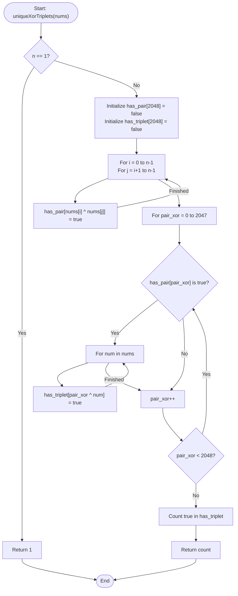

# 💡 Approach — Number of Unique XOR Triplets II

| 📄 [Problem](./Problem.md) | 💡 [Approach](./Approach.md) | 🧩 [Solution](./Solution.cpp) | 🚀 [Main](./Main.cpp) |

---

## 🎯 Core Insight

> [!TIP]
> **XOR Properties & Constraints Optimization**
> 
> 1. **Index Freedom**: An XOR triplet can be formed as $nums[i] \oplus nums[j] \oplus nums[k]$ with $i \le j \le k$. Since XORing identical elements cancels them out:
>    - Choosing $i = j$ reduces the triplet to $0 \oplus nums[k] = nums[k]$. Thus, all single elements in the array are also achievable triplet values.
>    - The overall set of achievable XOR triplet values is exactly equivalent to the XOR of any two indices (a pair) combined with a third index.
> 2. **Valuation Range**:
>    - The constraints specify $nums[i] \le 1500$.
>    - Since $1500 < 2048 = 2^{11}$, all values are represented using at most 11 bits.
>    - The XOR sum of any three numbers $\le 1500$ will also have at most 11 bits, meaning any triplet XOR sum is strictly less than $2048$.
> 3. **Time-Space Tradeoff**:
>    - Finding all unique pair XOR values $P = nums[i] \oplus nums[j]$ takes $O(N^2)$ time.
>    - Since the maximum possible value is $< 2048$, the number of unique pair XOR values is at most $2048$.
>    - We can then iterate over all valid pair XOR values (at most 2048) and XOR them with all $N$ elements in `nums` to find all achievable triplet XORs.
>    - This reduces the overall time complexity to $O(N^2 + 2048 \times N)$, which easily runs within the time limit for $N \le 1500$.

---

## 🔩 Step-by-Step Breakdown

### 1. Base Case
- If $N == 1$, only one triplet is possible, $(0,0,0)$ resulting in $nums[0]$. Return `1`.

### 2. Generate Pairs
- Create a boolean array `has_pair` of size 2048 initialized to `false`.
- Iterate through all pairs $(i, j)$ with $i < j$:
  - Mark `has_pair[nums[i] ^ nums[j]] = true`.

### 3. Generate Triplets
- Create a boolean array `has_triplet` of size 2048 initialized to `false`.
- Iterate through all possible values of `pair_xor` from 0 to 2047:
  - If `has_pair[pair_xor]` is `true`:
    - For each `num` in `nums`, mark `has_triplet[pair_xor ^ num] = true`.

### 4. Count Unique Values
- Count the number of `true` values in `has_triplet`.
- Return the count.

---

## 🔄 Mermaid Flowchart

---

## 🧮 Dry Run

### Dry Run 1: Example 1 (`nums = [1, 3]`)

* **Initial state**: `n = 2`, `has_pair` and `has_triplet` initialized to `false`.
* **Pairs Generation**:
  - $i=0, j=1 \implies nums[0] \oplus nums[1] = 1 \oplus 3 = 2$.
  - `has_pair[2] = true`.
* **Triplets Generation**:
  - Iterate `pair_xor` from 0 to 2047. Only `pair_xor = 2` has `has_pair[2] == true`.
    - For `num = 1`: `has_triplet[2 ^ 1] = has_triplet[3] = true`.
    - For `num = 3`: `has_triplet[2 ^ 3] = has_triplet[1] = true`.
* **Counting**:
  - `has_triplet[1]` and `has_triplet[3]` are `true`.
  - Total count = 2.
* **Return**: `2`.

---

### Dry Run 2: Example 2 (`nums = [6, 7, 8, 9]`)

* **Pairs Generation**:
  - `6 ^ 7 = 1`
  - `6 ^ 8 = 14`
  - `6 ^ 9 = 15`
  - `7 ^ 8 = 15`
  - `7 ^ 9 = 14`
  - `8 ^ 9 = 1`
  - `has_pair` is `true` for indices: `{1, 14, 15}`.
* **Triplets Generation**:
  - `pair_xor = 1`:
    - `1 ^ 6 = 7`
    - `1 ^ 7 = 6`
    - `1 ^ 8 = 9`
    - `1 ^ 9 = 8`
    - `has_triplet` is `true` for `{6, 7, 8, 9}`.
  - `pair_xor = 14`:
    - `14 ^ 6 = 8`, `14 ^ 7 = 9`, `14 ^ 8 = 6`, `14 ^ 9 = 7`.
  - `pair_xor = 15`:
    - `15 ^ 6 = 9`, `15 ^ 7 = 8`, `15 ^ 8 = 7`, `15 ^ 9 = 6`.
* **Counting**:
  - `has_triplet` is `true` for `{6, 7, 8, 9}`.
  - Total count = 4.
* **Return**: `4`.

---

## ⏱️ Complexity Analysis

- **Time Complexity**: $O(N^2 + M \cdot N)$, where $N$ is the number of elements in `nums` and $M = 2048$.
  - The nested loops to compute pairs take $O(N^2)$ iterations.
  - The nested loops to compute triplets take $O(M \cdot N)$ iterations because there are at most $M$ unique pair XOR values.
  - Counting unique values takes $O(M)$ operations.
  - With $N \le 1500$, total operations are roughly $\frac{1500^2}{2} + 2048 \times 1500 \approx 4.2 \times 10^6$, which runs in less than $10$ ms.
- **Auxiliary Space**: $O(1)$ auxiliary space because we use two fixed-size tables of size $2048$.

---

<h3>Happy Coding! 🚀</h3>

