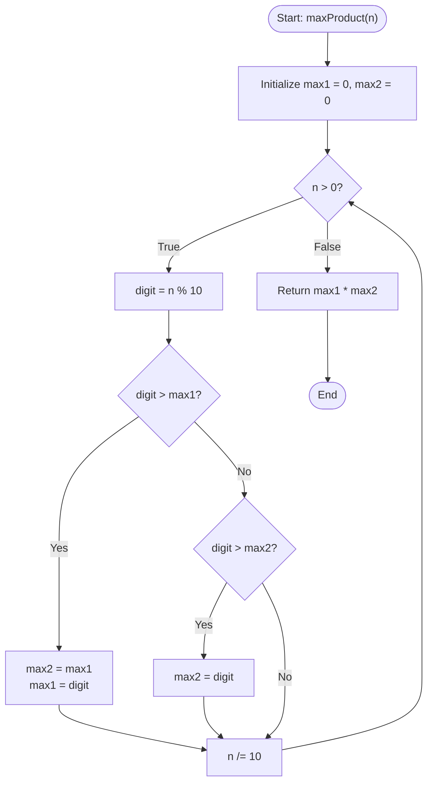

# 💡 Approach — Maximum Product of Two Digits

| 📄 [Problem](./Problem.md) | 💡 [Approach](./Approach.md) | 🧩 [Solution](./Solution.cpp) | 🚀 [Main](./Main.cpp) |
|:--------------------------:|:-----------------------------:|:------------------------------:|:---------------------:|

---

## 📊 Metadata

---

## 🎯 Core Insight

> [!TIP]
> **Greedy Digit Extraction**
> 
> To maximize the product of any two digits in a number, we simply need to find the **two largest digits** in the number and multiply them.
> - We can extract digits one by one using modulo arithmetic (`% 10` and `/ 10`).
> - We keep track of the largest (`max1`) and second-largest (`max2`) digits dynamically in $O(1)$ space.

---

## 🔩 Step-by-Step Breakdown

### Step 1: Extract digits and track the two largest digits
- Loop while the number $n > 0$.
- Extract the last digit: `digit = n % 10`.
- Update `max1` and `max2` by comparing with the current digit:
  - If `digit > max1`: `max2 = max1`, `max1 = digit`.
  - Else if `digit > max2`: `max2 = digit`.
- Discard the last digit: `n /= 10`.

### Step 2: Return the product of the two largest digits
- Return `max1 * max2`.

---

## 🔄 Mermaid Flowchart

---

## 🧮 Dry Run

### Dry Run: Example 3 ($n = 124$)

- **Initial state**: `max1 = 0`, `max2 = 0`

| Iteration | Current $n$ | Extracted `digit` | Condition Check | Updated `max1` | Updated `max2` |
| :---: | :---: | :---: | :--- | :---: | :---: |
| **1** | $124$ | $4$ | $4 > 0$ (Update both) | $4$ | $0$ |
| **2** | $12$ | $2$ | $2 > 0$ (Update `max2` only) | $4$ | $2$ |
| **3** | $1$ | $1$ | $1 \le 2$ (No update) | $4$ | $2$ |
| **End** | $0$ | — | Loop terminates | **4** | **2** |

*   **Final Product**: `max1 * max2` = $4 \times 2 = 8$.

---

## 📊 Complexity Analysis

| Complexity | Analysis |
| :--- | :--- |
| **Time Complexity** | $O(\log_{10} n)$ as we process each digit of the number $n$ exactly once. Since $n \le 10^9$, this is at most 10 iterations (effectively $O(1)$). |
| **Auxiliary Space** | $O(1)$ auxiliary space since we only use a constant number of variables. |

---

> *"Simplicity is the ultimate sophistication."* — Leonardo da Vinci

---

<h3>Happy Coding! 🚀</h3>

