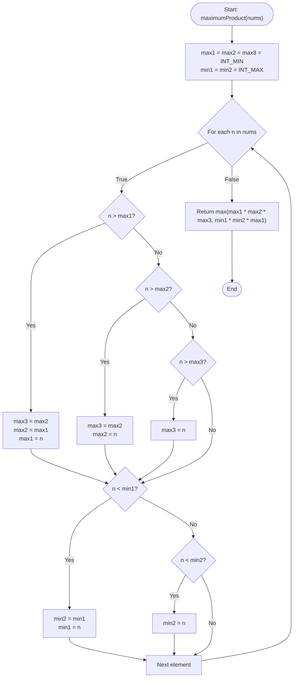

# 💡 Approach — Maximum Product of Three Numbers

| 📄 [Problem](./Problem.md) | 💡 [Approach](./Approach.md) | 🧩 [Solution](./Solution.cpp) | 🚀 [Main](./Main.cpp) |
|:--------------------------:|:-----------------------------:|:------------------------------:|:---------------------:|

---

## 📊 Metadata

---

## 🎯 Core Insight

> [!TIP]
> **Extreme Values Scan**
> 
> The maximum product of three numbers in any array can only come from two possible scenarios:
> 1. The product of the **three largest positive numbers**: $\text{max1} \times \text{max2} \times \text{max3}$.
> 2. The product of the **two smallest negative numbers** (which multiply to a positive result) and the **largest positive number**: $\text{min1} \times \text{min2} \times \text{max1}$.
> 
> By scanning the array once, we can track these 5 values ($\text{max1}, \text{max2}, \text{max3}$ and $\text{min1}, \text{min2}$) in $O(n)$ time and $O(1)$ space.

---

## 🔩 Step-by-Step Breakdown

### Step 1: Initialize Extremum Trackers
- Let `max1`, `max2`, `max3` store the three largest numbers found so far, initialized to `INT_MIN`.
- Let `min1`, `min2` store the two smallest numbers found so far, initialized to `INT_MAX`.

### Step 2: Single Pass Extraction
For each number `n` in `nums`:
- **Update Maximums**:
  - If `n > max1`: Shift maximums down (`max3 = max2`, `max2 = max1`) and set `max1 = n`.
  - Else if `n > max2`: Shift `max3 = max2` and set `max2 = n`.
  - Else if `n > max3`: Set `max3 = n`.
- **Update Minimums**:
  - If `n < min1`: Shift minimum down (`min2 = min1`) and set `min1 = n`.
  - Else if `n < min2`: Set `min2 = n`.

### Step 3: Compare and Return Maximum Product
- Return the maximum of `max1 * max2 * max3` and `min1 * min2 * max1`.

---

## 🔄 Mermaid Flowchart

---

## 🧮 Dry Run

### Dry Run: `nums` = `[1, 2, 3, 4]`

- **Initial state**: `max1 = max2 = max3 = INT_MIN`, `min1 = min2 = INT_MAX`

| Element `n` | `max1` | `max2` | `max3` | `min1` | `min2` | Action Taken |
| :---: | :---: | :---: | :---: | :---: | :---: | :--- |
| **1** | $1$ | `INT_MIN` | `INT_MIN` | $1$ | `INT_MAX` | Update `max1` and `min1` |
| **2** | $2$ | $1$ | `INT_MIN` | $1$ | $2$ | Update `max1`, `max2` and `min2` |
| **3** | $3$ | $2$ | $1$ | $1$ | $2$ | Update `max1`, `max2`, `max3` (no min change) |
| **4** | $4$ | $3$ | $2$ | $1$ | $2$ | Update `max1`, `max2`, `max3` (no min change) |

* **Possible Scenario 1**: `max1 * max2 * max3` $= 4 \times 3 \times 2 = 24$.
* **Possible Scenario 2**: `min1 * min2 * max1` $= 1 \times 2 \times 4 = 8$.
* **Final Result**: $\max(24, 8) = 24$.

---

## 📊 Complexity Analysis

| Complexity | Analysis |
| :--- | :--- |
| **Time Complexity** | $O(n)$ because we iterate through the list of numbers of size $n$ exactly once. |
| **Auxiliary Space** | $O(1)$ since we only use a fixed number of integer variables to track the extremes. |

---

> *"The details are not the details. They make the design."* — Charles Eames

---

<h3>Happy Coding! 🚀</h3>

