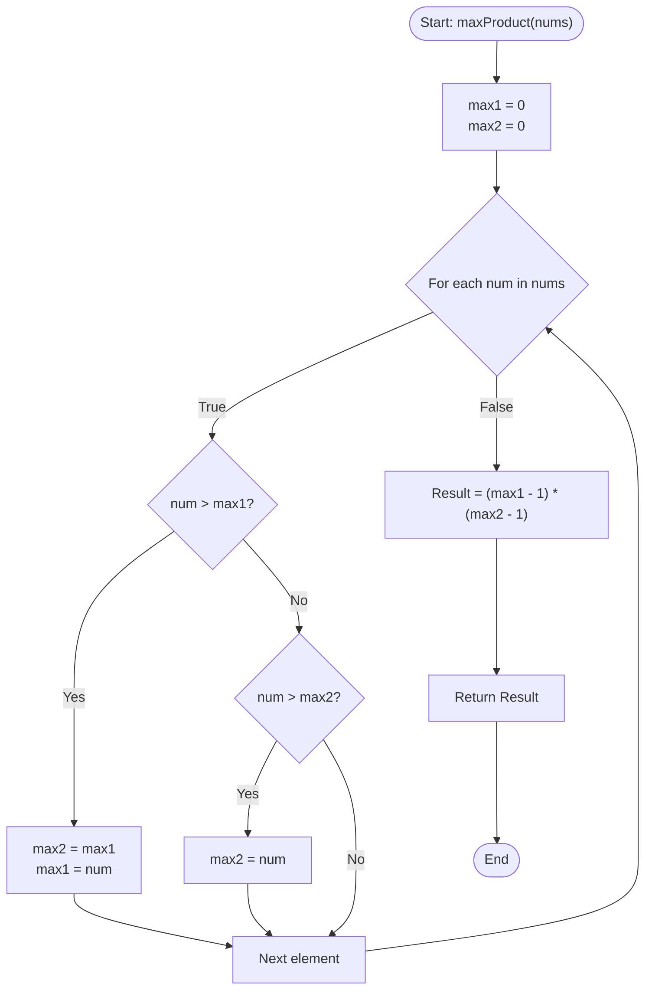

# 💡 Approach — Maximum Product of Two Elements in an Array

| 📄 [Problem](./Problem.md) | 💡 [Approach](./Approach.md) | 🧩 [Solution](./Solution.cpp) | 🚀 [Main](./Main.cpp) |
|:--------------------------:|:-----------------------------:|:------------------------------:|:---------------------:|

---

## 📊 Metadata

---

## 🎯 Core Insight

> [!TIP]
> **Greedy Top-Two Selection**
> 
> Since all numbers in the array are positive ($nums[i] \ge 1$), the product expression $(nums[i] - 1) \times (nums[j] - 1)$ is strictly non-decreasing with respect to the values of $nums[i]$ and $nums[j]$.
> 
> Therefore, the maximum possible product is always achieved by picking the **two largest elements** in the array. 
> Instead of sorting the array in $O(n \log n)$ or building a max-heap in $O(n \log k)$ time, we can simply find the two largest values (`max1` and `max2`) in a single pass of $O(n)$ time and $O(1)$ space.

---

## 🔩 Step-by-Step Breakdown

### Step 1: Initialize Max Trackers
- Let `max1` represent the largest element found so far, initialized to `0`.
- Let `max2` represent the second largest element found so far, initialized to `0`.

### Step 2: Single Pass Evaluation
Iterate through each number `num` in the array `nums`:
- If `num > max1`:
  - The previous largest `max1` now becomes the second largest: `max2 = max1`.
  - Update the largest element: `max1 = num`.
- Else if `num > max2`:
  - Update only the second largest element: `max2 = num`.

### Step 3: Compute Product
- Return the calculated maximum product: `(max1 - 1) * (max2 - 1)`.

---

## 🔄 Mermaid Flowchart

---

## 🧮 Dry Run

### Dry Run: `nums` = `[3, 4, 5, 2]`

- **Initial state**: `max1 = 0`, `max2 = 0`

| Element `num` | `max1` | `max2` | Action Taken |
| :---: | :---: | :---: | :--- |
| **3** | $3$ | $0$ | `num > max1` $\rightarrow$ `max2 = max1 (0)`, `max1 = 3` |
| **4** | $4$ | $3$ | `num > max1` $\rightarrow$ `max2 = max1 (3)`, `max1 = 4` |
| **5** | $5$ | $4$ | `num > max1` $\rightarrow$ `max2 = max1 (4)`, `max1 = 5` |
| **2** | $5$ | $4$ | `num <= max1` and `num <= max2` $\rightarrow$ No changes |

* **Final maximums**: `max1 = 5`, `max2 = 4`.
* **Result**: $(5 - 1) \times (4 - 1) = 4 \times 3 = 12$.

---

## 📊 Complexity Analysis

| Complexity | Analysis |
| :--- | :--- |
| **Time Complexity** | $O(n)$ since we scan the array of size $n$ exactly once. |
| **Auxiliary Space** | $O(1)$ because we only use two integer variables (`max1`, `max2`) to track the largest elements. |

---

> *"Optimizing the simple things yields the greatest returns."* — Senior C++ Engineer

---

<h3>Happy Coding! 🚀</h3>

