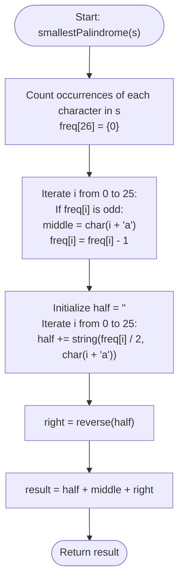

# 💡 Approach — Smallest Palindromic Rearrangement I

| 📄 [Problem](./Problem.md) | 💡 [Approach](./Approach.md) | 🧩 [Solution](./Solution.cpp) | 🚀 [Main](./Main.cpp) |
|:--------------------------:|:-----------------------------:|:------------------------------:|:---------------------:|

---

## 📊 Metadata

---

## 🎯 Core Insight

> [!TIP]
> **Palindromic Symmetry & Counting Sort**
> 
> A palindrome consists of a left half, an optional single center character (if the length is odd), and a right half that is the exact mirror image of the left half.
> 
> To minimize a palindromic string lexicographically:
> 1. We must make the left half lexicographically as small as possible.
> 2. The smallest left half is constructed by putting the lexicographically smaller characters as early in the prefix as possible. This means the left half should simply contain half of all even occurrences of characters, sorted in ascending alphabetical order.
> 3. Since the alphabet size is very small ($26$ lowercase English letters), we can count frequencies in $O(n)$ time.
> 4. Generating the left half in sorted order is trivial: we simply iterate from `'a'` to `'z'` and append `freq[char] / 2` instances of each character.
> 5. Any single character with an odd count must occupy the center.
> 6. The right half is formed by reversing the left half.

---

## 🔩 Step-by-Step Breakdown

### Step 1: Character Frequency Count
- Initialize a frequency array of size 26 to count occurrences of each character in `s`.

### Step 2: Extract the Odd Count Character (Middle)
- Iterate through the frequency array. If a character has an odd frequency, store it as the `middle` character and decrement its frequency in the array by 1. Since `s` is guaranteed to be palindromic, at most one character can have an odd frequency.

### Step 3: Construct the Halved Prefixes
- Initialize an empty string `half`.
- Iterate from `'a'` to `'z'` (indices $0$ to $25$). For each character, append `freq[i] / 2` copies of it to `half`.

### Step 4: Reassemble the Palindrome
- The resulting smallest palindrome is `half` + `middle` + `reverse(half)`. Return this string.

---

## 🔄 Mermaid Flowchart

---

## 🧮 Dry Run

### Dry Run: Example 2 (`s = "babab"`)
- **Step 1: Count Frequencies:** `freq = {'a': 2, 'b': 3}`
- **Step 2: Check for Odd Frequency:**
  - `'a'` has count 2 (even).
  - `'b'` has count 3 (odd). Set `middle = 'b'` and update `freq['b'] = 2`.
- **Step 3: Construct `half` (sorted order):**
  - For `'a'`: append $2 / 2 = 1$ copy $\rightarrow$ `half = "a"`
  - For `'b'`: append $2 / 2 = 1$ copy $\rightarrow$ `half = "ab"`
- **Step 4: Reassemble:**
  - `right = reverse(half) = "ba"`
  - `result = "ab" + "b" + "ba" = "abbba"`

---

## 📊 Complexity Analysis

| Complexity | Analysis |
| :--- | :--- |
| **Time Complexity** | $O(n)$ where $n$ is the length of `s`. We traverse the string once to count frequencies and once to build the final palindrome. Reversing `half` of length $n/2$ is also $O(n)$. |
| **Auxiliary Space** | $O(1)$ auxiliary space because the frequency array is of fixed size $26$, and other variables take constant space. (Excluding the output string space of $O(n)$). |

---

> *"Symmetry dictates the shape, but order defines the beauty."* — Senior C++ Engineer

---

<h3>Happy Coding! 🚀</h3>

