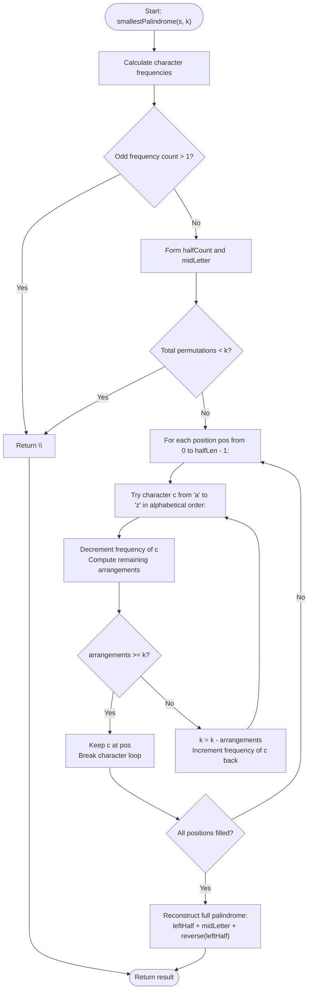

# 💡 Approach — Smallest Palindromic Rearrangement II

| 📄 [Problem](./Problem.md) | 💡 [Approach](./Approach.md) | 🧩 [Solution](./Solution.cpp) | 🚀 [Main](./Main.cpp) |
|:--------------------------:|:-----------------------------:|:------------------------------:|:---------------------:|

---

## 📊 Metadata

---

## 🎯 Core Insight

> [!TIP]
> **Halved Palindrome Lexicographical Search (Capped Permutations)**
>
> A string rearrangement forms a palindrome if and only if at most one character has an odd frequency. In any palindromic permutation:
> 1. The first half (left side) completely determines the second half (right side), with any odd-frequency character fixed in the exact middle.
> 2. Finding the $k$-th lexicographically smallest palindromic permutation simplifies to finding the $k$-th lexicographical permutation of the multiset of characters belonging to the left half.
> 3. We can build this left half character-by-character from index $0$ to $N - 1$. At each position, we attempt to place the smallest available character 'a' through 'z'.
> 4. If we temporarily place a character, we compute the number of unique permutations (arrangements) of the remaining characters using the multinomial coefficient:
>    $$\text{Arrangements} = \frac{(\text{Remaining Length})!}{\prod (\text{Remaining Count of } c)!}$$
> 5. If the calculated count is $\ge k$, the character is correct. We commit it and move to the next position.
> 6. Otherwise, we subtract the count from $k$, restore the character's frequency, and try the next alphabetical character.
>
> **Optimization:** Since $k \le 10^6$, any intermediate permutation count exceeding $10^6$ can be safely capped at $10^6 + 1$ (representing infinity). This simple cap avoids integer overflow and enables standard fast combinatorics without big integer classes, resulting in an optimal $O(n)$ implementation.

---

## 🔩 Step-by-Step Breakdown

### Step 1: Character Frequency Count
- Count the frequency of each lowercase English letter in the input string `s`.

### Step 2: Palindrome Feasibility check
- Count how many characters have an odd frequency. If this count is $> 1$, a palindrome is impossible. Return `""`.

### Step 3: Extract Halved Prefixes and Middle Character
- Divide each character frequency by 2 to get the multiset for the left half.
- If a character has an odd frequency, assign it as the `midLetter`.

### Step 4: Verify Total Permutations Against $k$
- Calculate the total permutations possible for the left half multiset. If the total is $< k$, return `""`.

### Step 5: Lexicographical Permutation Generation
- For each position in the left half, try characters `c` from 'a' to 'z':
  - Skip if the frequency of `c` is 0.
  - Decrement `c`'s count and calculate the remaining combinations.
  - If the arrangements count is $\ge k$, keep `c` in the current position, and break to the next position.
  - Otherwise, subtract the arrangements count from $k$, increment `c`'s count back, and try the next letter.

### Step 6: Reassemble the Full Palindrome
- Combine `leftHalf` + `midLetter` + `reverse(leftHalf)` and return.

---

## 🔄 Mermaid Flowchart

---

## 🧮 Dry Run

### Dry Run: `s = "bacab"`, `k = 2`
- **Initial Setup:** `count = {a: 2, b: 2, c: 1}`. Odd count = 1 ('c'). Palindrome is possible.
- **Halved Configuration:** `halfCount = {a: 1, b: 1}`, `midLetter = "c"`, `halfLen = 2`.
- **Total Permutations of `{a, b}`:** $\frac{2!}{1! \times 1!} = 2$. Since $k = 2 \le 2$, we can proceed.

| Position (`pos`) | Character Try (`c`) | Remaining Count after Placement | Arrangements | `arrangements >= k`? | Action / Update | Left Half (`leftHalf`) |
| :---: | :---: | :---: | :---: | :---: | :--- | :---: |
| **0** | `'a'` | `{a: 0, b: 1}` | $\frac{1!}{0! \times 1!} = 1$ | ❌ No ($1 < 2$) | $k = 2 - 1 = 1$ Restore `'a'` to count 1. | `""` |
| | `'b'` | `{a: 1, b: 0}` | $\frac{1!}{1! \times 0!} = 1$ | ✔️ Yes ($1 \ge 1$) | Keep `'b'`. Commit placement. | `"b"` |
| **1** | `'a'` | `{a: 0, b: 0}` | $\frac{0!}{0! \times 0!} = 1$ | ✔️ Yes ($1 \ge 1$) | Keep `'a'`. Commit placement. | `"ba"` |

- **Reassembly:** `leftHalf + midLetter + reverse(leftHalf)` $\rightarrow$ `"ba" + "c" + "ab"` $\rightarrow$ `"bacab"`. Correct!

---

## 📊 Complexity Analysis

| Complexity | Analysis |
| :--- | :--- |
| **Time Complexity** | $O(n)$ where $n$ is the length of string $s$. The counting of characters takes $O(n)$ time. The generation of the left half takes $O(n \times 26 \times 26) \approx O(n)$ time since the alphabet size is constant and multinomial combinations computation is capped at $MAX = 10^6+1$, taking $O(1)$ constant time. |
| **Auxiliary Space** | $O(n)$ to store the frequency arrays and construct the final palindromic string. |

---

> *"Bounding combinatorial growth lets us explore lexicographical spaces linearly."* — Senior C++ Engineer

---

<h3>Happy Coding! 🚀</h3>

