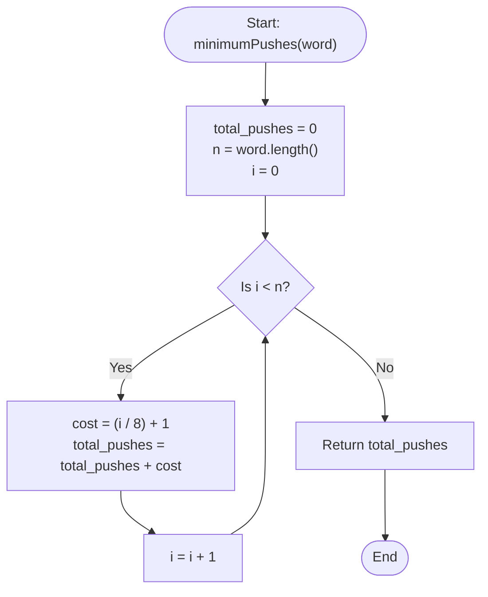

# 💡 Approach — Minimum Number of Pushes to Type Word I

| 📄 [Problem](./Problem.md) | 💡 [Approach](./Approach.md) | 🧩 [Solution](./Solution.cpp) | 🚀 [Main](./Main.cpp) |
|:--------------------------:|:-----------------------------:|:------------------------------:|:---------------------:|

---

## 📊 Metadata

---

## 🎯 Core Insight

> [!TIP]
> **Greedy Keypad Mapping for Distinct Letters**
>
> We have 8 keys (`2` through `9`) available on a telephone keypad to map lowercase letters.
>
> 1. Since all letters in the given word are **distinct**, each character has a frequency of exactly $1$.
> 2. To minimize the total pushes, we want to map as many characters as possible to the first position of the keys, then to the second position, and so on.
> 3. By greedily mapping:
>    - The first $8$ letters to the $1\text{st}$ position of the $8$ keys (requiring $1$ push each).
>    - The next $8$ letters to the $2\text{nd}$ position (requiring $2$ pushes each).
>    - The next $8$ letters to the $3\text{rd}$ position (requiring $3$ pushes each).
>    - The remaining letters to the $4\text{th}$ position (requiring $4$ pushes each).
> 4. For any $i$-th character (0-indexed) in the word, the number of pushes required is exactly $\lfloor i / 8 \rfloor + 1$.
>
> This mathematical formulation allows us to calculate the total pushes directly in $O(n)$ time and $O(1)$ space.

---

## 🔩 Step-by-Step Breakdown

### Step 1: Initialize Push Counter
- Initialize `total_pushes = 0`.
- Get the length of the word `n = word.length()`.

### Step 2: Iterate through the Characters
- Loop through the index `i` from `0` to `n - 1`:
  - Calculate the cost of the $i$-th character as `(i / 8) + 1`.
  - Add this cost to `total_pushes`.

### Step 3: Return the Result
- Return `total_pushes` as the final minimum pushes required.

---

## 🔄 Mermaid Flowchart

---

## 🧮 Dry Run

### Dry Run: Example 2
- **Input:** `word = "xycdefghij"` ($n = 10$).
- **Initial Setup:** `total_pushes = 0`.

| Index `i` | Character `word[i]` | Key Position Slot | Cost Calculation `(i / 8) + 1` | Action / Update | Total Pushes |
| :---: | :---: | :---: | :---: | :---: | :---: |
| **0** | `'x'` | 1st Slot | `(0 / 8) + 1 = 1` | `total_pushes += 1` | **1** |
| **1** | `'y'` | 1st Slot | `(1 / 8) + 1 = 1` | `total_pushes += 1` | **2** |
| **2** | `'c'` | 1st Slot | `(2 / 8) + 1 = 1` | `total_pushes += 1` | **3** |
| **3** | `'d'` | 1st Slot | `(3 / 8) + 1 = 1` | `total_pushes += 1` | **4** |
| **4** | `'e'` | 1st Slot | `(4 / 8) + 1 = 1` | `total_pushes += 1` | **5** |
| **5** | `'f'` | 1st Slot | `(5 / 8) + 1 = 1` | `total_pushes += 1` | **6** |
| **6** | `'g'` | 1st Slot | `(6 / 8) + 1 = 1` | `total_pushes += 1` | **7** |
| **7** | `'h'` | 1st Slot | `(7 / 8) + 1 = 1` | `total_pushes += 1` | **8** |
| **8** | `'i'` | 2nd Slot | `(8 / 8) + 1 = 2` | `total_pushes += 2` | **10** |
| **9** | `'j'` | 2nd Slot | `(9 / 8) + 1 = 2` | `total_pushes += 2` | **12** |

---

## 📊 Complexity Analysis

| Complexity | Analysis |
| :--- | :--- |
| **Time Complexity** | $O(n)$ where $n$ is the length of `word`. Since $n \le 26$, this runs in $O(1)$ constant time operations. |
| **Auxiliary Space** | $O(1)$ since only a few variables are used to keep track of indices and counts, needing no extra space. |

---

> *"Greedy choices work beautifully when the constraints guarantee uniform distribution."* — Senior C++ Engineer

---

<h3>Happy Coding! 🚀</h3>

