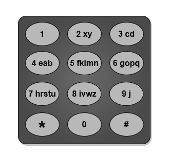

# [3014. Minimum Number of Pushes to Type Word I](https://leetcode.com/problems/minimum-number-of-pushes-to-type-word-i/?envType=daily-question&envId=2026-07-30)

| 📄 [Problem](./Problem.md) | 💡 [Approach](./Approach.md) | 🧩 [Solution](./Solution.cpp) | 🚀 [Main](./Main.cpp) |
|:--------------------------:|:-----------------------------:|:------------------------------:|:---------------------:|

---

## 📊 Metadata

---

## 🧩 Problem Description

You are given a string `word` containing distinct lowercase English letters.

Telephone keypads have keys mapped with distinct collections of lowercase English letters, which can be used to form words by pushing them. For example, the key `2` is mapped with `["a","b","c"]`, we need to push the key one time to type `"a"`, two times to type `"b"`, and three times to type `"c"`.

It is allowed to remap the keys numbered `2` to `9` to distinct collections of letters. The keys can be remapped to any amount of letters, but each letter must be mapped to exactly one key. You need to find the minimum number of times the keys will be pushed to type the string `word`.

Return the minimum number of pushes needed to type `word` after remapping the keys.

An example mapping of letters to keys on a telephone keypad is given below. Note that `1`, `*`, `#`, and `0` do not map to any letters.

  

---

## 📌 Examples

**Example 1:**

  

- **Input:** `word = "abcde"`
- **Output:** `5`
- **Explanation:** 
  The remapped keypad given in the image provides the minimum cost.
  - `"a"` $\rightarrow$ one push on key `2`
  - `"b"` $\rightarrow$ one push on key `3`
  - `"c"` $\rightarrow$ one push on key `4`
  - `"d"` $\rightarrow$ one push on key `5`
  - `"e"` $\rightarrow$ one push on key `6`
  Total cost is $1 + 1 + 1 + 1 + 1 = 5$.
  It can be shown that no other mapping can provide a lower cost.

**Example 2:**

  

- **Input:** `word = "xycdefghij"`
- **Output:** `12`
- **Explanation:** 
  The remapped keypad given in the image provides the minimum cost.
  - `"x"` $\rightarrow$ one push on key `2`
  - `"y"` $\rightarrow$ two pushes on key `2`
  - `"c"` $\rightarrow$ one push on key `3`
  - `"d"` $\rightarrow$ two pushes on key `3`
  - `"e"` $\rightarrow$ one push on key `4`
  - `"f"` $\rightarrow$ one push on key `5`
  - `"g"` $\rightarrow$ one push on key `6`
  - `"h"` $\rightarrow$ one push on key `7`
  - `"i"` $\rightarrow$ one push on key `8`
  - `"j"` $\rightarrow$ one push on key `9`
  Total cost is $1 + 2 + 1 + 2 + 1 + 1 + 1 + 1 + 1 + 1 = 12$.
  It can be shown that no other mapping can provide a lower cost.

---

## 📐 Constraints

- $1 \le word.length \le 26$
- `word` consists of lowercase English letters.
- All letters in `word` are distinct.

---

## ⏱️ Expected Complexities

| Complexity | Expected |
| :--- | :--- |
| **Time Complexity** | $O(n)$ |
| **Auxiliary Space** | $O(1)$ |

---

<h3>Happy Coding! 🚀</h3>

