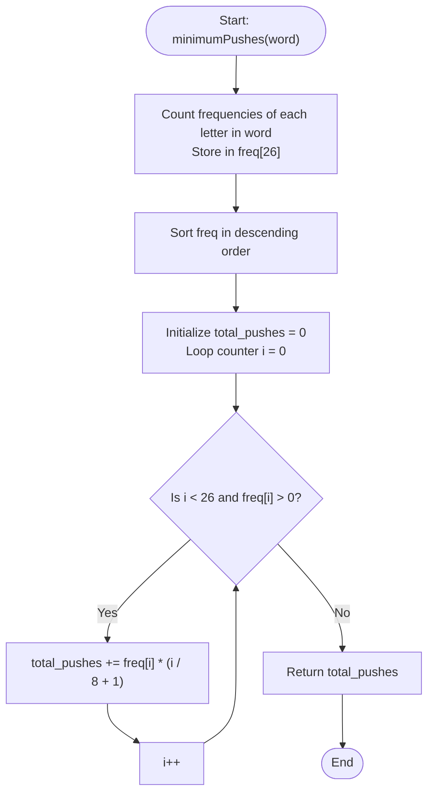

# 💡 Approach — Minimum Number of Pushes to Type Word II

| 📄 [Problem](./Problem.md) | 💡 [Approach](./Approach.md) | 🧩 [Solution](./Solution.cpp) | 🚀 [Main](./Main.cpp) |
|:--------------------------:|:-----------------------------:|:------------------------------:|:---------------------:|

---

## 📊 Metadata

---

## 🎯 Core Insight

> [!TIP]
> **Greedy Mapping Strategy**
>
> 1. **Keypad Constraints:** There are 8 keys available for remapping (numbered 2 to 9).
> 2. **Minimize Pushes:** To type a word with the minimum number of presses, we should map the most frequently occurring letters in the word to the 1st position of the keys, requiring only 1 push.
> 3. **Grouping by Cost:** 
>    - The 8 most frequent letters can be mapped as the 1st character of the 8 keys (cost: 1 push).
>    - The next 8 most frequent letters can be mapped as the 2nd character of the 8 keys (cost: 2 pushes).
>    - The next 8 most frequent letters can be mapped as the 3rd character of the 8 keys (cost: 3 pushes).
>    - The remaining 2 letters can be mapped as the 4th character of keys (cost: 4 pushes).
> 4. **Sort and Multiply:** Count the occurrences of each letter, sort them in descending order, and multiply the frequency of the $i$-th letter by its slot press cost $(i / 8 + 1)$.

---

## 🔩 Step-by-Step Breakdown

### Step 1: Count Letter Frequencies
- Create a frequency array/vector of size 26, initialized to 0.
- Iterate through `word` and increment the count of each character.

### Step 2: Sort Frequencies
- Sort the frequency array in descending order. This ensures the characters that appear most frequently are placed at the beginning.

### Step 3: Compute Minimum Pushes
- Initialize `total_pushes = 0`.
- Iterate through the sorted frequencies:
  - If the frequency is 0, break early since all remaining characters have 0 frequency.
  - Otherwise, for index $i$, add `freq[i] * (i / 8 + 1)` to `total_pushes`.

### Step 4: Return the Result
- Return `total_pushes`.

---

## 🔄 Mermaid Flowchart

---

## 🧮 Dry Run

### Dry Run: Example 3
- **Input:** `word = "aabbccddeeffgghhiiiiii"`
- **Initial Setup:** `total_pushes = 0`.

#### Phase 1: Frequency Counting
- Letters frequencies: `i` = 6, `a` = 2, `b` = 2, `c` = 2, `d` = 2, `e` = 2, `f` = 2, `g` = 2, `h` = 2.
- All other letters have frequency 0.

#### Phase 2: Sorting Descending
- Sorted array `freq`: `[6, 2, 2, 2, 2, 2, 2, 2, 2, 0, 0, ..., 0]`.

#### Phase 3: Pushes Calculation

| Index `i` | Char Freq | Cost Multiplier `(i / 8 + 1)` | Added Pushes | Total Pushes |
| :---: | :---: | :---: | :---: | :---: |
| **0** | 6 | 1 | $6 \times 1 = 6$ | 6 |
| **1** | 2 | 1 | $2 \times 1 = 2$ | 8 |
| **2** | 2 | 1 | $2 \times 1 = 2$ | 10 |
| **3** | 2 | 1 | $2 \times 1 = 2$ | 12 |
| **4** | 2 | 1 | $2 \times 1 = 2$ | 14 |
| **5** | 2 | 1 | $2 \times 1 = 2$ | 16 |
| **6** | 2 | 1 | $2 \times 1 = 2$ | 18 |
| **7** | 2 | 1 | $2 \times 1 = 2$ | 20 |
| **8** | 2 | 2 | $2 \times 2 = 4$ | 24 |
| **9** | 0 | - | Loop terminates | 24 |

---

## 📊 Complexity Analysis

| Complexity | Analysis |
| :--- | :--- |
| **Time Complexity** | $O(n + \Sigma \log \Sigma) \approx O(n)$ where $n$ is the length of `word` and $\Sigma = 26$ is the alphabet size. Counting character frequencies takes $O(n)$ time. Sorting the 26 frequencies takes $O(26 \log 26) \approx O(1)$ time. Thus, the overall time complexity is linear and highly optimized. |
| **Auxiliary Space** | $O(\Sigma) \approx O(1)$ space to store the letter frequencies of constant size (26 integers). |

---

> *"Greedy choices at each step, when mathematically aligned, yield global optimality with beautiful simplicity."* — Senior competitive programmer

---

<h3>Happy Coding! 🚀</h3>

