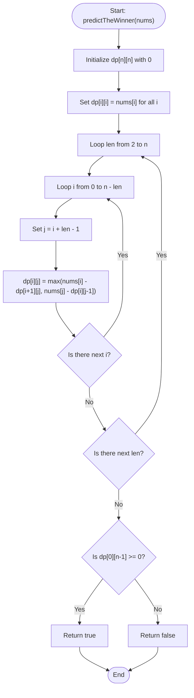

# 💡 Approach — Predict the Winner

| 📄 [Problem](./Problem.md) | 💡 [Approach](./Approach.md) | 🧩 [Solution](./Solution.cpp) | 🚀 [Main](./Main.cpp) |
|:--------------------------:|:-----------------------------:|:------------------------------:|:---------------------:|

---

## 📊 Metadata

---

## 🎯 Core Insight

> [!TIP]
> **Relative Score Difference & Optimal Play**
>
> 1. **Maximize Relative Score:** Instead of tracking separate absolute scores for Player 1 and Player 2, we track the **relative score difference** (Player 1's score minus Player 2's score).
>    - At any point in the game, the player whose turn it is wants to maximize their relative score over the other player.
> 2. **Game Recurrence:** If a player has a choice between left element $nums[i]$ and right element $nums[j]$ from the subarray $nums[i \dots j]$:
>    - If they pick $nums[i]$, the other player gets the subarray $nums[i+1 \dots j]$. The other player plays optimally and achieves a relative difference of $dp(i+1, j)$. So the current player's relative score becomes $nums[i] - dp(i+1, j)$.
>    - If they pick $nums[j]$, the other player gets the subarray $nums[i \dots j-1]$ and achieves a relative difference of $dp(i, j-1)$. So the current player's relative score becomes $nums[j] - dp(i, j-1)$.
>    - The current player optimally chooses the maximum of these two:
>      $$dp(i, j) = \max(nums[i] - dp(i+1, j), \ nums[j] - dp(i, j-1))$$
> 3. **Base Cases:** When $i == j$, only one number remains. The current player must pick it, and the other player gets 0. Hence, $dp(i, i) = nums[i]$.
> 4. **Winning Condition:** Player 1 wins if the maximum relative score starting from the full array $nums[0 \dots n-1]$ is greater than or equal to 0 (meaning Player 1's score $\ge$ Player 2's score).

---

## 🔩 Step-by-Step Breakdown

### Step 1: Initialize DP Table
- Create a 2D table `dp` of size $n \times n$ where `dp[i][j]` represents the maximum relative score difference the current player can achieve from the subarray `nums[i...j]`.

### Step 2: Base Case (Subarray of Length 1)
- For every index $i$, set `dp[i][i] = nums[i]`.

### Step 3: Bottom-up DP Transitions
- Iterate subarray lengths `len` from 2 up to $n$.
- For each starting index $i$ and ending index $j = i + len - 1$:
  - Transition: `dp[i][j] = max(nums[i] - dp[i + 1][j], nums[j] - dp[i][j - 1])`.

### Step 4: Return Result
- Player 1 wins if `dp[0][n - 1] >= 0`.

---

## 🔄 Mermaid Flowchart

---

## 🧮 Dry Runs

### Dry Run 1: `nums = [1, 5, 2]`
- **Subarrays of length 1:**
  - `dp[0][0] = 1`, `dp[1][1] = 5`, `dp[2][2] = 2`
- **Subarrays of length 2:**
  - `dp[0][1] = max(nums[0] - dp[1][1], nums[1] - dp[0][0]) = max(1 - 5, 5 - 1) = 4`
  - `dp[1][2] = max(nums[1] - dp[2][2], nums[2] - dp[1][1]) = max(5 - 2, 2 - 5) = 3`
- **Subarrays of length 3:**
  - `dp[0][2] = max(nums[0] - dp[1][2], nums[2] - dp[0][1]) = max(1 - 3, 2 - 4) = -2`
- **Result:** `dp[0][2] = -2 < 0` $\rightarrow$ `false`.

### Dry Run 2: `nums = [1, 5, 233, 7]`
- **Subarrays of length 1:**
  - `dp[0][0] = 1`, `dp[1][1] = 5`, `dp[2][2] = 233`, `dp[3][3] = 7`
- **Subarrays of length 2:**
  - `dp[0][1] = max(1 - 5, 5 - 1) = 4`
  - `dp[1][2] = max(5 - 233, 233 - 5) = 228`
  - `dp[2][3] = max(233 - 7, 7 - 233) = 226`
- **Subarrays of length 3:**
  - `dp[0][2] = max(1 - 228, 233 - 4) = 229`
  - `dp[1][3] = max(5 - 226, 7 - 228) = -221`
- **Subarrays of length 4:**
  - `dp[0][3] = max(1 - (-221), 7 - 229) = 222`
- **Result:** `dp[0][3] = 222 >= 0` $\rightarrow$ `true`.

---

## 📊 Complexity Analysis

| Complexity | Analysis |
| :--- | :--- |
| **Time Complexity** | $\mathcal{O}(n^2)$ where $n$ is the number of elements in `nums`. We fill a 2D table of size $n \times n$, where each cell takes $\mathcal{O}(1)$ time to compute. |
| **Auxiliary Space** | $\mathcal{O}(n^2)$ to store the DP table of size $n \times n$. (Can be optimized to $\mathcal{O}(n)$ using a 1D DP array, but the 2D table is highly readable and fits well within limits since $n \le 20$). |

---

<h3>Happy Coding! 🚀</h3>

