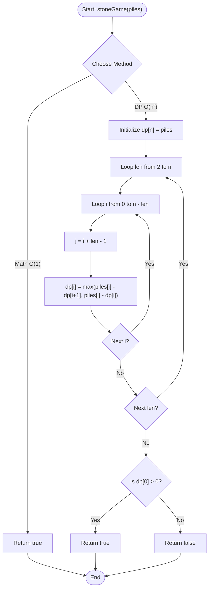

# 💡 Approach — LeetCode 877: Stone Game

| 📄 [Problem](./Problem.md) | 💡 [Approach](./Approach.md) | 🧩 [Solution](./Solution.cpp) | 🚀 [Main](./Main.cpp) |
|:--------------------------:|:-----------------------------:|:------------------------------:|:---------------------:|

---

## 📊 Metadata

---

## 🎯 Core Insights

This problem can be solved in two ways: via a mathematical proof that leads to an $O(1)$ constant-time solution, or using standard Game Theory Dynamic Programming that scales to generalized inputs.

### 1. Mathematical Proof (O(1) Insight)
- There is an **even** number of piles ($n$).
- The total sum of stones is **odd**, meaning there can be no ties.
- Let's classify the piles into two groups based on their indices:
  - **Even-indexed piles:** $piles[0], piles[2], piles[4], \dots$
  - **Odd-indexed piles:** $piles[1], piles[3], piles[5], \dots$
- Since the total sum is odd, one group MUST have more stones than the other.
- Alice (going first) can pre-calculate which group has a larger sum.
- If the even-indexed piles have more stones:
  - Alice starts by picking the first pile $piles[0]$ (even index).
  - This leaves Bob with ends $piles[1]$ (odd) and $piles[n-1]$ (odd).
  - Bob is forced to pick an odd-indexed pile. Let's say Bob picks $piles[1]$, leaving ends $piles[2]$ (even) and $piles[n-1]$ (odd).
  - Alice can then pick $piles[2]$ (even).
  - Alice can repeat this, always picking an even-indexed pile and forcing Bob to pick an odd-indexed pile.
- If the odd-indexed piles have more stones, Alice starts by picking the last pile $piles[n-1]$ (odd index) and forces the same strategy.
- Consequently, Alice can **always** win. Thus, we can simply `return true`.

### 2. Dynamic Programming Formulation (Game Theory O(n²))
- Let `dp[i][j]` represent the maximum score differential (Alice's score minus Bob's score) when playing optimally on subsegment `piles[i...j]`.
- For a subsegment `piles[i...j]`, the current player has two choices:
  - Take the left pile `piles[i]`. The opponent gets optimal differential `dp[i + 1][j]`. The net gain is `piles[i] - dp[i + 1][j]`.
  - Take the right pile `piles[j]`. The opponent gets optimal differential `dp[i][j - 1]`. The net gain is `piles[j] - dp[i][j - 1]`.
- Since both players play optimally, they maximize their net gain:
  - $dp[i][j] = \max(piles[i] - dp[i + 1][j], piles[j] - dp[i][j - 1])$
- **Base Case:** For subsegments of length 1, `dp[i][i] = piles[i]`.
- **Result:** If `dp[0][n - 1] > 0`, Alice wins (`true`), else she loses (`false`).
- Space complexity can be optimized to $O(n)$ because we only need the previous row's states to compute the current row's states.

---

## 🔩 Step-by-Step DP Breakdown (Space-Optimized O(n))

### Step 1: Initialize DP Array
- Create a 1D DP array of size $n$, initialized with `dp[i] = piles[i]`. This represents subsegments of length 1.

### Step 2: Iterate over Lengths
- Loop length `len` from $2$ to $n$:
  - Loop starting index `i` from $0$ to $n - len$:
    - Calculate ending index `j = i + len - 1`.
    - Update `dp[i] = max(piles[i] - dp[i + 1], piles[j] - dp[i])`.

### Step 3: Return Result
- If `dp[0] > 0`, Alice wins (`true`), else Bob wins (`false`).

---

## 🔄 Mermaid Flowchart

---

## 🧮 Dry Run (DP Approach)

### Input: `piles = [5, 3, 4, 5]`
- $n = 4$

#### Initialization (`len = 1`):
- `dp = [5, 3, 4, 5]`

#### Iteration 1 (`len = 2`):
- `i = 0, j = 1`: `dp[0] = max(piles[0] - dp[1], piles[1] - dp[0]) = max(5 - 3, 3 - 5) = max(2, -2) = 2`
- `i = 1, j = 2`: `dp[1] = max(piles[1] - dp[2], piles[2] - dp[1]) = max(3 - 4, 4 - 3) = max(-1, 1) = 1`
- `i = 2, j = 3`: `dp[2] = max(piles[2] - dp[3], piles[3] - dp[2]) = max(4 - 5, 5 - 4) = max(-1, 1) = 1`
- `dp` state: `[2, 1, 1, 5]`

#### Iteration 2 (`len = 3`):
- `i = 0, j = 2`: `dp[0] = max(piles[0] - dp[1], piles[2] - dp[0]) = max(5 - 1, 4 - 2) = max(4, 2) = 4`
- `i = 1, j = 3`: `dp[1] = max(piles[1] - dp[2], piles[3] - dp[1]) = max(3 - 1, 5 - 1) = max(2, 4) = 4`
- `dp` state: `[4, 4, 1, 5]`

#### Iteration 3 (`len = 4`):
- `i = 0, j = 3`: `dp[0] = max(piles[0] - dp[1], piles[3] - dp[0]) = max(5 - 4, 5 - 4) = max(1, 1) = 1`
- `dp` state: `[1, 4, 1, 5]`

- **Result:** `dp[0] = 1 > 0` $\rightarrow$ `true` (Alice wins).

---

## 📊 Complexity Analysis

| Complexity | Mathematical Insight | Dynamic Programming |
| :--- | :--- | :--- |
| **Time Complexity** | $\mathcal{O}(1)$ | $\mathcal{O}(n^2)$ |
| **Auxiliary Space** | $\mathcal{O}(1)$ | $\mathcal{O}(n)$ |

---

<h3>Happy Coding! 🚀</h3>

