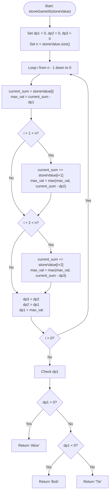

# 💡 Approach — LeetCode 1406: Stone Game III

| 📄 [Problem](./Problem.md) | 💡 [Approach](./Approach.md) | 🧩 [Solution](./Solution.cpp) | 🚀 [Main](./Main.cpp) |
|:--------------------------:|:-----------------------------:|:------------------------------:|:---------------------:|

---

## 📊 Metadata

---

## 🎯 Core Insights

This problem can be modeled as a classic game-theory game played on a row of stones. Because the players play optimally, we can use **Dynamic Programming (DP)**.

### 1. State Definition
Let $dp[i]$ represent the **maximum relative score** (Current Player's Score - Opponent's Score) that the player whose turn it is can achieve starting from index $i$ to the end of the array.

### 2. Transition Relation
At index $i$, the current player has up to three choices:
- **Take 1 stone:** The player gets value `stoneValue[i]`. The opponent plays optimally from index $i+1$, achieving a relative score of $dp[i+1]$. The current player's relative score becomes:
  $$stoneValue[i] - dp[i+1]$$
- **Take 2 stones:** The player gets value `stoneValue[i] + stoneValue[i+1]`. The opponent plays optimally from index $i+2$, achieving a relative score of $dp[i+2]$. The current player's relative score becomes:
  $$(stoneValue[i] + stoneValue[i+1]) - dp[i+2]$$
- **Take 3 stones:** The player gets value `stoneValue[i] + stoneValue[i+1] + stoneValue[i+2]`. The opponent plays optimally from index $i+3$, achieving a relative score of $dp[i+3]$. The current player's relative score becomes:
  $$(stoneValue[i] + stoneValue[i+1] + stoneValue[i+2]) - dp[i+3]$$

Since the current player plays optimally, they will choose the option that maximizes their relative score:
$$dp[i] = \max \begin{cases}
stoneValue[i] - dp[i+1] \\
stoneValue[i] + stoneValue[i+1] - dp[i+2] & \text{(if } i+1 < n\text{)} \\
stoneValue[i] + stoneValue[i+1] + stoneValue[i+2] - dp[i+3] & \text{(if } i+2 < n\text{)}
\end{cases}$$

### 3. Space Optimization to $O(1)$
To compute $dp[i]$, we only need the values of $dp[i+1]$, $dp[i+2]$, and $dp[i+3]$.
We can maintain just three variables (`dp1`, `dp2`, `dp3`) to store these states. This reduces the auxiliary space complexity from $O(n)$ to $O(1)$.

### 4. Game Result Determination
- If $dp[0] > 0$, Alice (who goes first) can achieve a strictly greater score than Bob, so Alice wins: return `"Alice"`.
- If $dp[0] < 0$, Bob wins: return `"Bob"`.
- If $dp[0] == 0$, the game ends in a draw: return `"Tie"`.

---

## 🔩 Step-by-Step Breakdown

### Step 1: Initialize DP State Variables
- Let `dp1 = 0`, `dp2 = 0`, `dp3 = 0`. These represent $dp[n]$, $dp[n+1]$, and $dp[n+2]$ respectively.

### Step 2: Backward DP Loop
- Loop `i` from $n-1$ down to $0$:
  - Initialize `current_sum = 0` and `max_val = INT_MIN`.
  - Try taking $1$ stone: `current_sum += stoneValue[i]`, and update `max_val = max(max_val, current_sum - dp1)`.
  - Try taking $2$ stones (if $i+1 < n$): `current_sum += stoneValue[i+1]`, and update `max_val = max(max_val, current_sum - dp2)`.
  - Try taking $3$ stones (if $i+2 < n$): `current_sum += stoneValue[i+2]`, and update `max_val = max(max_val, current_sum - dp3)`.
  - Shift DP states: `dp3 = dp2`, `dp2 = dp1`, `dp1 = max_val`.

### Step 3: Return Game Winner
- Analyze the final relative score `dp1` (which represents $dp[0]$):
  - Return `"Alice"` if `dp1 > 0`.
  - Return `"Bob"` if `dp1 < 0`.
  - Return `"Tie"` if `dp1 == 0`.

---

## 🔄 Mermaid Flowchart

---

## 🧮 Dry Run

### Dry Run: Example 1
- **Input:** `stoneValue = [1, 2, 3, 7]`

#### Phase 1: Initialization
- `dp1 = 0`, `dp2 = 0`, `dp3 = 0`

#### Phase 2: DP Updates
- **$i = 3$ (value $7$):**
  - Take 1: `current_sum = 7`, `max_val = 7 - 0 = 7`.
  - Shift: `dp3 = 0`, `dp2 = 0`, `dp1 = 7`.
- **$i = 2$ (value $3$):**
  - Take 1: `current_sum = 3`, `max_val = 3 - 7 = -4`.
  - Take 2: `current_sum = 3 + 7 = 10`, `max_val = max(-4, 10 - 0) = 10`.
  - Shift: `dp3 = 0`, `dp2 = 7`, `dp1 = 10`.
- **$i = 1$ (value $2$):**
  - Take 1: `current_sum = 2`, `max_val = 2 - 10 = -8`.
  - Take 2: `current_sum = 2 + 3 = 5`, `max_val = max(-8, 5 - 7) = -2`.
  - Take 3: `current_sum = 2 + 3 + 7 = 12`, `max_val = max(-2, 12 - 0) = 12`.
  - Shift: `dp3 = 7`, `dp2 = 10`, `dp1 = 12`.
- **$i = 0$ (value $1$):**
  - Take 1: `current_sum = 1`, `max_val = 1 - 12 = -11`.
  - Take 2: `current_sum = 1 + 2 = 3`, `max_val = max(-11, 3 - 10) = -7`.
  - Take 3: `current_sum = 1 + 2 + 3 = 6`, `max_val = max(-7, 6 - 7) = -1`.
  - Shift: `dp3 = 10`, `dp2 = 12`, `dp1 = -1`.

#### Phase 3: Result
- Since `dp1 = -1 < 0`, we return `"Bob"`.

---

## 📊 Complexity Analysis

| Complexity | Analysis |
| :--- | :--- |
| **Time Complexity** | $O(n)$ because we iterate from the end to the start of the array of size $n$ exactly once. |
| **Auxiliary Space** | $O(1)$ since we only store three DP state variables. |

---

<h3>Happy Coding! 🚀</h3>

