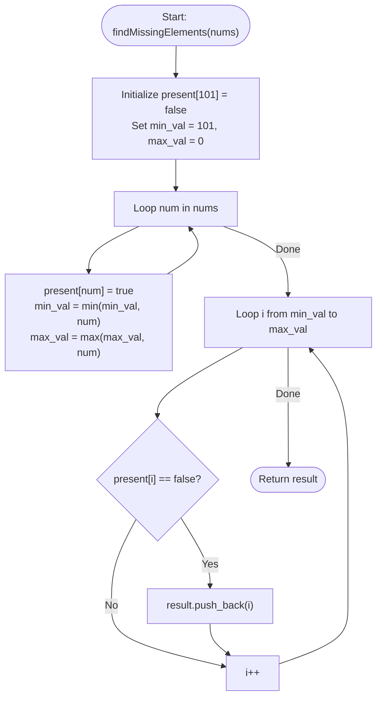

# 💡 Approach — 3731. Find Missing Elements

| 📄 [Problem](./Problem.md) | 💡 [Approach](./Approach.md) | 🧩 [Solution](./Solution.cpp) | 🚀 [Main](./Main.cpp) |
|:--------------------------:|:-----------------------------:|:------------------------------:|:---------------------:|

---

## 📊 Metadata

---

## 🎯 Core Insight

> [!TIP]
> **Frequency Lookup Array (Boolean Flag Map)**
>
> 1. **Determine the Range Bounds:** The range of integers is defined by the minimum and maximum values present in `nums`. We can find both `min_val` and `max_val` in a single pass of the array.
> 2. **Efficient Presence Checking:** Since the elements are bounded by $1 \le nums[i] \le 100$, we can use a direct boolean index array (of size 101) to mark which elements exist in `nums` in $O(1)$ time.
> 3. **Find Gaps:** By iterating sequentially from `min_val` to `max_val`, any number not marked in our boolean array is missing. Pushing them to our result in this order ensures the output list is naturally sorted.

---

## 🔩 Step-by-Step Breakdown

### Step 1: Initialize Variables
- Create a boolean array `present` of size 101 initialized to `false`.
- Initialize `min_val = 101` and `max_val = 0`.

### Step 2: Populate Existence and Bounds
- Loop through each element `num` in `nums`:
  - Mark `present[num] = true`.
  - Update `min_val = min(min_val, num)`.
  - Update `max_val = max(max_val, num)`.

### Step 3: Identify Missing Values
- Iterate `i` from `min_val` to `max_val`:
  - If `present[i] == false`, add `i` to the `result` list.

### Step 4: Return Result
- Return the collected `result` list.

---

## 🔄 Mermaid Flowchart

---

## 🧮 Dry Run

### Dry Run: Example 1
- **Input:** `nums = [1, 4, 2, 5]`

#### Phase 1: Population
- `num = 1`: `present[1] = true`, `min_val = 1`, `max_val = 1`
- `num = 4`: `present[4] = true`, `min_val = 1`, `max_val = 4`
- `num = 2`: `present[2] = true`, `min_val = 1`, `max_val = 4`
- `num = 5`: `present[5] = true`, `min_val = 1`, `max_val = 5`

#### Phase 2: Missing Scan
- Scan `i` from `1` to `5`:
  - `i = 1`: `present[1]` is `true` -> skip.
  - `i = 2`: `present[2]` is `true` -> skip.
  - `i = 3`: `present[3]` is `false` -> `result = [3]`.
  - `i = 4`: `present[4]` is `true` -> skip.
  - `i = 5`: `present[5]` is `true` -> skip.

- **Result:** `[3]`

---

## 📊 Complexity Analysis

| Type | Complexity | Description |
| :--- | :--- | :--- |
| **Time Complexity** | $O(N + R)$ | Where $N$ is the number of elements in `nums` and $R$ is the range $max\_val - min\_val$. In the worst case, $N \le 100$ and $R \le 100$, so this is extremely fast. |
| **Auxiliary Space** | $O(1)$ | We only use a fixed size boolean array of size 101, which consumes negligible memory. |

---

<h2>Happy Coding! 🚀</h2>

