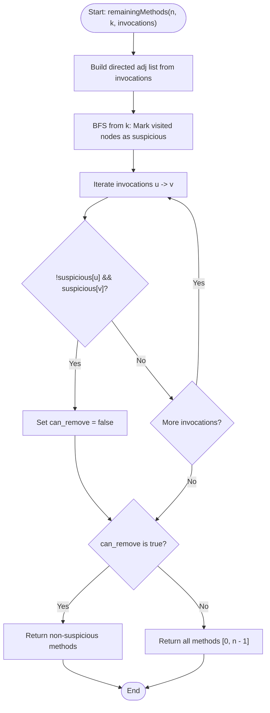

# 💡 Approach — Remove Methods From Project

| 📄 [Problem](./Problem.md) | 💡 [Approach](./Approach.md) | 🧩 [Solution](./Solution.cpp) | 🚀 [Main](./Main.cpp) |
|:--------------------------:|:-----------------------------:|:------------------------------:|:---------------------:|

---

## 📊 Metadata

---

## 🎯 Core Insight

> [!TIP]
> **Graph Traversal (BFS/DFS) + Edge Cross-Reference**
>
> 1. **Suspicious Subgraph Identification:** Build an adjacency list representing method calls. Starting from the bugged method `k`, perform a standard BFS traversal. Any method visited during this traversal is reachable from `k` and is marked as **suspicious**.
> 2. **Dependency Leak Check:** Iteratively inspect every invocation $u \to v$. If a method $u$ outside the suspicious group invokes a method $v$ inside the suspicious group, the suspicious group **cannot** be safely removed.
> 3. **Result Construction:** If the leak check is triggered, return all methods $[0, n-1]$. Otherwise, return only the methods not marked as suspicious.

---

## 🔩 Step-by-Step Breakdown

### Step 1: Build the Adjacency List
- Create a directed adjacency list `adj` of size `n` where `adj[u]` contains all methods $v$ invoked by $u$.

### Step 2: BFS Reachability from `k`
- Maintain a boolean array `suspicious` of size `n` initialized to `false`.
- Initialize a queue `q` and push `k` into it, marking `suspicious[k] = true`.
- While `q` is not empty, pop the front node `curr` and traverse its neighbors:
  - If a neighbor is not yet marked `suspicious`, mark it `suspicious` and push it to `q`.

### Step 3: Cross-Reference Invocations
- Iterate through every invocation `[u, v]`:
  - If `!suspicious[u] && suspicious[v]`, then we have a dependency leak (an external method invokes a suspicious method). Set a safety flag `can_remove = false` and terminate the check early.

### Step 4: Final Output Construction
- If `can_remove` is `true`:
  - Collect all indices $i$ from $0$ to $n-1$ where `suspicious[i]` is `false`.
- Otherwise:
  - Return all indices from $0$ to $n-1$.

---

## 🔄 Mermaid Flowchart

---

## 🧮 Dry Run

### Dry Run: Example 2
- **Input:** `n = 5`, `k = 0`, `invocations = [[1, 2], [0, 2], [0, 1], [3, 4]]`

#### Phase 1: Build Graph
- `adj[0] = {2, 1}`
- `adj[1] = {2}`
- `adj[2] = {}`
- `adj[3] = {4}`
- `adj[4] = {}`

#### Phase 2: BFS from `k = 0`
- `suspicious = {T, F, F, F, F}`
- Queue: `[0]`
- Pop `0`: Neighbors: `2`, `1`.
  - Mark `suspicious[2] = True`, Queue: `[2]`
  - Mark `suspicious[1] = True`, Queue: `[2, 1]`
- Pop `2`: Neighbors: None.
- Pop `1`: Neighbors: `2` (already suspicious).
- Suspicious methods: `{0, 1, 2}`.

#### Phase 3: Edge Check
- `[1, 2]`: Both suspicious. OK.
- `[0, 2]`: Both suspicious. OK.
- `[0, 1]`: Both suspicious. OK.
- `[3, 4]`: Neither suspicious. OK.
- `can_remove = true`.

#### Phase 4: Construct Output
- Non-suspicious methods: `{3, 4}`.
- **Output:** `[3, 4]`

---

## 📊 Complexity Analysis

| Complexity | Analysis |
| :--- | :--- |
| **Time Complexity** | $O(n + E)$ where $E = \text{invocations.length}$. Building the graph takes $O(E)$ time. The BFS visits each vertex and edge at most once, which takes $O(n + E)$ time. Checking all invocations takes $O(E)$ time. |
| **Auxiliary Space** | $O(n + E)$ to store the directed graph representation and the BFS recursion queue/boolean array. |

---

<h3>Happy Coding! 🚀</h3>

