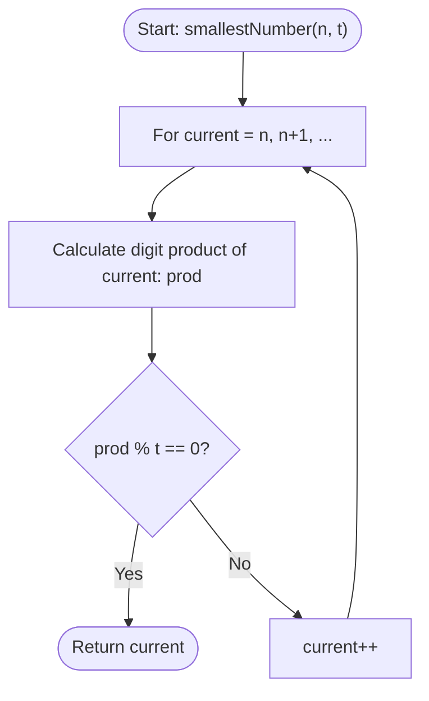

# 💡 Approach — Smallest Divisible Digit Product I

| 📄 [Problem](./Problem.md) | 💡 [Approach](./Approach.md) | 🧩 [Solution](./Solution.cpp) | 🚀 [Main](./Main.cpp) |
|:--------------------------:|:-----------------------------:|:------------------------------:|:---------------------:|

---

## 📊 Metadata

---

## 🎯 Core Insight

> [!TIP]
> **Brute Force Enumeration**
>
> 1. **Search Space:** The given number $n$ is small ($1 \le n \le 100$). The next multiple of 10 greater than or equal to $n$ will always have a `0` as its units digit, meaning the product of its digits will be `0`.
> 2. **0 Divisibility:** Since `0` is divisible by any integer $t \ge 1$, we are guaranteed to find a valid solution within at most 10 increments of $n$.
> 3. **Brute Force Search:** We can simply loop starting from $n$, incrementing the number by 1 at each step, and return the first number whose digit product is divisible by $t$.

---

## 🔩 Step-by-Step Breakdown

### Step 1: Helper function for digit product
- Define a helper function `getDigitProduct(num)`:
  - Initialize `product = 1`.
  - While `num > 0`:
    - Multiply `product` by `num % 10`.
    - Divide `num` by 10.
  - Return `product`.

### Step 2: Search loop
- Start a loop from `current = n`:
  - Check if `getDigitProduct(current) % t == 0`.
  - If it is, return `current`.
  - Otherwise, increment `current` by 1 and continue.

---

## 🔄 Mermaid Flowchart

---

## 🧮 Dry Run

### Dry Run: Example 2
- **Input:** `n = 15`, `t = 3`

#### Iteration 1 (`current = 15`):
- Digits of 15: 1, 5. Product = $1 \times 5 = 5$.
- Check: $5 \pmod 3 = 2 \neq 0$.
- Increment `current` to 16.

#### Iteration 2 (`current = 16`):
- Digits of 16: 1, 6. Product = $1 \times 6 = 6$.
- Check: $6 \pmod 3 = 0$.
- Condition met! Return `16`.

---

## 📊 Complexity Analysis

| Complexity | Analysis |
| :--- | :--- |
| **Time Complexity** | $O(1)$ because the loop runs at most 10 times, and for each number, digit extraction takes at most 3 operations (as $n \le 110$). |
| **Auxiliary Space** | $O(1)$ as we only store a few local variables for computation. |

---

<h3>Happy Coding! 🚀</h3>

