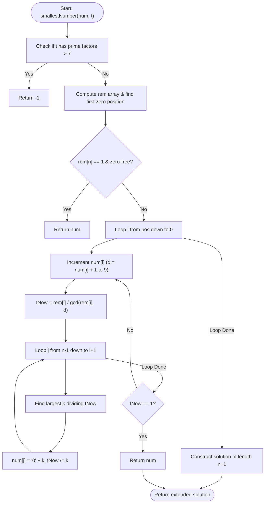

# 💡 Approach — Smallest Divisible Digit Product II

| 📄 [Problem](./Problem.md) | 💡 [Approach](./Approach.md) | 🧩 [Solution](./Solution.cpp) | 🚀 [Main](./Main.cpp) |
|:--------------------------:|:-----------------------------:|:------------------------------:|:---------------------:|

---

## 📊 Metadata

---

## 🎯 Core Insight

> [!TIP]
> **Greedy Digit Search + GCD Simplification**
>
> 1. **Validity Check:** Since digits are in $[1, 9]$, a valid digit product cannot contain any prime factors other than 2, 3, 5, or 7. If $t$ has any prime factor $> 7$, we immediately return `"-1"`.
> 
> 2. **Prefix-Remainder State:** We compute a prefix remainder array `rem[i]`. `rem[i]` represents the remaining required product of suffix digits to make the total product divisible by $t$, after matching a prefix of length $i$. It is updated as:
>    $$\text{rem}[i+1] = \frac{\text{rem}[i]}{\gcd(\text{rem}[i], num[i] - '0')}$$
> 
> 3. **Search for Pivot:**
>    - We find the rightmost digit we can increment, starting from `pos` (which is the first occurrence of `0`, or `n-1` if there are no zeros).
>    - For each position $i$ from `pos` down to `0`, we increment the digit `num[i]` to some digit $d > num[i]$. We calculate the new remaining requirement `tNow`:
>      $$\text{tNow} = \frac{\text{rem}[i]}{\gcd(\text{rem}[i], d)}$$
>    - We then greedily check if `tNow` can be factored into $n - 1 - i$ digits. We iterate from the last index $j = n - 1$ down to $i + 1$, filling them with the largest possible digit $k \in [9, 1]$ that divides `tNow`. If `tNow` becomes `1`, it is a valid configuration, and we return `num`.
> 
> 4. **Extension:** If no same-length solution exists, we construct the smallest number of length $n + 1$ by greedily extracting factors from $t$ (from 9 down to 2) and padding with '1's at the beginning.

---

## 🔩 Step-by-Step Breakdown

### Step 1: Factorize $t$
- Check if $t$ is divisible by any prime $> 7$. If so, return `"-1"`.

### Step 2: Compute Prefix Remainders
- Traverse $num$ from left to right.
- If $num[i] == '0'$, set the pivot start position `pos = i` and stop.
- Otherwise, update `rem[i+1] = rem[i] / gcd(rem[i], num[i] - '0')`.
- If `rem[n] == 1` and $num$ contains no zeros, return $num$.

### Step 3: Backtrack/Increment from Right
- Loop $i$ from `pos` down to `0`:
  - Increment $num[i]$ while $num[i] \le '9'$.
  - Compute the remaining divisor requirement: `tNow = rem[i] / gcd(rem[i], num[i] - '0')`.
  - Try to greedily satisfy `tNow` using the remaining digits $j = n-1$ down to $i+1$:
    - Find the largest digit $k \le 9$ that divides `tNow`.
    - Update `tNow /= k` and set $num[j] = '0' + k$.
  - If `tNow == 1`, return the constructed $num$.

### Step 4: Fallback to Length $n+1$
- If no solution of length $n$ is found, find the greedy factorization of $t$ using digits $9$ down to $2$.
- Pad the remaining positions with '1's at the front to make the length $n+1$, sort/reverse, and return.

---

## 🔄 Mermaid Flowchart

---

## 📊 Complexity Analysis

| Complexity | Analysis |
| :--- | :--- |
| **Time Complexity** | $O(n)$ because we traverse the digits of $num$ at most a few times, and the factorization checks perform constant time operations. |
| **Auxiliary Space** | $O(n)$ to store the `rem` array of size $n+1$. |

---

<h3>Happy Coding! 🚀</h3>

