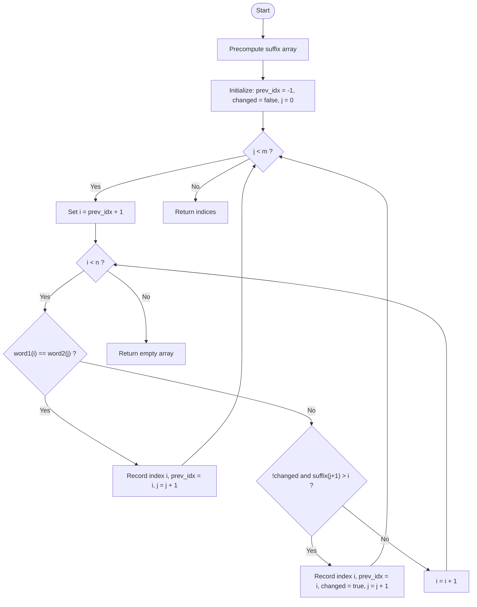

# 💡 Approach — Find the Lexicographically Smallest Valid Sequence

| 📄 [Problem](./Problem.md) | 💡 [Approach](./Approach.md) | 🧩 [Solution](./Solution.cpp) | 🚀 [Main](./Main.cpp) |
|:--------------------------:|:-----------------------------:|:------------------------------:|:---------------------:|

## 📊 Metadata

---

> [!TIP]
> **Core Insight:**
> To find the lexicographically smallest sequence of indices, we want to match each character of `word2` at the earliest possible index in `word1`. If we make a mismatch replacement, we must ensure that the remaining suffix of `word2` can be matched perfectly (0 changes) in the remaining part of `word1`. Precomputing the rightmost matching indices of suffixes of `word2` in `word1` enables $O(1)$ verification for any mismatch replacement.

---

## 🔩 Step-by-Step Breakdown

1. **Precompute Suffix Array**:
   - We construct a `suffix` array of size `m + 1`, where `suffix[j]` represents the maximum index in `word1` where the suffix `word2[j...m-1]` can be matched as a subsequence with zero mismatches.
   - We initialize `suffix[m] = n` as a sentinel value.
   - We traverse `word2` from right to left (`j = m-1` down to `0`), matching characters against `word1` from right to left using a pointer `idx`.

2. **Greedy Matching with Two Pointers**:
   - We iterate through `word2` (`j = 0` to `m-1`), tracking the index in `word1` using `i` (starting from `prev_idx + 1`).
   - If `word1[i] == word2[j]`, we have an exact match. We store `i` in our results, update `prev_idx = i`, and proceed to the next character `j + 1`.
   - If `word1[i] != word2[j]`, we can greedily change `word1[i]` to match `word2[j]` only if:
     - We haven't used our mismatch budget yet (`!changed`).
     - The rest of `word2` (from `j + 1`) can be matched with 0 changes at indices after `i`. This is valid if `suffix[j + 1] > i`.
     - If both conditions hold, we change the character, set `changed = true`, record the index, update `prev_idx = i`, and move to `j + 1`.
   - If neither condition is met, we increment `i` to look for a later match.
   - If we reach the end of `word1` without matching `word2[j]`, it means no valid sequence exists; we return `{}`.

---

## 🔄 Mermaid Flowchart

---

## 📊 Complexity Analysis

| Complexity | Resource | Details |
| :---: | :---: | :--- |
| **Time Complexity** | $O(N + M)$ | The suffix array construction takes $O(N)$ time. The greedy two-pointer matching traversal advances `i` and `j` linearly, taking at most $O(N)$ time. |
| **Space Complexity** | $O(M)$ | The space required is for the suffix array of size $M + 1$ and the output indices array. |

---

> *"The translation of a complex state space into a simple suffix validation is the essence of optimal greedy design."*

---

<h3>Happy Coding! 🚀</h3>

