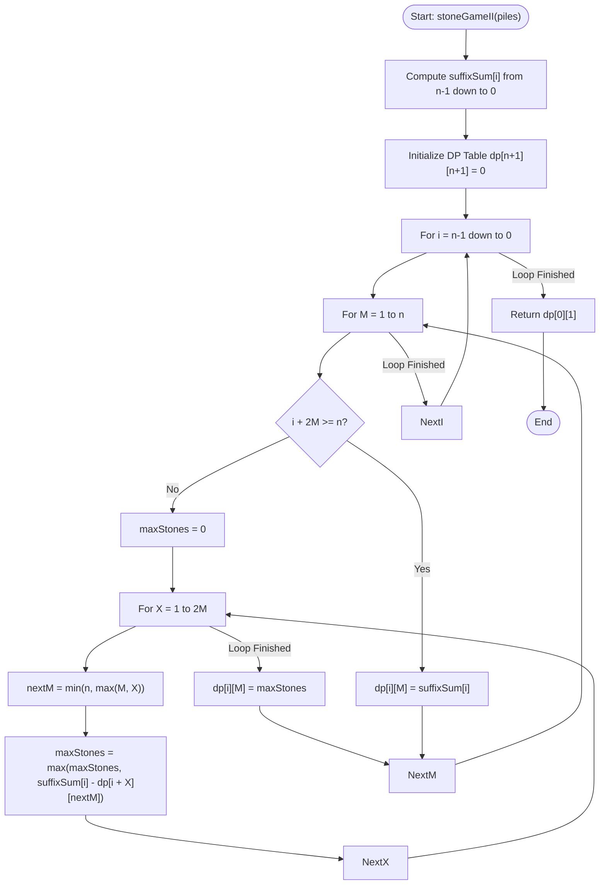

# 💡 Approach — Stone Game II

| 📄 [Problem](./Problem.md) | 💡 [Approach](./Approach.md) | 🧩 [Solution](./Solution.cpp) | 🚀 [Main](./Main.cpp) |
|:--------------------------:|:-----------------------------:|:------------------------------:|:---------------------:|

---

## 📊 Metadata

---

## 🎯 Core Insight

> [!TIP]
> **Game Theory and Suffix Sum Maximization**
> 
> 1. **Suffix Sum Formulation:**
>    Let $suffixSum[i]$ store the total number of stones remaining from pile $i$ to the end ($n-1$).
>    $$suffixSum[i] = \sum_{k=i}^{n-1} piles[k]$$
>    This is critical because at any step, if the current player makes a move that leaves the next player with $S_{next}$ stones, the current player's score will be:
>    $$\text{Score}_{current} = suffixSum[i] - S_{next}$$
>    
> 2. **DP State Representation:**
>    Let $dp[i][M]$ represent the maximum number of stones the current player can get starting from pile $i$ with the current parameter $M$.
> 
> 3. **Transition Rules:**
>    On their turn, the player can choose to take $X$ piles where $1 \le X \le 2M$.
>    - The next player will start at index $i + X$ with a new parameter $M_{next} = \max(M, X)$.
>    - The next player plays optimally, getting $dp[i + X][M_{next}]$ stones.
>    - The current player wants to maximize their score:
>      $$dp[i][M] = \max_{1 \le X \le 2M} \left( suffixSum[i] - dp[i + X][\max(M, X)] \right)$$
> 
> 4. **Base Case:**
>    If $i + 2M \ge n$, the player can take all remaining piles. In this case, the optimal move is to take everything, getting $suffixSum[i]$ stones:
>    $$dp[i][M] = suffixSum[i]$$

---

## 🔩 Step-by-Step Breakdown

### Step 1: Precompute Suffix Sums
- Initialize `suffixSum` array of size $n+1$.
- Populate it from right to left: `suffixSum[i] = suffixSum[i+1] + piles[i]`.

### Step 2: Initialize DP Table
- Create a 2D array `dp` of size $(n+1) \times (n+1)$ initialized to $0$.
- Capping $M$ at $n$ is sufficient because if $2M \ge n$, we can always take all remaining piles.

### Step 3: Iterate Backward
- Iterate index $i$ from $n - 1$ down to $0$:
  - For each $i$, iterate parameter $M$ from $1$ up to $n$:
    - **Case A: Take all remaining piles:**
      - If $i + 2M \ge n$, set `dp[i][M] = suffixSum[i]`.
    - **Case B: Try all valid pile splits:**
      - Otherwise, loop $X$ from $1$ to $2M$:
        - Cap the next $M$ parameter to avoid index out of bounds: `nextM = min(n, max(M, X))`.
        - Update `dp[i][M] = max(dp[i][M], suffixSum[i] - dp[i + X][nextM])`.

### Step 4: Extract Answer
- The result for the game starting at index $0$ with $M = 1$ is stored in `dp[0][1]`.

---

## 🔄 Mermaid Flowchart

---

## 🧮 Dry Run

### Dry Run: `piles = [2, 7, 9, 4, 4]`, $n = 5$

- **Suffix Sums:** `suffixSum = [26, 24, 17, 8, 4, 0]`

#### 1. Index $i = 4$ (`piles[4] = 4`)
- For all $M \ge 1$, $i + 2M = 4 + 2M \ge 5$.
- `dp[4][M] = suffixSum[4] = 4`.

#### 2. Index $i = 3$ (`piles[3] = 4`)
- For all $M \ge 1$, $i + 2M = 3 + 2M \ge 5$.
- `dp[3][M] = suffixSum[3] = 8`.

#### 3. Index $i = 2$ (`piles[2] = 9`)
- For $M \ge 2$: $2 + 2(2) = 6 \ge 5 \rightarrow$ `dp[2][M] = 17`.
- For $M = 1$: $2 + 2(1) = 4 < 5$. We must try $X \in [1, 2]$.
  - $X = 1$: `nextM = 1`. `suffixSum[2] - dp[3][1] = 17 - 8 = 9`.
  - $X = 2$: `nextM = 2`. `suffixSum[2] - dp[4][2] = 17 - 4 = 13`.
  - `dp[2][1] = max(9, 13) = 13`.

#### 4. Index $i = 1$ (`piles[1] = 7`)
- For $M \ge 2$: $1 + 4 = 5 \ge 5 \rightarrow$ `dp[1][M] = 24`.
- For $M = 1$: $1 + 2 = 3 < 5$. Try $X \in [1, 2]$.
  - $X = 1$: `nextM = 1`. `suffixSum[1] - dp[2][1] = 24 - 13 = 11`.
  - $X = 2$: `nextM = 2`. `suffixSum[1] - dp[3][2] = 24 - 8 = 16`.
  - `dp[1][1] = max(11, 16) = 16`.

#### 5. Index $i = 0$ (`piles[0] = 2`)
- For $M = 1$: $0 + 2 = 2 < 5$. Try $X \in [1, 2]$.
  - $X = 1$: `nextM = 1`. `suffixSum[0] - dp[1][1] = 26 - 16 = 10`.
  - $X = 2$: `nextM = 2`. `suffixSum[0] - dp[2][2] = 26 - 17 = 9`.
  - `dp[0][1] = max(10, 9) = 10`.

- **Final Answer:** `dp[0][1] = 10`

---

## 📊 Complexity Analysis

| Complexity | Analysis |
| :--- | :--- |
| **Time Complexity** | $O(n^3)$ — There are $O(n^2)$ states in our DP table. For each state, we iterate $X$ from $1$ to $2M$, which is bounded by $O(n)$ steps. |
| **Auxiliary Space** | $O(n^2)$ — Required for storing the $(n+1) \times (n+1)$ dynamic programming lookup table. |

---

> *"In game theory, the best defense is a perfect projection of your opponent's optimal moves."*

---

<h3>Happy Coding! 🚀</h3>

