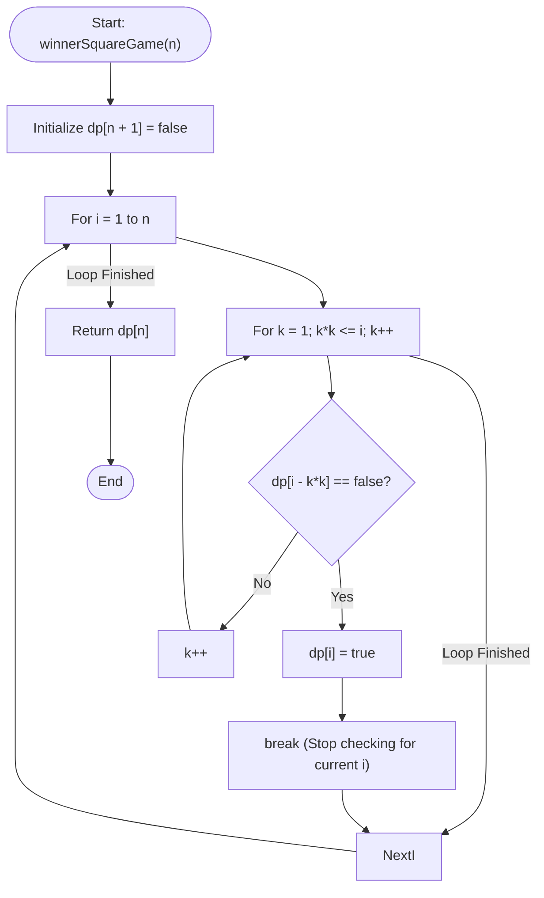

# 💡 Approach — Stone Game IV

| 📄 [Problem](./Problem.md) | 💡 [Approach](./Approach.md) | 🧩 [Solution](./Solution.cpp) | 🚀 [Main](./Main.cpp) |
|:--------------------------:|:-----------------------------:|:------------------------------:|:---------------------:|

---

## 📊 Metadata

---

## 🎯 Core Insight

> [!TIP]
> **Game Theory and Winning/Losing Positions**
> 
> 1. **Definitions:**
>    - A **winning position** (`true`) is a state from which the current player can make at least one move that leads to a losing position for the next player.
>    - A **losing position** (`false`) is a state from which all valid moves lead to winning positions for the next player.
>    - **Base Case:** $dp[0] = \text{false}$ (a player who must take a turn when there are $0$ stones has no moves and loses).
> 
> 2. **DP State Representation:**
>    - Let $dp[i]$ be a boolean representing whether the player starting their turn with $i$ stones can win the game.
> 
> 3. **Transition Rules:**
>    - From $i$ stones, a player can transition to $i - k^2$ stones for any positive integer $k$ such that $k^2 \le i$.
>    - If there exists any $k$ such that $dp[i - k^2] = \text{false}$, then $dp[i] = \text{true}$ (the current player can choose that move and force the opponent to lose).
>    - If for all valid $k$, $dp[i - k^2] = \text{true}$, then $dp[i] = \text{false}$ (no matter what the player chooses, the opponent will be in a winning position).
> 
> 4. **Complexity Optimization:**
>    - For each state $i$ from $1$ to $n$, we only need to check $k^2 \le i$, which takes $O(\sqrt{i})$ transitions.
>    - The overall time complexity is $\sum_{i=1}^n O(\sqrt{i}) \approx O(n\sqrt{n})$, which easily runs within the time limit for $n = 10^5$.

---

## 🔩 Step-by-Step Breakdown

### Step 1: Initialize DP Array
- Create a boolean array `dp` of size $n + 1$ initialized to `false`.
- The base case `dp[0] = false` is implicitly handled.

### Step 2: Bottom-Up DP Computation
- For each $i$ from $1$ to $n$:
  - Iterate through all positive integers $k$ such that $k^2 \le i$:
    - Check if the state after removing $k^2$ stones is a losing position for the opponent: `!dp[i - k * k]`.
    - If `!dp[i - k * k]` is true, set `dp[i] = true` and break immediately (early exit).

### Step 3: Return Result
- The answer is stored in `dp[n]`.

---

## 🔄 Mermaid Flowchart

---

## 🧮 Dry Run

### Dry Run: $n = 4$

- **Base case:** `dp[0] = false`

#### 1. $i = 1$
- $k = 1$: $k^2 = 1 \le 1$. Remaining: `dp[1 - 1] = dp[0] = false`.
- Since `dp[0]` is false, `dp[1] = true`.

#### 2. $i = 2$
- $k = 1$: $k^2 = 1 \le 2$. Remaining: `dp[2 - 1] = dp[1] = true`.
- Loop finished. No move leads to a false state.
- `dp[2] = false`.

#### 3. $i = 3$
- $k = 1$: $k^2 = 1 \le 3$. Remaining: `dp[3 - 1] = dp[2] = false`.
- Since `dp[2]` is false, `dp[3] = true`.

#### 4. $i = 4$
- $k = 1$: $k^2 = 1 \le 4$. Remaining: `dp[4 - 1] = dp[3] = true`.
- $k = 2$: $k^2 = 4 \le 4$. Remaining: `dp[4 - 4] = dp[0] = false`.
- Since `dp[0]` is false, `dp[4] = true`.

- **Final Answer:** `dp[4] = true`

---

## 📊 Complexity Analysis

| Complexity | Analysis |
| :--- | :--- |
| **Time Complexity** | $O(n\sqrt{n})$ — For each state $i$ from $1$ to $n$, we iterate at most $\sqrt{i}$ times. The sum $\sum_{i=1}^n \sqrt{i} \approx \frac{2}{3} n^{1.5}$, which is roughly $3.16 \times 10^7$ operations for $n = 10^5$, executing in a few milliseconds. |
| **Auxiliary Space** | $O(n)$ — A boolean array/vector of size $n+1$ is used to store the DP states. |

---

> *"In optimal game theory, a winning path is found by identifying and exploiting the opponent's inevitable losing states."*

---

<h3>Happy Coding! 🚀</h3>

