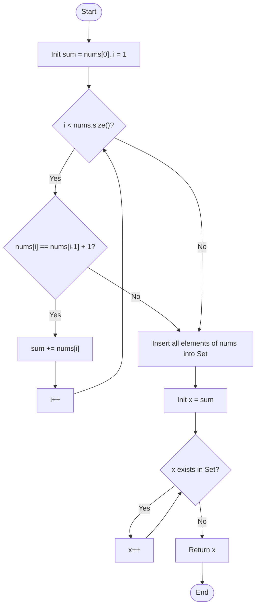

# 💡 Approach — Smallest Missing Integer Greater Than Sequential Prefix Sum

| 📄 [Problem](./Problem.md) | 💡 [Approach](./Approach.md) | 🧩 [Solution](./Solution.cpp) | 🚀 [Main](./Main.cpp) |
|:--------------------------:|:-----------------------------:|:------------------------------:|:---------------------:|

---

## 📊 Metadata

---

## 🎯 Core Insight

> [!TIP]
> **Sequential Prefix Scanning & Hash-Based Lookup**
> 
> 1. **Longest Sequential Prefix:**
>    A prefix starting at `nums[0]` is sequential if every subsequent element is exactly $1$ greater than its predecessor.
>    We can simply scan the array from left to right starting at index $1$. If `nums[i] == nums[i-1] + 1`, we add it to our prefix sum. The moment this condition fails, the longest sequential prefix ends.
> 
> 2. **Smallest Missing Integer:**
>    Once the sequential prefix sum $S$ is calculated, we need to find the smallest integer $x \ge S$ that does not exist in `nums`.
>    By storing all elements of `nums` in a hash set (`std::unordered_set<int>`), we can check if $x$ is present in $O(1)$ time. 
>    We start with $x = S$ and increment it by $1$ as long as $x$ exists in our hash set. The first $x$ not found in the set is our answer.

---

## 🔩 Step-by-Step Breakdown

### Step 1: Compute Longest Sequential Prefix Sum
- Initialize `sum = nums[0]`.
- Iterate through the array `nums` from index `i = 1` to `n - 1`:
  - If `nums[i] == nums[i - 1] + 1`, add `nums[i]` to `sum`.
  - Otherwise, break out of the loop.

### Step 2: Store Array Elements in a Hash Set
- Insert all elements from `nums` into an `unordered_set<int> present`.

### Step 3: Find the Smallest Missing Integer
- Initialize `x = sum`.
- While `present.count(x)` is true (i.e. `x` exists in `nums`):
  - Increment `x` by `1`.
- Return `x`.

---

## 🔄 Mermaid Flowchart

---

## 🧮 Dry Run

### Dry Run: `nums = [3, 4, 5, 1, 12, 14, 13]`

1. **Prefix Sum Calculation:**
   - `sum = nums[0] = 3`.
   - `i = 1`: `nums[1] = 4`, which is `3 + 1`. `sum = 3 + 4 = 7`.
   - `i = 2`: `nums[2] = 5`, which is `4 + 1`. `sum = 7 + 5 = 12`.
   - `i = 3`: `nums[3] = 1`, which is not `5 + 1`. Break.
   - Longest sequential prefix sum is `12`.

2. **Hash Set construction:**
   - `present = {3, 4, 5, 1, 12, 14, 13}`.

3. **Finding Missing Integer:**
   - `x = 12`: `12` is in set. Increment `x` to `13`.
   - `x = 13`: `13` is in set. Increment `x` to `14`.
   - `x = 14`: `14` is in set. Increment `x` to `15`.
   - `x = 15`: `15` is not in set. Stop.
   - Return `15`. Correct!

---

## 📊 Complexity Analysis

| Complexity | Analysis |
| :--- | :--- |
| **Time Complexity** | $O(n)$ — We scan the array once to compute the prefix sum ($O(n)$ time) and once to insert all elements into a hash set ($O(n)$ time). The search loop increments $x$ at most $n + 1$ times, with each check taking $O(1)$ time on average. |
| **Auxiliary Space** | $O(n)$ — To store the unique elements of `nums` in `std::unordered_set<int>`, which contains at most $n$ elements. |

---

> *"Sequential scanning and hash lookup: a perfect combination of order and search efficiency."*

---

<h3>Happy Coding! 🚀</h3>

