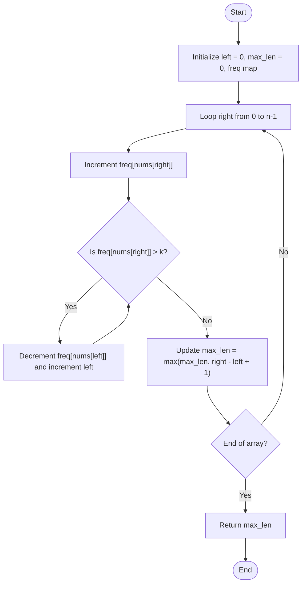

# 💡 Approach — Length of Longest Subarray With at Most K Frequency

| 📄 [Problem](./Problem.md) | 💡 [Approach](./Approach.md) | 🧩 [Solution](./Solution.cpp) | 🚀 [Main](./Main.cpp) |
|:--------------------------:|:-----------------------------:|:------------------------------:|:---------------------:|

## 📊 Metadata

---

> [!TIP]
> **Core Insight**: Since we need the *longest* contiguous subarray satisfying a condition, we can use a **sliding window** with two pointers (`left` and `right`). We expand the window by moving `right` and tracking element frequencies. If any element's frequency exceeds `k`, we shrink the window from the `left` until the condition is restored.

---

## 🔩 Step-by-Step Breakdown

### Step 1: State Definition
Maintain the following variables:
- `left`: Pointer representing the start of the current sliding window.
- `max_len`: Stores the length of the longest good subarray found so far.
- `freq`: An `unordered_map` mapping each number to its current frequency within the window `[left, right]`.

### Step 2: Expand the Window
Iterate through the array with `right` from `0` to `n-1`:
- Add `nums[right]` to our sliding window.
- Increment the frequency `freq[nums[right]]`.

### Step 3: Shrink the Window on Violation
- If the frequency of `nums[right]` becomes greater than `k`:
  - Shrink the window from the left by decrementing the frequency of `nums[left]` and incrementing `left`.
  - Repeat this until `freq[nums[right]] <= k`.

### Step 4: Update Result
- The current window `[left, right]` is now valid.
- Update `max_len = max(max_len, right - left + 1)`.

### Step 5: Return Result
- Once the loop ends, return `max_len`.

---

## 🔄 Mermaid Flowchart

---

## 🧮 Dry Run

### Dry Run: `nums = [1, 2, 3, 1, 2, 3, 1, 2]`, `k = 2`

- **Initialization**:
  - `left = 0`, `max_len = 0`.
  - `freq` is empty.

#### Iteration Step-by-Step:
- **`right = 0` (val = 1)**:
  - `freq[1] = 1`. Valid since `freq[1] <= 2`.
  - `max_len = max(0, 0 - 0 + 1) = 1`.
- **`right = 1` (val = 2)**:
  - `freq[2] = 1`. Valid since `freq[2] <= 2`.
  - `max_len = max(1, 1 - 0 + 1) = 2`.
- **`right = 2` (val = 3)**:
  - `freq[3] = 1`. Valid since `freq[3] <= 2`.
  - `max_len = max(2, 2 - 0 + 1) = 3`.
- **`right = 3` (val = 1)**:
  - `freq[1] = 2`. Valid since `freq[1] <= 2`.
  - `max_len = max(3, 3 - 0 + 1) = 4`.
- **`right = 4` (val = 2)**:
  - `freq[2] = 2`. Valid since `freq[2] <= 2`.
  - `max_len = max(4, 4 - 0 + 1) = 5`.
- **`right = 5` (val = 3)**:
  - `freq[3] = 2`. Valid since `freq[3] <= 2`.
  - `max_len = max(5, 5 - 0 + 1) = 6`. Window: `[1, 2, 3, 1, 2, 3]`
- **`right = 6` (val = 1)**:
  - `freq[1] = 3` (Violates `freq[1] <= 2`).
  - **Shrink window**: Decrement `freq[nums[left]]` (where `left = 0`, `nums[0] = 1`), `freq[1]` becomes `2`. Increment `left` to `1`.
  - Violations resolved. Valid window is now `[1..6]`.
  - `max_len = max(6, 6 - 1 + 1) = 6`. Window: `[2, 3, 1, 2, 3, 1]`
- **`right = 7` (val = 2)**:
  - `freq[2] = 3` (Violates `freq[2] <= 2`).
  - **Shrink window**: Decrement `freq[nums[left]]` (where `left = 1`, `nums[1] = 2`), `freq[2]` becomes `2`. Increment `left` to `2`.
  - Violations resolved. Valid window is now `[2..7]`.
  - `max_len = max(6, 7 - 2 + 1) = 6`. Window: `[3, 1, 2, 3, 1, 2]`

- **Result**: Return `max_len = 6`. Correct!

---

## 📊 Complexity Analysis

| Complexity | Resource | Details |
| :--- | :--- | :--- |
| **Time Complexity** | $\mathcal{O}(n)$ | Each element is visited at most twice: once by `right` and once by `left`. |
| **Space Complexity** | $\mathcal{O}(n)$ | An `unordered_map` is used to store frequencies of up to $n$ unique elements. |

---

> *"The key to solving sliding window problems is knowing exactly when to stop expanding and start shrinking."*

---

<h3>Happy Coding! 🚀</h3>

