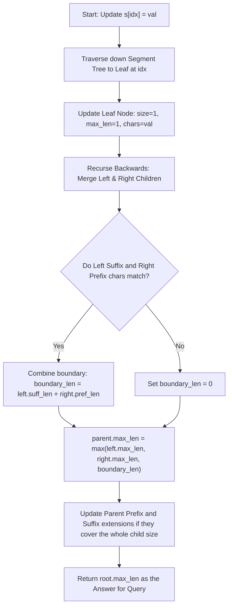

# 💡 Approach — Longest Substring of One Repeating Character

| 📄 [Problem](./Problem.md) | 💡 [Approach](./Approach.md) | 🧩 [Solution](./Solution.cpp) | 🚀 [Main](./Main.cpp) |
|:--------------------------:|:-----------------------------:|:------------------------------:|:---------------------:|

## 📊 Metadata

## 📊 Metadata

---

> [!TIP]
> **Core Insight:**
> A naive scan per update takes $O(N)$ leading to $O(N \cdot K)$ overall, which is too slow. To achieve logarithmic time per update, we can model the string using a **Segment Tree**. Each segment node keeps track of the longest repeating substring length within its bounds, as well as the longest repeating prefix and suffix sequences. When merging two adjacent segments, we check if the characters at the boundary match. If they do, the suffix of the left segment can merge with the prefix of the right segment, creating a new contiguous repeating substring across the boundary.

---

## 🔩 Step-by-Step Breakdown

### Step 1: Define the Node Structure
Each segment tree node stores the metadata of range $[L, R]$:
- `size`: length of the segment.
- `max_len`: maximum repeating substring length within the segment.
- `pref_char`: starting character of the segment.
- `pref_len`: length of the repeating prefix.
- `suff_char`: ending character of the segment.
- `suff_len`: length of the repeating suffix.

### Step 2: Implement the Node Merging Function
When merging `left` and `right` nodes:
1. `parent.size = left.size + right.size`
2. `parent.pref_char = left.pref_char`
3. If `left.pref_len == left.size` and `left.pref_char == right.pref_char`, the repeating prefix extends completely from the left segment into the right segment:
   - `parent.pref_len = left.size + right.pref_len`
   - Else, `parent.pref_len = left.pref_len`
4. `parent.suff_char = right.suff_char`
5. If `right.suff_len == right.size` and `right.suff_char == left.suff_char`, the repeating suffix extends completely from the right segment into the left segment:
   - `parent.suff_len = right.size + left.suff_len`
   - Else, `parent.suff_len = right.suff_len`
6. Calculate `parent.max_len` as the maximum of:
   - `left.max_len`
   - `right.max_len`
   - If `left.suff_char == right.pref_char`, the combined boundary length `left.suff_len + right.pref_len`.

### Step 3: Build the Segment Tree
Recursively divide the string into halves and initialize leaf nodes with `size = 1`, `max_len = 1`, and the corresponding character as both suffix and prefix. Merge them bottom-up.

### Step 4: Perform Point Updates
To update a character at index `idx` to `val`, traverse down to the corresponding leaf node in $O(\log N)$, modify it, and re-merge all ancestor nodes on the path back to the root.

### Step 5: Retrieve Query Results
After each update, the root node of the tree (`tree[1]`) immediately holds the global longest repeating substring length in its `max_len` field. We can query this in $O(1)$ time.

---

## 🔄 Mermaid Flowchart

---

## 📊 Complexity Analysis

| Measure | Complexity | Details |
| :--- | :--- | :--- |
| **Time (Build)** | $O(N)$ | Tree contains $4N$ nodes, each built in $O(1)$ merge steps. |
| **Time (Update)** | $O(\log N)$ | Traverses a path from root to leaf of length $\log N$. |
| **Time (Query)** | $O(1)$ | Directly accesses the root node's `max_len` field. |
| **Space (Auxiliary)**| $O(N)$ | Tree size is bounded by $4N$ nodes, using negligible memory (~8 MB). |

---

> *"The art of programming is the art of organizing complexity, of mastering multitude and avoiding its confusion."* — Edsger W. Dijkstra

<h3>Happy Coding! 🚀</h3>

