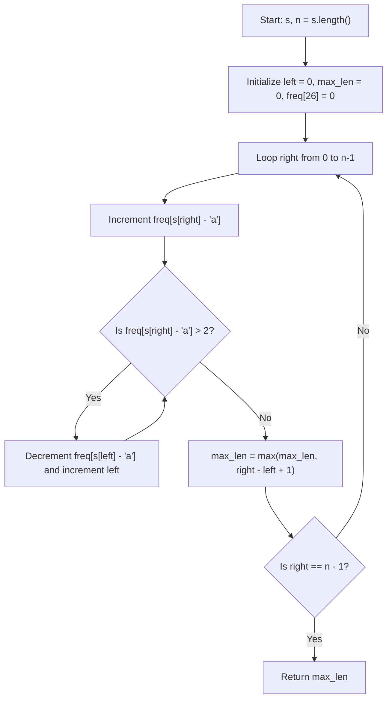

# 💡 Approach — Maximum Length Substring With Two Occurrences

| 📄 [Problem](./Problem.md) | 💡 [Approach](./Approach.md) | 🧩 [Solution](./Solution.cpp) | 🚀 [Main](./Main.cpp) |
|:--------------------------:|:-----------------------------:|:------------------------------:|:---------------------:|

## 📊 Metadata

---

> [!TIP]
> **Core Insight:**
> We want to find the maximum length continuous substring in `s` where no character appears more than 2 times.
> This is a classic **Sliding Window (Two Pointers)** problem. By keeping a frequency array of size 26 for lowercase English letters, we expand the right pointer to include characters and shrink from the left pointer whenever any character's count exceeds 2.

---

## 🔩 Step-by-Step Breakdown

### Step 1: Initialize Frequency Tracking and Pointers
Maintain an array `freq` of size 26 (initialized to 0) to store character counts within the active window `[left, right]`. Initialize `left = 0` and `max_len = 0`.

### Step 2: Expand the Right Pointer
Iterate `right` from `0` to `n - 1`. For each character `ch = s[right]`, increment its frequency `freq[ch - 'a']++`.

### Step 3: Shrink Window on Constraint Violation
While `freq[s[right] - 'a'] > 2`:
- Decrement the count of `s[left]` from `freq`: `freq[s[left] - 'a']--`.
- Increment `left` to shrink the window from the left.

### Step 4: Update Maximum Substring Length
After restoring the valid state (where all characters in the current window appear $\le 2$ times), calculate `right - left + 1` and update `max_len = max(max_len, right - left + 1)`.

---

## 🔄 Mermaid Flowchart

---

## 🧮 Dry Run

### Detailed Execution Trace for `s = "bcbbbcba"`

Initial state: `left = 0`, `max_len = 0`, `freq = [0, 0, ..., 0]`

| `right` | `s[right]` | `freq` After Add | Constraint Violated (`freq > 2`)? | `left` Adjustment | Active Window | Substring | Window Length | `max_len` |
| :---: | :---: | :---: | :---: | :---: | :---: | :---: | :---: | :---: |
| `0` | `'b'` | `b: 1` | No | `left = 0` | `[0..0]` | `"b"` | 1 | 1 |
| `1` | `'c'` | `b: 1, c: 1` | No | `left = 0` | `[0..1]` | `"bc"` | 2 | 2 |
| `2` | `'b'` | `b: 2, c: 1` | No | `left = 0` | `[0..2]` | `"bcb"` | 3 | 3 |
| `3` | `'b'` | `b: 3, c: 1` | **Yes** (`freq[b] = 3`) | Decrement `s[0]` ('b') $\to$ `freq[b]=2`, `left = 1` | `[1..3]` | `"cbb"` | 3 | 3 |
| `4` | `'b'` | `b: 3, c: 1` | **Yes** (`freq[b] = 3`) | Decrement `s[1]` ('c') $\to$ `freq[c]=0`, `left = 2` Decrement `s[2]` ('b') $\to$ `freq[b]=2`, `left = 3` | `[3..4]` | `"bb"` | 2 | 3 |
| `5` | `'c'` | `b: 2, c: 1` | No | `left = 3` | `[3..5]` | `"bbc"` | 3 | 3 |
| `6` | `'b'` | `b: 3, c: 1` | **Yes** (`freq[b] = 3`) | Decrement `s[3]` ('b') $\to$ `freq[b]=2`, `left = 4` | `[4..6]` | `"bcb"` | 3 | 3 |
| `7` | `'a'` | `b: 2, c: 1, a: 1` | No | `left = 4` | `[4..7]` | `"bcba"` | 4 | **4** |

**Final Answer:** `4` (achieved by substring `"bcba"` at indices `4..7`).

---

## 📊 Complexity Analysis

| Measure | Complexity | Details |
| :--- | :--- | :--- |
| **Time Complexity** | $O(N)$ | Both `left` and `right` pointers traverse the string at most once. |
| **Space Complexity** | $O(1)$ | Frequency array takes fixed $O(26)$ space. |

---

> *"Premature optimization is the root of all evil."* — Donald Knuth

<h3>Happy Coding! 🚀</h3>

