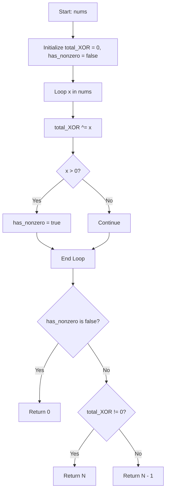

# 💡 Approach — Longest Subsequence With Non-Zero Bitwise XOR

| 📄 [Problem](./Problem.md) | 💡 [Approach](./Approach.md) | 🧩 [Solution](./Solution.cpp) | 🚀 [Main](./Main.cpp) |
|:--------------------------:|:-----------------------------:|:------------------------------:|:---------------------:|

## 📊 Metadata

---

## 💡 Core Insight

> [!TIP]
> **Core Insight:**  
> 1. If **all elements** in `nums` are `0`, then every non-empty subsequence has XOR `0`. No non-zero XOR subsequence exists $\implies$ return `0`.
> 2. Calculate the bitwise XOR of the **entire array** $\text{total\_XOR} = \text{nums}[0] \oplus \text{nums}[1] \oplus \dots \oplus \text{nums}[N-1]$.
>    - If $\text{total\_XOR} \neq 0$, the longest subsequence with non-zero XOR is the full array itself of length $N$.
> 3. If $\text{total\_XOR} == 0$ and at least one element $x > 0$ exists:
>    - Removing $x$ from the array leaves a subsequence of length $N - 1$.
>    - The XOR of this subsequence is $\text{total\_XOR} \oplus x = 0 \oplus x = x \neq 0$.
>    - Thus, the maximum length is $N - 1$.

---

## 🔩 Step-by-Step Breakdown

1. **Step 1: Compute Total XOR and Non-Zero Flag**:
   - Traverse `nums` once. Compute `total_XOR ^= num` and check if `num > 0`.
2. **Step 2: Case Analysis**:
   - If no non-zero element exists (all elements are 0), return `0`.
   - If `total_XOR != 0`, return `N`.
   - Else (`total_XOR == 0` and non-zero element exists), return `N - 1`.

---

## 🔍 Detailed Dry Run

### Example 1: `nums = [1, 2, 3]`

- `total_XOR = 1 ^ 2 ^ 3 = 0`
- Non-zero element exists (`1 > 0`)
- Since `total_XOR == 0`, answer is $N - 1 = 3 - 1 = 2$.

### Example 2: `nums = [2, 3, 4]`

- `total_XOR = 2 ^ 3 ^ 4 = 5 != 0`
- Since `total_XOR != 0`, answer is $N = 3$.

### Example 3: `nums = [0, 0, 0]`

- `total_XOR = 0`, no non-zero element exists.
- Output: `0`.

---

## 🔄 Mermaid Flowchart

---

## 📊 Complexity Analysis

| Complexity | Resource | Details / Explanation |
| :--------: | :------: | --------------------- |
| **Time**   | $O(N)$   | Single linear scan over array `nums`. |
| **Space**  | $O(1)$   | Uses scalar variables `total_XOR` and `has_nonzero`. |

---

> *"If the total XOR cancels out to zero, dropping any non-zero element breaks the symmetry to yield a non-zero sum of length N - 1."*

---

<h3>Happy Coding! 🚀</h3>

